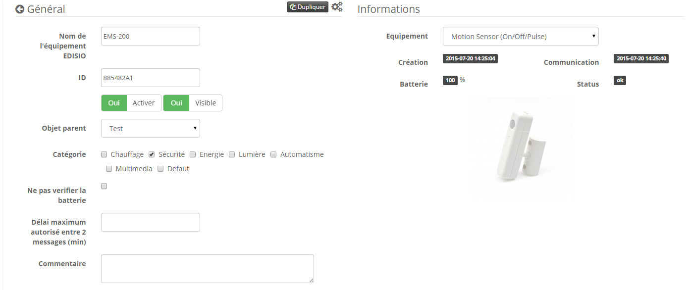

-   **The module**

-   ** The Jeedom **

summary
======

Placed in a corridor, the living room, the garage of your house for example,
the motion sensor detects a presence, the change of state is
instantaneous.

Thanks to its wide viewing angle and range, it helps to secure
a wide perimeter. Built-in LED indicator signals any changes
state.

functions
=========

-   Detects movements, even in complete darkness

-   Ultra compact

-   Signal transmitted instantly during a detection

-   Self-protection on pulling out

-   Ease of use and installation

-   Wall mounting with screws or double-sided

-   Battery level information

Technical characteristics
===========================

-   Module type: Edisio transmitter

-   Power Supply: 3VDC (ER14250 Lithium Battery)

-   Frequency: 868.3 MHz

-   Operating temperature: 0 ° C + 45 ° C

-   Free field range: 100M

-   Range of detection: 6M

-   Dimensions: 25x79x19mm

-   Degree of protection: IP20

-   Use: Indoor

Module data
=================

-   Brand: Edisio Smart Home

-   Name: EMS-200

General configuration
======================

To configure the Edisio plugin and associate a module with Jeedom,
refer to this
[Documentation] (https://www.jeedom.fr/doc/documentation/plugins/edisio/fr_FR/edisio.html).

> ** Important **
>
> So that Jeedom automatically creates your sending modules, do not forget
> do not activate the option in the plugin configuration.

> ** Tip **
>
> The placement is recommended at a height of 150 cm and close to
> the desired temperature.

Button "E"
----------

You will find the "E" button which is the sensor association button
temperature.

Detection
---------

The sensor detects the slightest movement in a radius of about 6m

Setting the timer
-----------------------

By default, the timer is disabled. This parameter is used to configure
the delay:

Association of the sensor at Jeedom
===============================

The association of the motion sensor, is simple as hello. he
just press the "E" button, located under the sensor. This one will be
automatically recognized by Jeedom. It will be enough to go to
Edisio plugin. So you can place it in an object, give it a
name and save.

Once your equipment is associated, you should get this:

> ** Tip **
>
> In order for the widget to be present on the dashboard, consider placing
> your equipment in an object.

Orders
---------

Once your equipment is created, you should get the orders
associated with the module:

Here is the list of orders:

-   Presence: This is the command that indicates if a presence is
    detected

-   Battery: Indicates the status of the battery

information
------------

Once your equipment associated with Jeedom, various information will be
available:

-   Creation: Indicates the date the equipment was created

-   Communication: Indicates the last call recorded between
    Jeedom and the module

-   Battery: Indicates battery status of battery modules

-   Status: Returns the status of the module

Alternative visual
=================

F.A.Q.
======

How to pilot a Z-Wave receiver?

: With the Jeedom script plugin.

How can I have the same visual?

: With the Jeedom Widgets plugin.

** @ ** Jamsta
