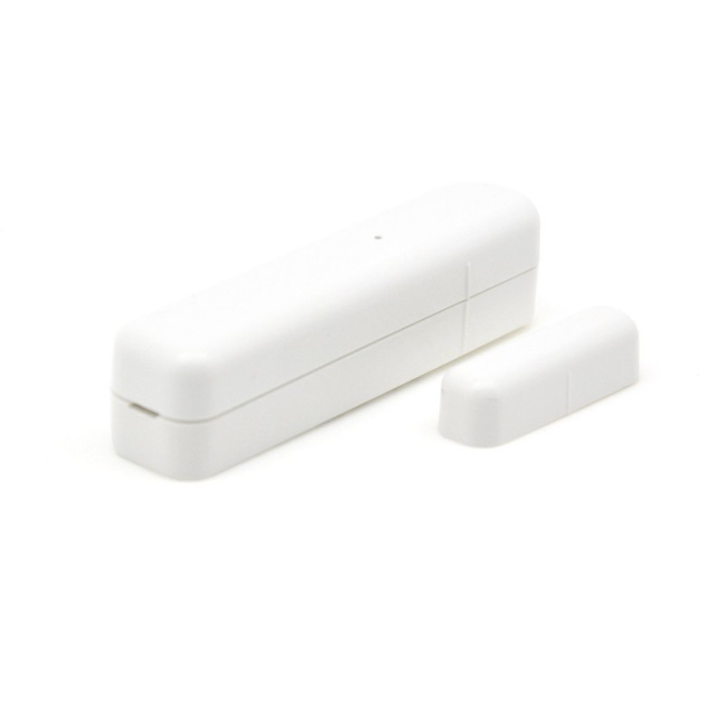

-   **The module**

-   **The Jeedom**

summary
======

Placed on a door, window, garage door, drawer, all opening, this
compact and discreet sensor will allow you to know the state
opening or closing of the latter.

Depending on the condition, the sensor controls the switching on or off of your
lighting, closing or opening the shutters, or the
triggering an alarm via a scenario.

The signal is only sent to the separation of the sound sensor
magnetic element. Built-in LED indicator signals any changes
state. Low battery level indicated by 3 "beep" sound on the
receiver

functions
=========

-   Battery powered wireless magnetic sensor

-   Detects openings / closures

-   Ultra compact

-   Easy installation and in complete freedom

-   Signal transmitted instantly when opening / closing

-   Self-protection on pulling out

-   Battery level information

-   Wall mounting with screws or double-sided tape

Technical characteristics
===========================

-   Module type: Edisio transmitter

-   Power Supply: 3VDC (ER14250 Lithium Battery)

-   Frequency: 868.3 MHz

-   Operating temperature: 0 ° C + 45 ° C

-   Free field range: 100M

-   Dimensions: 25x79x19mm

-   Degree of protection: IP20

-   Use: Indoor

Module data
=================

-   Brand: Edisio Smart Home

-   Name: EOS-200

General configuration
======================

To configure the Edisio plugin and associate a module with Jeedom,
refer to this
[Documentation] (https://www.jeedom.fr/doc/documentation/plugins/edisio/fr_FR/edisio.html).

> **Important**
>
> So that Jeedom automatically creates your sending modules, do not forget
> do not activate the option in the plugin configuration.

Button "E"
----------

You will find below the button "E" which is the button of association of the
temperature sensor.

Configuration
-------------

By default, the sensor is configured in NO (Normally Open)

> **Note**
>
> It will be necessary to configure your sensor, if you wish to have a
> widget with a door closed when it is.

Association of the sensor at Jeedom
===============================

The association of the motion sensor is as simple as hello. he
just press the "E" button, located under the sensor. This one will be
automatically recognized by Jeedom. It will be enough to go to
Edisio plugin. So you can place it in an object, give it a
name and save.

Once your equipment is associated, you should get this:

> **Tip**
>
> In order for the widget to be present on the dashboard, consider placing
> your equipment in an object.

Orders
---------

Once your equipment is created, you should get the orders
associated with the module:

Here is the list of orders:

-   Door: This is the command that indicates if the door is open or
    closed

-   Battery: Indicates the status of the battery

information
------------

Once your equipment associated with Jeedom, various information will be
available:

-   Creation: Indicates the date on which the equipment was created

-   Communication: Indicates the last call recorded between
    Jeedom and the module

-   Battery: Indicates battery status of battery modules

-   Status: Returns the status of the module

Alternative visual
=================

F.A.Q.
======

How to pilot a Z-Wave receiver?

: With the Jeedom script plugin.

How can I have the same visual?

: With the Jeedom Widgets plugin.

**@** Jamsta
