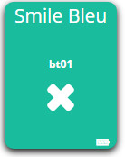
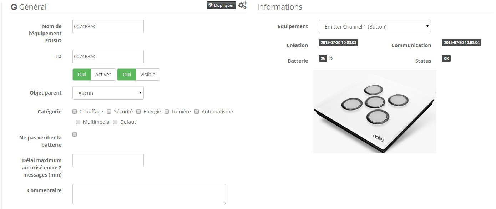

-   **The module**

-   **The Jeedom**

summary
======

"Smile" remotes have a channel, they are ideal for the table
bedside, bathroom and especially for children, because these are
very robust thanks to the material used. Ultra simple and at once
"Fun" they aim to be practical in the habitat. They exist
in three different colors.

They connect easily to different receivers and can therefore
control on / off lighting, variable lighting,
shutters, gates, garage doors. Available in 3 colors.

Moreover, the interaction with other protocols is possible, it can
interact with Edisio brand receivers, with Jeedom, but
also by any Z-Wave receiver on your network.

functions
=========

-   Usage: Lighting, Dimmer

-   Small, discreet and aesthetic

-   Ease of use and installation

Technical characteristics
===========================

-   Module type: Edisio transmitter

-   Power Supply: 3VDC (CR2032 Lithium Battery)

-   Channels: 1

-   Radio protocol: 868.3 MHz

-   Free field range: 100 M

-   Operating temperature: -10 ° C + 50 ° C

-   Dimensions: 65x18mm

-   Degree of protection: IP64

Module data
=================

-   Brand: Edisio Smart Home

-   Name: ETC1

-   Reference: P01 / Y01 / L01

General configuration
======================

To configure the Edisio plugin and associate a module with Jeedom,
refer to this
[Documentation] (https://www.jeedom.fr/doc/documentation/plugins/edisio/fr_FR/edisio.html).

> **Important**
>
> So that Jeedom automatically creates your sending modules, do not forget
> do not activate the option in the plugin configuration.

Operating diagram
---------------------------

Here is the operation of the remote control:

Replacing the battery
-----------------------

To replace the battery of your remote control, here is the procedure to follow
:

Remote control association in Jeedom
=======================================

The association of an Edisio transmitter, is done simply and
automatically. Just press the key of your
remote control.

Once your equipment is associated, you should get this:

Orders
---------

Once your equipment is created, you should get the orders
associated with the module:

Here is the list of orders:

-   bt01: This is the command that allows to interact with the button 1

-   Battery: Indicates the status of the battery

information
------------

Once your equipment associated with Jeedom, various information will be
available:

-   Creation: Indicates the date the equipment was created

-   Communication: Indicates the last call recorded between
    Jeedom and the micro-module

-   Battery: Indicates battery status of battery modules

-   Status: Returns the status of the module

use
-----------

Once your remote is set up, you can with the
Jeedom script plugin, interact with your remote control on Jeedom
and its equipment.

> **Note**
>
> The remote control has a binary state return.

**@** Jamsta
