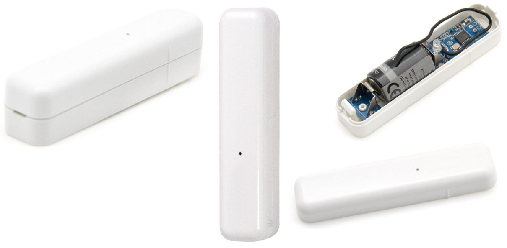

-   **The module**

-   **The Jeedom**

summary
======

Placed in a room, the temperature of the desired room will go up
automatically. In addition, associated with a receiver type EMR-2000 or
EDR-B4 (4 outputs) you will have a connected and controllable thermostat
from anywhere in the world through the internet.

The signal is only sent after detecting a difference in
temperature of o, 5 ° C or 1 ° C or every 5 minutes. In addition, the sensor
is compact and discreet.

The integrated LED indicator signals any change of state.

functions
=========

-   Battery powered wireless temperature sensor

-   Ultra compact

-   Signal transmitted instantly when an increase or decrease
    of the temperature

-   Ease of use and installation

-   Wall mounting with screws or double-sided

-   Battery level information

Technical characteristics
===========================

-   Module type: Edisio transmitter

-   Use: Indoor

-   Power Supply: 3VDC (ER14250 Lithium Battery)

-   Autonomy: Up to 3 years

-   Frequency: 868.3 MHz

-   Operating temperature: 0 ° C + 45 ° C

-   Free field range: 100M

-   Dimensions: 25x79x19mm

-   Degree of protection: IP20

Module data
=================

-   Brand: Edisio Smart Home

-   Name: ETS-200

General configuration
======================

To configure the Edisio plugin and associate a module with Jeedom,
refer to this
[Documentation](https://www.jeedom.fr/doc/documentation/plugins/edisio/fr_FR/edisio.html).

> **Important**
>
> So that Jeedom automatically creates your sending modules, do not forget
> do not activate the option in the plugin configuration.

> **Tip**
>
> The placement is recommended at a height of 150 cm and close to
> the desired temperature.

Button "E"
----------

You will find below the button "E" which is the button of association of the
temperature sensor.

Adjusting the temperature delta
-------------------------------

By default, the temperature delta is programmed at 1 ° C (+/- 10%) in order to
optimize the battery life. You have the opportunity to
set this parameter:

Association of the sensor at Jeedom
===============================

The combination of the temperature sensor is a breeze. It is enough
press the "E" button, located under the sensor. This one will be
recognized automatically. Put it in an object, give it a name and
save.

Once your equipment is associated, you should get this:

Orders
---------

Once your equipment is created, you should get the orders
associated with the module:

Here is the list of orders:

-   Temperature: This is the command that indicates the temperature read

-   Battery: Indicates the status of the battery

information
------------

Once your equipment associated with Jeedom, various information will be
available:

-   Creation: Indicates the date on which the equipment was created

-   Communication: Indicates the last call recorded between
    Jeedom and the micro-module

-   Battery: Indicates battery status of battery modules

-   Status: Returns the status of the module

**@Jamsta**
