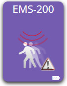

-   ** ** El módulo

-   ** El Jeedom visual **

resumen
======

Colocado en un pasillo, sala de estar, garaje de su casa, por ejemplo,
el sensor de movimiento detecta un cambio de estado de presencia es
instantánea.

Gracias a su amplio ángulo de visión y alcance, se puede asegurar
una amplia zona. El indicador LED integrado muestra los cambios
Estado.

funciones
=========

-   Detecta el movimiento, incluso en completa oscuridad

-   ultracompacta

-   La señal es transmitida inmediatamente después de la detección

-   tamper arranque

-   Facilidad de uso e instalación

-   El montaje en pared mediante tornillos o de doble cara

-   La información sobre el nivel de la batería

Características técnicas
===========================

-   Tipo de módulo: Transmisor Edisio

-   Alimentación: 3VDC (batería de litio ER14250)

-   Frecuencia: 868,3 MHz

-   Temperatura de funcionamiento: 0 ° C + 45 ° C

-   Rango en campo libre: 100M

-   Rango de detección: 6M

-   Tamaño: 25x79x19mm

-   Protección: IP20

-   Uso: en la residencia

datos de los módulos
=================

-   Marca: Smart Home Edisio

-   Nombre: EMS-200

configuración general
======================

Para configurar Edisio plugin y asociar un módulo de Jeedom,
referirse a este
[Documentación] (https://www.jeedom.fr/doc/documentation/plugins/edisio/fr_FR/edisio.html).

> ** Importante **
>
> Para Jeedom crea automáticamente los módulos de transmisión, recuerde
> No hay que activar la opción en la configuración del plugin.

> ** Tip **
>
> La inversión es aconsejable a una altura de 150 cm y cerca
> Al igual que la temperatura deseada.

Botón "E"
----------

Se encuentra el botón "E", que es el botón Conectar el sensor
temperatura.

detección
---------

El sensor detecta el más mínimo movimiento dentro de un intervalo de aproximadamente 6m

Ajuste del temporizador
-----------------------

De manera predeterminada, el temporizador se desactiva. Este parámetro se utiliza para configurar
el plazo :

Asociar el sensor a Jeedom
===============================

La combinación del sensor de movimiento, es simple. lo
Sólo tiene que pulsar el botón "E" que se encuentra debajo del sensor. Esto será
automáticamente reconocido por Jeedom. Es suficiente para visitar el
Plugin de Edisio. Así que se puede colocar en un objeto, darle una
un nombre y guardar.

Una vez que su equipo pareja, usted debe conseguir esto:

> ** Tip **
>
> Para que el widget para estar presente en el salpicadero, considere colocar
> Su equipo en un objeto.

comandos
---------

Una vez creada su equipo, debe obtener órdenes
asociado con el módulo:

Estos son los comandos:

-   Presencia: Este es el comando que indica si una presencia es
    detectado

-   Batería: Indica el estado de la batería

información
------------

Una vez que su equipo asociado con Jeedom, diversa información se
disponibles:

-   Creación: Muestra la fecha en que se creó el equipo

-   Comunicación: Indica la última comunicación registrada entre
    Jeedom y el módulo

-   Batería: Indica el estado de la batería de módulos de batería

-   Estado: Devuelve el estado del módulo

alternativa visual
=================

F.A.Q.
======

Cómo conducir un receptor Z-Wave?

: Con el plugin Escenario Jeedom.

¿Cómo puedo tener la misma visual?

: Con el plugin widgets de Jeedom.

** ** @ Jamsta
