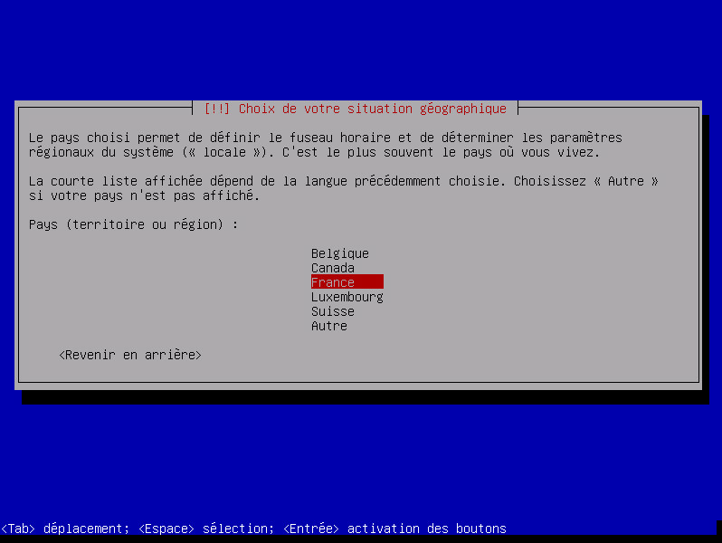
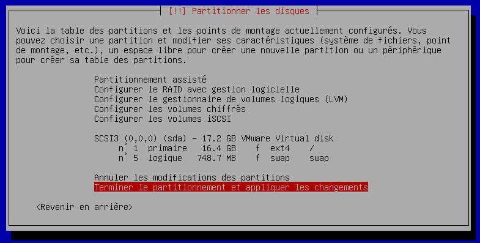
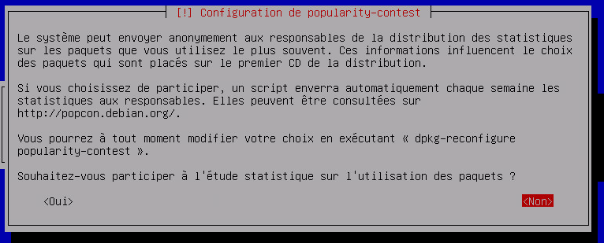

We will see here how to install a Debian, as well as
than VM or in direct installation on a physical machine

Recovery of sources
========================

You can find the latest Debian version in netinstall (size
minimal but need internet for installation)
[here] (https://www.debian.org/CD/netinst) (you have to take the image
amd64) or click directly
[Here] (http://cdimage.debian.org/debian-cd/9.1.0/amd64/iso-cd/debian-9.1.0-amd64-netinst.iso)
to download the iso.

Launching the installation
===========================

On a physical machine
------------------------

You have to either burn the iso on a CD and put the CD in the machine
(but nowadays CD players are increasingly rare) or so
create a bootable USB key.

For the bootable USB key you have to download rufus
[there] (http://rufus.akeo.ie/downloads/rufus-2.9.exe), launch it and
configure like this:

> ** Note **
>
> Remember to select the ISO file you downloaded
> just before

All you have to do is click on start, then put the USB key
on the machine and have it booted on.

On a VM
----------

The manipulation is quite simple, you create a new machine
virtual, you plug in, put a virtual CD drive on it that points
to the iso (remember to connect it) and you start the machine. See
[Here] (https://jeedom.github.io/documentation/howto/fr_FR/doc-howto-vmware.creer_une_vm.html)
for more details.

Installation
============

Press enter to start the installation:

Choose "French" and confirm with the enter key

Here you have to choose "French" (French)

Same,

Enter the name of your machine (here nabaztag but if it's a jeedom
put jeedom)

Just press enter:

Put a password, I advise you a simple here (like oooo),
it can be changed later (passwd command):

Give it back:

Give the name of the main user (here nabaztag but if it is a
jeedom put jeedom)

Give the same thing:

Put a password, I advise you a simple here (like oooo),
it can be changed later (passwd command):

Give the same thing:

Confirm by pressing enter:

Same,

Confirm again by pressing enter:

We still validate:

And even :

Choose "France" and confirm:

Confirm by pressing enter:

Same,

And again (yes we valid a lot on a debian installation):

Now more complicated, you have to deselect "environment of
Debian desktop "by pressing the space key and select" server
SSH "pressing space (you have to move with the arrows of
keyboard), then validate by pressing enter:

We validate again:

You have to choose / dev / sda then validate:

There you just have to remove the USB key, the cdrom or the virtual cdrom
and press enter:

That's your debian installation is over. You can stop the
tutorial there if you want it or follow the following steps for a few
system modifications (useful especially for jeedom).

Optimization for Jeedom
========================

To prepare the installation of Jeedom you can do some
optimizations:

Add vim and sudo
-------------------

    sudo apt-get install -y vim sudo

Add fail2ban
----------------

Fail2ban is a software that allows to secure access to your debian,
in case of too many connection failures it blocks access to
the IP in question (so not to everyone, only to the attacker) a
time.

    sudo apt-get install -y fail2ban

Add Open VMware Tools
-----------------------------

Open VMware Tools install system-specific drivers
installed and bring the optimizations of this hosted OS
on an ESXi hypervisor.

    sudo apt-get install -y open-vm-tools

All you have to do is install Jeedom by following
[This] (https://jeedom.github.io/documentation/installation/fr_FR/doc-installation.html#_autre)
