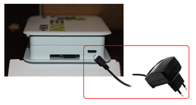

First of all thank you for buying the Jeedom Mini +. Here you will find
the detailed documentation on how to put this
box, and discover home automation with Jeedom.

The Jeedom Mini + box you received must contain:

-   Jeedom Mini + Box (JeedomBoard Mono Card - ARM Cortex A9 1.2Ghz
    & 512 MB of RAM)

-   A 5V 2A mains charger.

-   A micro SD card with Jeedom software pre-installed. (This
    card is normally already inserted in the box)

-   A MicroSD / SD Card adapter.

-   A Jeedom sticker.

-   * An RFXcom 433E module with its USB cable. * (Only if you have
    bought the starter pack with RFXcom interface).

-   * A Z-Wave + RaZberry card. * (Only if you purchased the pack
    Z-Wave + compatible start-up card) (This card is normally already
    installed in the box)

Before you can use it, you need to plug in your Jeedom Mini + box
on your local network (on router, switch or your internet box ...), and
on the sector.

Before you begin, please note that Jeedom works with the help of
plugins. Several plugins are preinstalled on your Jeedom Mini +:

The Z-Wave plugin used to configure your Z-Wave network and add
new Z-Wave modules.

The Mail plugin.

The Widget and Script plugins.

The weather plugin.

You will find many more plugins directly via
the Jeedom interface on the Jeedom Market.

In addition, do not forget that you have 2 coupons
(sent by email), allowing you to install 2 paid plugins
free (RFXCOM and Alarm). To use it you have to create a
account on the Jeedom Market, see the documentation: [Doc
Market] (https://jeedom.fr/doc_market.php).

In the e-mail you received, you will also find the Service number
Pack associated with Jeedom Mini +. You can inform him about your
Market profile, this will allow you, among other things, access to
different services that correspond to your service pack.

You can now follow the documentation: [First steps with
Jeedom] (https://www.jeedom.fr/doc/documentation/premiers-pas/fr_FR/doc-premiers-pas.html)
That will allow you to find the IP address of your Jeedom Mini + and
you connect to it to start setting up and using it.

To deepen the discovery and use of Jeedom, you have
complete documentation: [Documentation
Jeedom] (https://jeedom.fr/doc) and also a section listing
the video tutorials: [Video tutorials] (https://jeedom.fr/video.php).
Feel free to visit the Jeedom Forum for any other
question: [Forum Jeedom] (https://forum.jeedom.fr/).

Thank you, and good discovery of home automation with Jeedom.
