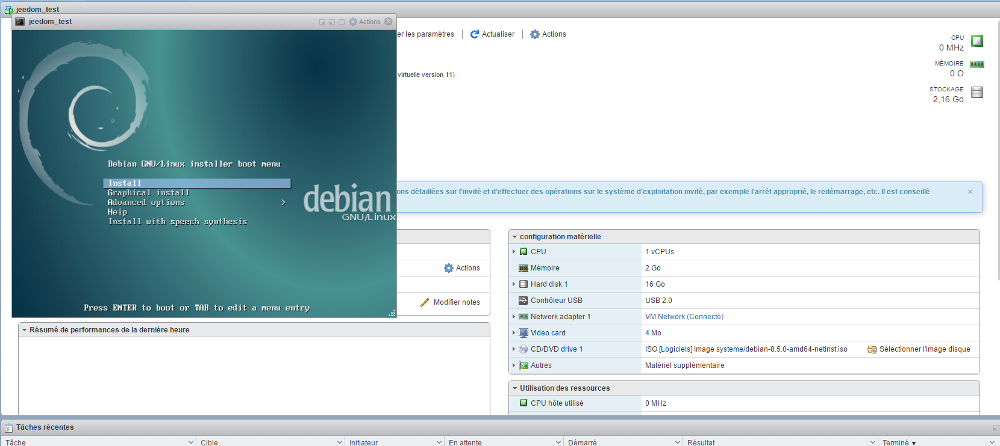
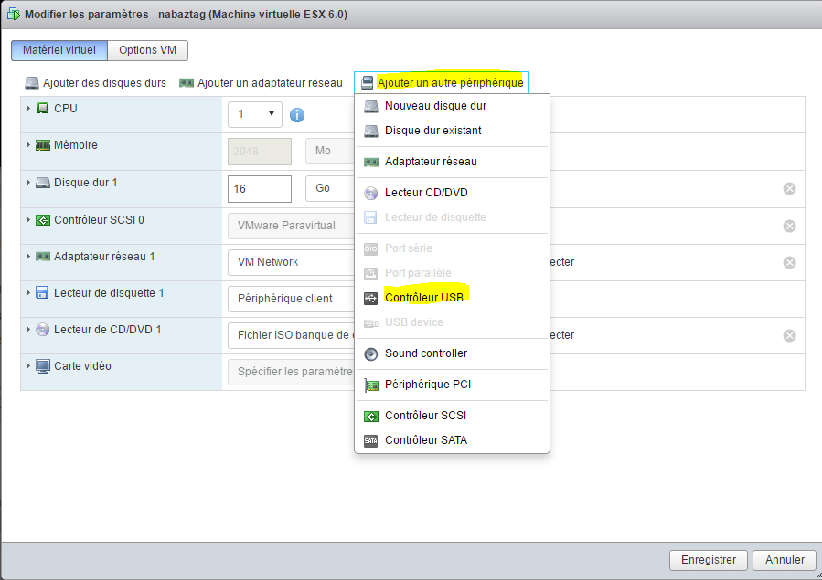

We will see here how to create a VM under VMware.

There is a little important thing to know about VMware, there is 2
way of the manager:

-   the web interface (present by default in 6.0 update 2, or by the
    vibrate for the other versions), it is accessed by
    IP \ _ESXI / ui

-   the heavy and historic VMware client (vSphere client)

Here I will mainly use the web interface because I think it's
the future of VMware, which is moving away from the heavy client
(By the way all the novelties since the 5.1 are not usable
with the heavy client).

Also note that the web interface is still being set up
at VMware, you will probably encounter some bugs or
slowdowns with but a little refreshment of the page and that
leave without worries.

Login to the web interface
===========================

Go to IP \ _ESXI / ui with your internet browser, you must have:

> ** Note **
>
> If you do not have anything I advise you to install
> the web interface, all the information
> [here] (https://jeedom.github.io/documentation/howto/fr_FR/doc-howto-vmware.trucs_et_astuces.html)

Enter your login credentials for ESXI:

As you can see the interface is quite nice and allows to
do a lot of things, I will not go into details but you
can already from this screen:

-   stop / restart the ESXi

-   see the use of resources (CPU, memory and disk)

-   have information about your system (operating time,
    version of VMware, version of bios, display of datastores)

-   button to create a VM (we'll use it right after)

-   an action button that allows you to switch to maintenance mode
    (practical if you have an ESXi cluster otherwise you do not
    will never serve), enable / disable SSH service (is used
    in the backups configuration tutorial)

Sending the installation iso
=============================

After downloading your installation iso
([Here] (http://cdimage.debian.org/debian-cd/8.5.0/amd64/iso-cd/debian-8.5.0-amd64-netinst.iso)
for example for debian 8.5 in netinstall), you have to put it on
your datastore.

For this click on datastore:

Select your datastore (usually it's called datastore1):

Click on "Datastore Browser":

Click on "Download" (the first):

Select the iso previously downloaded and validate:

You can then follow the progress of the shipment:

Once finished you can see that your iso has arrived on the
datastore:

Creating your first VM
=============================

Click on the "Create / Save VM" button:

Click Next:

Then give a name to your machine and specify its system
operating (here we will install a Debian):

Indicate the target datastore:

Here you will be able to configure the parameters of your machine (disk
hard, CPU, memory ...):

> ** Note **
>
> All these parameters can be modified afterwards without any problem, to note
> all the same that it is not really possible to reduce the size
> of a hard disk, we can increase it (but we have to know how to manage it at
> OS level next) but not reduce it.

At the CD / DVD player, select "ISO Bank File"
data ":

Then select the location where your ISO is stored (see
previous chapter) and confirm:

Then do next:

Then you have a summary of your configuration, click on
"Finish":

A message at the top will tell you that it's good, then click on
"Virtual Machines":

You must see your virtual machine (if it is not the case click
on "Refresh") click on it:

You must have a page like this, click on the play button:

Your machine will launch and you will be able to install
your OS:

> ** Important **
>
> Once your machine is installed, ABSOLUTELY install them
> VMware tools (this allows VMware to have information about your VM
> and extinguish it properly). Under debian just do
> "sudo apt-get -y install open-vm-tools".

For the rest of the installation I invite you to read this
[Tutorial] (https://jeedom.github.io/documentation/howto/fr_FR/doc-howto-debian.installation.html#_installation)

Mount USB peripherals in the VM
=======================================

> ** Note **
>
> If you do not have the options below it is necessary to put in
> day the ESXi Embedded Host Client, all the information
> [here] (https://jeedom.github.io/documentation/howto/fr_FR/doc-howto-vmware.trucs_et_astuces.html)

It's a pretty rare need, but I had to use it for Jeedom, in
effect I have on my ESXi the keys Zwave, RFXcom, edisio, enOcean and GSM
connected and I had to connect them to my VM Jeedom to be able to
use it.

> ** Note **
>
> For Zwave, RFXcom, edisio and enOcean there is no problem, for
> GSM keys you have to follow this
> [tutorial] (https://jeedom.github.io/documentation/howto/en_US/doc-howto-gsm.huawei_mode_modem.html)
> before to force the key in modem mode only if it is not
> not seen correctly on the ESXi.

Go to your VM then do "Change settings":

Click on "Add another device" then USB controller:

> ** Note **
>
> The following step should be repeated for each USB device that
> you want to connect

Save, redo "Change settings", then "Add another
device "and" USB device ":

Choose your USB device from the drop-down list:

And here your device is plugged into your VM. Every
restart it will be auto reconnected to the VM and if you
physically disconnect / connect then it will be reconnected to
your VM. In other words the use is now totally
transparent.
