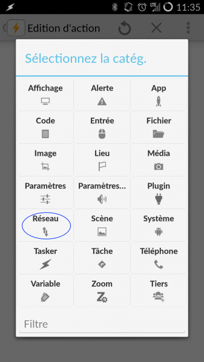

meta
========

Este artículo tiene como objetivo que le guiará en el uso de Android
hablar con Jeedom. Utilizaremos las interacciones Jeedom motor
permite hacer peticiones y responder Jeedom allí (y también, si
deseados, diferentes escenarios o elementos activos).

instalación
============

Prerrequisitos
-------------

Naturalmente, usted tiene un dispositivo Android (tablet, teléfono, PC
micrófono y altavoces) e instalarlo
[Tasker] (https://play.google.com/store/apps/details?id=net.dinglisch.android.taskerm&hl=fr)
y
[Autovoz] (https://play.google.com/store/apps/details?id=com.joaomgcd.autovoice&hl=fr).
Esto permite crear sus propios comandos de voz de Google Now
para automatizar tareas utilizando la voz.

Nota: autovoz único componente a charlar, pero Jeedom
Jeedom no permite responder. Para que haga, no se necesita
plug-in Tasker. este ejemplo también se puede utilizar en la sustitución de
autovoz expresar reconocimiento por parte de una etiqueta NFC, una de geolocalización,
un SMS recibido ...

El principio
-----------

Vamos a utilizar un perfil de estado Tasker. Esta será una
autovoz reconocimiento de voz. La siguiente tarea se le pedirá que
Tasker realizar dos acciones. La primera será a él y llamar Jeedom
transmitir el resultado de texto de reconocimiento de voz. La segunda
indicará el retorno Jeedom.

crear perfil de
==================

un nuevo perfil se añade con una condición ** ** como un disparador.

Se selecciona Plugin ** ** en la primera pantalla.

Por tipo de plug-in, la selección de autovoz ** **.

En autovoz **** submenú, seleccionando Reconocido** **.

Puede guardar la configuración por defecto, si no quiere
especificar palabras clave u otros parámetros.

Podemos dar un nombre al perfil como "Interacciones" y Jeedom
copia de seguridad se realizará después de que el marco de una misión.

La tarea
========

Se añade una nueva tarea ** ** al perfil recién creado. por
ejemplo, puede ser llamado "Jeedom API".

La tarea incluirá eventualmente dos acciones: llamada a la API ****** y digamos
** retorno.

En primer lugar vamos a añadir una acción ** ** Tipo de red.

A continuación, selecciona ** ** HTTP GET.

Allí se llenarán de información Jeedom. Aquí está la información
Entrar :

-   Servidor: puerto: `https: // mondomain.tld`

-   ruta:
    `/jeedom/core/api/jeeApi.php? Apikey votreclef = & tipo = interactuar y consulta = UTF-8 y %avcommnofilter = 1`

No se olvide de poner su clave de API en lugar de la cadena
`Votreclef`. Debemos dejar que `%avcommonfilter` al final, será
reemplazado por el regreso de autovoz.

Añadir una acción de ** ** Say. Para ello, las acciones de filtrado
poner "decir" en la lupa.

Y vamos `HTTPD`% en el campo de texto.

Se acabó. En reconocimiento de texto por autovoz, se Jeedom
llamó y se le configuró en las interacciones de respuesta
se habla por teléfono. Recuerde que debe configurar
interacciones Jeedom y nada le puede pedir que
desee. De "¿cuál es la temperatura de la sala de estar" a "encender la luz
viva ".

> **Tip**
>
> Si no funciona desde el principio, a menudo porque es autovoz
> No está activo. Para este lanzamiento, haga clic en Google Now
> Integración y la primera opción en la parte superior y permitir
> Autovoz.

> **Tip**
>
> Por defecto, desactiva la búsqueda autovoz Google Now, se
> Posibilidad de anular este comportamiento, ya que en Tasker clic
> Su perfil y "edición" (lápiz pequeño) y "avanzado" (mientras
> Abajo), y desactive "Haz de búsqueda de Google Now" (en la parte inferior).
