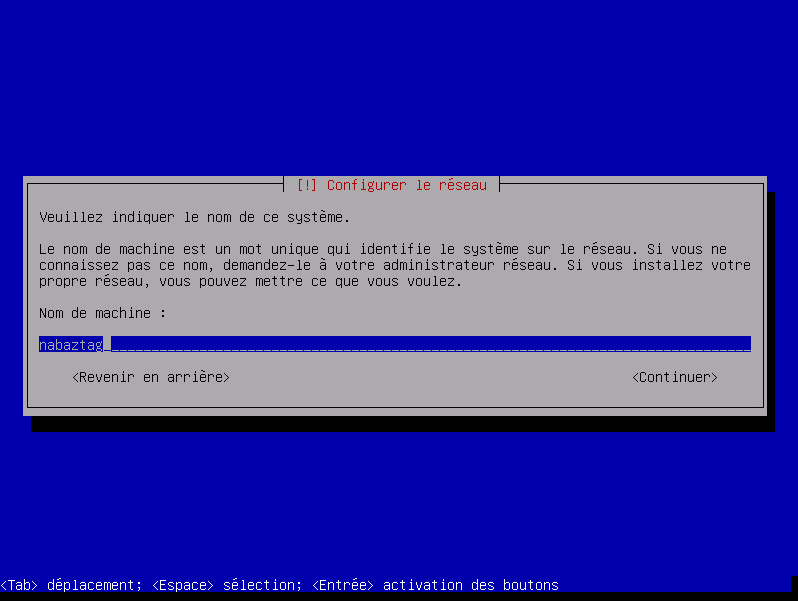
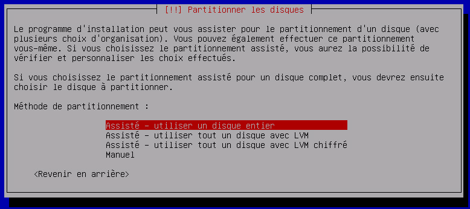
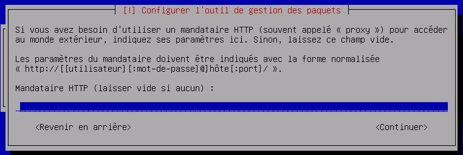

Veremos cómo instalar Debian, así como
que VM o instalación directa en una máquina física

Conseguir las fuentes
========================

Puede encontrar las últimas Debian versión netinstall (tamaño
mínima, pero necesita internet para la instalación)
[Aquí] (https://www.debian.org/CD/netinst) (que tiene que tomar la imagen
amd64) o hacer clic directamente
[Aquí] (http://cdimage.debian.org/debian-cd/9.1.0/amd64/iso-cd/debian-9.1.0-amd64-netinst.iso)
para descargar la iso.

Inicio de la instalación
===========================

En una máquina física
------------------------

Que o bien quemar el ISO en un CD y poner el CD en la máquina
(Sin embargo, nuestros jugadores el día de CD son cada vez más raro) o de lo contrario
crear una memoria USB de inicio.

Para memoria USB de inicio debe descargar rufus
[No] (http://rufus.akeo.ie/downloads/rufus-2.9.exe), el inicio y
configure de esta manera:

> ** Nota **
>
> Recuerde seleccionar el archivo ISO que descargó
> Justo antes

Sólo tiene que hacer clic en Inicio y, a continuación, poner el stick USB
en la máquina y para arrancarlo.

En una máquina virtual
----------

El manejo es muy sencillo, se crea una nueva máquina
virtual, la conexión, ponga una unidad de CD virtual que apunta anteriormente
a iso (Recuerde conectar) y se inicia la máquina. Ver
[Aquí] (https://jeedom.github.io/documentation/howto/fr_FR/doc-howto-vmware.creer_une_vm.html)
para más detalles.

instalación
============

Pulse Intro para iniciar la instalación:

Seleccione "francés" y pulsar la tecla enter

Aquí hay que elegir la opción "Francés" (francés)

mismo

Introduzca el nombre de su máquina (nabaztag aquí, pero si es un jeedom
poner jeedom)

Sólo la entrada de prensa:

Poner una contraseña, yo le aconsejo que simplemente aquí (como oooo)
se puede cambiar más tarde (comando passwd):

Poner de nuevo el mismo:

Dar el nombre de usuario principal (nabaztag aquí, pero si se trata de una
jeedom jeedom opción de venta)

Vuelva a colocar la misma cosa:

Poner una contraseña, yo le aconsejo que simplemente aquí (como oooo)
se puede cambiar más tarde (comando passwd):

Vuelva a colocar la misma cosa:

Confirmar con entrada:

mismo

Una vez más confirmar con la tecla Enter:

Nos sigue siendo válida:

Y todavia :

Elija "Francia" y validar:

Confirmar con entrada:

mismo

Y sin embargo (sí un lote válida acerca de una instalación de Debian):

Ahora más complicado, hay que anular la selección de "entorno
oficina de Debian "pulsando la tecla de espacio y seleccione" Servidor
SSH "pulsando espacio (debe moverse con la flecha
teclado), a continuación, confirmar con la tecla ENTER:

Nos válida una vez más:

Debemos elegir / dev / sda y validar:

No sólo hay que quitar la llave USB, el CD-ROM o CD-ROM virtuales
y presione ENTRAR:

Aquí se ha terminado la instalación de Debian. Puede detener el
tutorial aquí si quieres o seguir los pasos de unos pocos
cambios en el sistema (útil especialmente para jeedom).

optimización Jeedom
========================

Para preparar la instalación de Jeedom usted puede hacer algo
optimizaciones:

Añadir vim y sudo
-------------------

    sudo apt-get install sudo vim -y

Añadir fail2ban
----------------

Fail2ban es un software que permite el acceso seguro a su debian,
si demasiados fallos en la conexión bloquea el acceso a
IP en cuestión (por lo que no es para todos, sólo el atacante) una
tiempo.

    sudo apt-get install fail2ban -y

Añadir Abrir las herramientas de VMware
-----------------------------

Open las herramientas de VMware instalar controladores específicos para el sistema
Operativo instalado y proporcionar optimizaciones que SO alojado
en un hipervisor ESXi.

    sudo apt-get install -y-vm-herramientas abiertas

Sólo será instalar Jeedom siguiente
[Este] (https://jeedom.github.io/documentation/installation/fr_FR/doc-installation.html#_autre)
