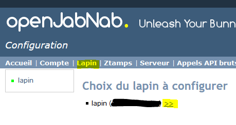
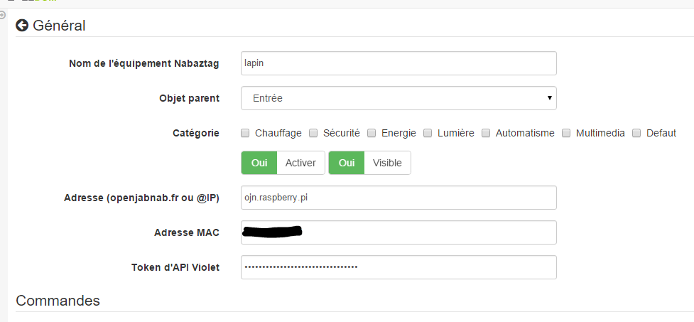

Aquí hay un tutorial sobre cómo instalar openjabnab localmente (en una o RPI
zumbido)

> ** Nota **
>
> Este tutorial se basa en gran medida en
> [Los mismos] (http://jetweb.free.fr/nabaztag_rpi/Tutoriel_OJN_RPi_v1-1.pdf)

dependencias de instalación
============================

Una vez que el sistema está instalado SSH hizo:

    apt-get update
    apt-get dist-upgrade
    apt-get install ssh
    apt-get install apache2 php5-mysql php5 libapache2-mod-php5
    reescritura a2enmod
    apt-get install make
    apt-get install build-essential
    apt-get install libqt4-dev-desaparecidos --fix
    apt-get install Qt4-dev-herramientas
    apt-get install bind9
    apt-get install git

Configuración de la red
=======================

A continuación, debe recuperar la dirección IP del sistema:

    ifconfig

El resultado es:

    eth0 Link encap: Ethernet HWaddr d0: 63: B4: 00: 54: 98
              inet addr: 192.168.0.162 Bcast: Máscara 192.168.0.255: 255.255.255.0
              inet6 addr: fe80 :: D263: b4ff: FE00: Alcance 5498/64: Enlace
              UP BROADCAST RUNNING MULTICAST MTU: 1500 Métrica: 1
              paquetes RX: 10721 Errores: 0 Eliminado: 0: 0 los sobrantes de bastidor: 0
              TX paquetes: 6477: 0 errores cayeron: 0 excesos: 0 portadora: 0
              colisiones: 0 txqueuelen: 1000
              bytes RX: 2032942 (1,9 MiB) TX bytes: 1230703 (1,1 MiB)

La dirección IP es 192.168.0.162.

> ** Nota **
>
> Para el resto del tutorial voy a utilizar esta IP, es, por supuesto,
> Reemplazar en función de la realidad

A continuación, editar /etc/resolv.conf

    /etc/resolv.conf vim

Y añade:

    192.168.0.162 servidor de nombres

Configuración de DNS
====================

Editar el archivo /etc/bind/named.conf.local

    cd / etc / bind /
    named.conf.local vim

Y añade:

    "Raspberry.pi" {area
     -Type master;
     presentar "/etc/bind/db.raspberry.pi";
    };
    "0.168.192.in-addr.arpa" {area
     -Type master;
     presentar "/etc/bind/db.192.168.0.inv";
    };

Crear el archivo db.raspberry.pi

vim db.raspberry.pi ---

Y ponerlo:

    $ TTL 604800
    @ IN SOA ojn.raspberry.pi. root.raspberry.pi. (
     1; de serie
     604800; refrescar
     86400; reintentar
     2419200; expira
     604,800); TTL caché negativo
    ;
    @ IN NS ojn.raspberry.pi.
    OJN EN UN 192.168.0.162
    192.168.0.162 192.168.0.162 EN UN

A continuación, cree el archivo de db.192.168.0.inv

    db.192.168.0.inv vim

Y poner:

    $ TTL 604800
    @ IN SOA ojn.raspberry.pi. root.localhost. (
     2; de serie
     604800; refrescar
     86400; reintentar
     2419200; expira
     604,800); TTL caché negativo
    ;
    @ IN NS ojn.raspberry.pi.
    162 IN PTR ojn.raspberry.pi.

> ** Importante **
>
> Recuerde reemplazar el 162 en la última fila de la última
> Parte de la IP de su sistema de

Iniciar el DNS:

    inicio /etc/init.d/bind9

Prueba si esto es bueno:

    ojn.raspberry.pi de ping

Usted debe tener:

    root @ Cubox-i: / home / OJN # ping ojn.raspberry.pi
    Ojn.raspberry.pi PING (192.168.0.162) 56 (84) bytes de datos.
    64 bytes de ojn.raspberry.pi (192.168.0.162): icmp_seq = 1 TTL = 64 tiempo = 0069 ms
    64 bytes de ojn.raspberry.pi (192.168.0.162): icmp_seq = 2 TTL = 64 tiempo = 0067 ms
    64 bytes de ojn.raspberry.pi (192.168.0.162): icmp_seq = 3 TTL = 64 tiempo = 0059 ms
    64 bytes de ojn.raspberry.pi (192.168.0.162): icmp_seq = 4 TTL = 64 tiempo = 0068 ms
    ^ C
    Ojn.raspberry.pi --- --- estadísticas de ping
    4 Los paquetes transmitidos, 4 recibieron, 0% de pérdida de paquetes, 3000ms tiempo
    rtt min / avg / max / MDEV = 0,059 / 0,065 / 0,069 / 0,010 ms

> ** Nota **
>
> Tienes que CTRL + C para salir de la tabla

Por razones de seguridad también vamos a añadir la resolución en / etc / hosts, hacemos:

    vim / etc / hosts

Y añade:

    ojn.raspberry.pi 192.168.0.162

openjabnab recuperación
=========================

Primero crearemos el usuario:

    adduser OJN
    cd / home / OJN

A continuación, clonar openjabnab:

    git clone https://github.com/OpenJabNab/OpenJabNab.git
    chown -R OJN: OJN / home / OJN / OpenJabNab /
    chmod 0777 / home / OJN / OpenJabNab / HTTP-envoltura / ojn_admin / include

Configuración del servidor Web
============================

Marca:

    cd / etc / apache2 / sites-available /
    ojn.conf vim

Y añade:

    <VirtualHost *: 80>
            DocumentRoot / home / OJN / OpenJabNab / HTTP-envoltura /
            ServerName ojn.raspberry.pi
             <Directory />
                     FollowSymLinks opciones
                    AllowOverride None
             </ Directory>
             <Directorio / home / OJN / OpenJabNab / HTTP-envoltura />
                     Options Indexes MultiView FollowSymLinks
                     AllowOverride todo
                    Orden allow, deny
                     Dejar de todas las
             </ Directory>
    </ VirtualHost>

A continuación, active la página web:

    a2ensite OJN

A continuación, debe autorizar el directorio del servidor openjabnab, hacer:

    /etc/apache2/apache2.conf vim

Y añade:

    <Directorio / home / OJN />
            Options Indexes FollowSymLinks
            AllowOverride None
            Por supuesto todos los requerir
    </ Directory>

A continuación, reinicie Apache:

    Servicio apache2 reload

openjabnab instalación
=========================

Marca:

    sabía OJN
    cd / home / OJN / OpenJabNab / servidor
    qmake -r
    hacer

> ** Nota **
>
> Este paso puede ser muy largo (hasta 45 minutos)

Configuración openjabnab
==========================

Marca:

    PC-dist bin openjabnab.ini / openjabnab.ini
    bin vim / openjabnab.ini

Y cambiar las siguientes líneas:

    StandAloneAuthBypass = true
    AllowAnonymousRegistration = true
    AllowUserManageBunny = true
    AllowUserManageZtamp = true

Y reemplazar todo my.domain.com * * * * por ojn.raspberry.pi

openjabnab Configuración del servidor Web
=======================================

En su puesto tiene que editar el archivo
C: \\ windows \\ system32 \\ \\ conductores etc y añadir:

    ojn.raspberry.pi 192.168.0.162

A continuación, vaya a:

    http: //ojn.raspberry.pi/ojn_admin/install.php

confirma en su totalidad

Inicio del servidor
====================

Aquí todo está listo sólo queda iniciar el servidor:

    sabía OJN
    cd ~ / OpenJabNab / server / bin
    ./openjabnab

Ahora vaya a:

    http: //ojn.raspberry.pi/ojn_admin/index.php

> ** Nota **
>
> Si todo es correcto que deben tener las estadísticas que aparecen en
> baja

Configuración del conejo
======================

Para configurar el conejo es bastante simple, debe desenchufar el
vuelva a conectar, la estancia pulse el botón. Debe
Normalmente iluminará en azul.

Luego, con su PC debe tener una nueva red inalámbrica
nabaztagXX, ingrese él escribiendo 192.168.0.1.

Una vez que se complete la configuración y la información inalámbrica
siguiente:

    DHCP habilitado: No se
    Máscara local: 255.255.255.0
    Local Gateway: 192.168.0.1 192.168.0.254 o (dependiendo de la red)
    servidor DNS: 192.168.0.162

openjabnab la supervisión del servidor y de inicio automático
================================================== ==

Como se dará cuenta si inicia una sesión del servidor
openjabnab detiene. Así que añadir un pequeño script para
supervisar el servidor y empezar automáticamente. Marca:

    cd / home / OJN
    checkojn.sh vim

Y añadir en:

    si [$ (ps ax | grep openjabnab | grep -v grep | wc -l) -eq 0]; entonces
        OJN SU; cd / home / OJN / OpenJabNab / server / bin; nohup ./openjabnab >> / dev / null 2> & 1 y
    fi

A continuación, hacer:

    chmod + x checkojn.sh

Ahora hay que añadir la secuencia de comandos en el arranque y verificación
cada 15 minutos, por ejemplo:

    crontab -e

Y añade:

    @reboot /home/ojn/checkojn.sh
    * / 15 * * * * /home/ojn/checkojn.sh

> ** Importante **
>
> Asegúrese de ponerlo en el crontab de root, si está
> Incluso con Ctrl + D OJN usuario

Configuración de su conejo en openjabnab
============================================

Ir a:

    http: //ojn.raspberry.pi/ojn_admin/index.php

Usted debe tener :

Ahora tiene que crear una cuenta haciendo clic en crear una
usuario:

Complete la información solicitada y log:

Una vez conectado al servidor de ir:

A continuación, desplácese hacia abajo para encontrar la lista de conejos conectados y recuperar
Dirección MAC:

A continuación, vaya a la cuenta y entrar en el campo del nombre y la dirección MAC
conejo y validar:

Ahora se encuentra en la página de su conejo de conejo, haga clic
para abrir su configuración:

Ahora debe activar el api morado y moverse en público,
También es aquí donde se encuentra la clave api morado que le servirá
Jeedom para:

A continuación encontrará la lista de plugins, no se olvide de la
interruptor (control TTS tipo o los oídos)

Configuración Jeedom
=======================

La configuración en Jeedom es bastante simple, debe ser primero
SSH en Jeedom (si usted tiene una caja Jeedom identificadores
se encuentran en el documento de instalación). A continuación, edite el archivo / etc / hosts

    vim / etc / hosts

Y añadir la siguiente línea:

    ojn.raspberry.pi 192.168.0.162

Entonces todo lo que ocurre en Jeedom después de crear su conejo aquí
la configuración a:

Esa es su madriguera de conejo tiene ahora su propio local de !!!!!

Ponga el TTS localmente
======================

Todo es local, excepto que pasa por el sitio TTS pero es Acapela
posible mediante la modificación de algunos archivos para pasar a nivel local

> ** Nota **
>
> Voy a considerar que está instalado en oenjabnab
> / Inicio / OJN / OpenJabNab y que está conectado como
> El usuario openjabnab aquí OJN

Creación de TTS jeedom
----------------------

Es necesario crear una carpeta en jeedom servver / TTS:

    mkdir / home / OJN / OpenJabNab / servidor / TTS / jeedom

A continuación, debe ser de 3 archivos:

-   jeedom.pro

<! - ->

    ################################################## ####################
    # Generado automáticamente por qmake (2.01a) Sat de enero 19 de 2008 07:10:01 pm
    ################################################## ####################

    TEMPLATE = lib
    CONFIG - = depuración
    CONFIG + = liberación Plugin qt
    QT + = red xml
    QT - = GUI
    INCLUDEPATH + =. ../../server ../../lib
    TARGET = tts_jeedom
    DESTDIR = ../../bin/tts
    DEPENDPATH + =. ../../server ../../lib
    LIBS + = -L ../../ bin / -lcommon
    MOC_DIR = ./tmp/moc
    OBJECTS_DIR = ./tmp/obj
    Win32 {
      QMAKE_CXXFLAGS_WARN_ON + = WX
    }
    UNIX {
      QMAKE_LFLAGS + = -Wl, -rpath, \ '\ $$ ORIGEN \'
      QMAKE_CXXFLAGS + = -Werror
    }

    # Input
    CABECERAS + = tts_jeedom.h
    SOURCES + = tts_jeedom.cpp

-   TTS \ _jeedom.h

<! - ->

    #ifndef _TTSACAPELA_H_
    #define _TTSACAPELA_H_

    # include <QHttp>
    # include <QMultiMap>
    # include <QTextStream>
    # include <QThread>
    # include "ttsinterface.h"

    clase TTSJeedom: TTSInterface pública
    {
      Q_OBJECT
      Q_INTERFACES (TTSInterface)

    pública:
      TTSJeedom ();
      virtual ~ TTSJeedom ();
      QByteArray CreateNewSound (QString, QString, bool);

    privada:
    };

    #endif

-   TTS \ _jeedom.cpp

<! - ->

    # include <QDateTime>
    # include <qurl>
    # include <QCryptographicHash>
    # include <QMapIterator>
    # include "tts_jeedom.h"
    # include "log.h"
    # include <QNetworkReply>
    # include <QNetworkRequest>
    # include <QNetworkAccessManager>

    Q_EXPORT_PLUGIN2 (tts_jeedom, TTSJeedom)

    TTSJeedom :: TTSJeedom (): TTSInterface ( "jeedom", "Jeedom")
    {
      voiceList.insert ( "en", "fr");
    }

    TTSJeedom :: ~ TTSJeedom ()
    {
    }

    QByteArray :: TTSJeedom CreateNewSound (texto QString, QString voz, bool forceOverwrite)
    {
      bucle QEventLoop;
      if (! voiceList.contains (voz))
        voz = "en";
      // Comprobar (y crear si es necesario) la carpeta de salida
      QDir outputFolder = ttsFolder;
      if (! outputFolder.exists (voz))
        outputFolder.mkdir (voz);

      if (! outputFolder.cd (voz))
      {
        LogError (QString ( "No se puede crear carpeta TTS:% 1") arg (ttsFolder.absoluteFilePath (voz)).);
        QByteArray retorno ();
      }

      // Calcular nomArchivo
      . QString archivo = QCryptographicHash :: almohadilla (text.toAscii () :: QCryptographicHash MD5) .toHex append () ( "mp3.");
      QString filePath = outputFolder.absoluteFilePath (filename);

      if (! forceOverwrite && QFile :: existe (rutaArchivo))
        volver ttsHTTPUrl.arg (voz, nombre de archivo) .toAscii ();

      // Fetch MP3
      QHttp http ( "TODO_IP_JEEDOM");
      QObject :: connect (http y señal (hecho (bool)) y lazo, SLOT (quit ()));

      QByteArray contentData;
      ContentData + = "apikey TODO_API_JEEDOM = & texto =" + qurl :: toPercentEncoding (texto);

      Header QHttpRequestHeader;
      Header.addValue ( "Host", "TODO_IP_JEEDOM");

      Header.setContentLength (ContentData.length ());
      Header.setRequest ( "GET", "/core/api/tts.php?apikey=TODO_API_JEEDOM&text="+QUrl::toPercentEncoding(text), 1, 1);

      http.request (Header, contentData);
      loop.exec ();

      QFile archivo (rutaArchivo);
      si (file.open (QIODevice WriteOnly: :))
      {
        LogError ( "No se puede abrir archivo de sonido para la escritura:" + rutaArchivo);
        QByteArray retorno ();
      }
      file.write (http.readAll ());
      file.close ();
      volver ttsHTTPUrl.arg (voz, nombre de archivo) .toAscii ();
    }

> ** Nota **
>
> Recuerde reemplazar el TODO

A continuación, se activa TTS jeedom editando
/home/ojn/OpenJabNab/server/tts/tts.pro añadiendo jeedom a SUBDIRS:

    TEMPLATE = subdirectorios
    Acapela SUBDIRS = google jeedom

recompilación
-------------

    cd / home / OJN / OpenJabNab / servidor
    qmake -r
    hacer

Cambiar el servicio TTS
------------------------------

Debe editar el archivo /home/ojn/OpenJabNab/server/bin/openjabnab.ini
y cambiar:

    Acapela TTS =

por

    TTS = jeedom

Reinicio openjabnab
--------------------

La forma más sencilla es mediante el reinicio de la máquina para reiniciar openjabnab
