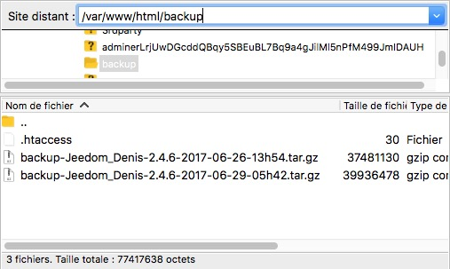

descripción
===========

El procedimiento permitirá conectarse a la caja para SFTP
para ir y obtener copias de seguridad diarias por ella.

> ** Tip **
>
> Tenga en cuenta que este procedimiento funciona, es necesario
> Servidor SSH de la caja sigue siendo funcional.

Instalación de Filezilla
=========================

FileZilla es un software libre disponible en todo
plataformas. Se pueden transferir archivos a través de diferentes
(FTP, FTPS, SFTP ...) Se puede descargar usando este enlace:
<Https://filezilla-project.org/download.php?type=client>

Entrar en la caja
==================

Para conectarse a la caja, sólo tiene que rellenar los campos
Filezilla información de la parte superior de la ventana:

-   Host: Dirección IP Jeedom (sftp: // se añade automáticamente)

-   ID: jeedom

-   Contraseña: Mjeedom96

-   Puerto: 22

A continuación, haga clic en "Conexión rápida"

Navegando en el directorio de copia de seguridad
===========================================

Una vez conectado, es necesario visitar el
directorio de copia de seguridad Jeedom.

2 casos:

-   Apache (Smart Box Jeedom): / var / www / html / copia de seguridad

-   servidor Nginx (Jeedom Mini +):
    / Usr / share / nginx / www / jeedom / copia de seguridad

La ruta a la información del sitio remoto en parte.

Copia de seguridad descarga
===============================

En la lista de copias de seguridad haciendo clic derecho, es posible
lanzado su descarga.

