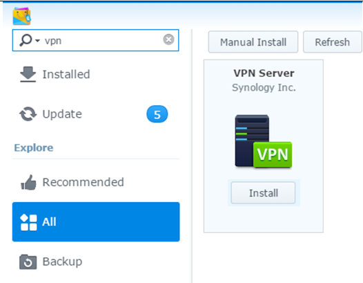
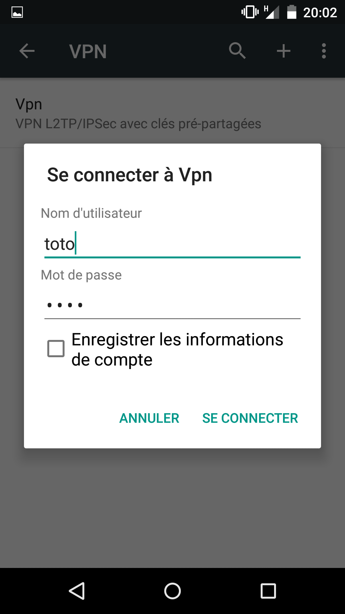

Instalar un servidor VPN
====================

Desde un navegador Web en un ordenador conectado a la misma red
Synology

Ir a la interfaz DSM y acceder con la cuenta de administrador y
vaya al menú principal y seleccione Centro de paquetes

Arriba a la izquierda en la ventana de búsqueda con la palabra VPN.
Servidor VPN debería aparecer, a continuación, haga clic en instalar.

Vuelve al menú principal y seleccionar un servidor VPN

En la apertura de la ventana, vaya a L2TP / IPSec

Seleccione la opción Habilitar servidor L2TP / IPSec VPN

En Dirección IP dinámica, introduzca un número que corresponde a la sub
la asignación de red IP de su dispositivo VPN en la red interna
usted. NB: No seleccione la misma que
Los ajustes de subred a su caja de subred ex libre de
máquinas es 192.168.1.0 por lo que en el ejemplo que pones 2

a continuación, introduzca el número máximo de conexiones que desea permitir
en el servidor VPN y el número máximo de conexiones simultáneas
para un usuario

Finalmente introducir una clave compartida Nota: esta es una contraseña que
entrará en la configuración de la VPN en el móvil o tableta.

Entonces aplique

Un mensaje indica que los puertos deben redirigirse a su
Caja de Internet a su NAS.

Permitir a los usuarios utilizar el servicio de VPN en el NAS
================================================== =============

Vuelve al menú principal y seleccionar un servidor VPN

En el privilegio de selección izquierda

Desactive todas las casillas debajo de PPTP y L2TP VPN abierto

Sólo marque la casilla al lado del usuario que desea
Permitir el uso de la VPN.

> ** Tip **
>
> Se recomienda crear un usuario sólo para VPN
> Sin otros derechos / potenciación que hacen que el VPN.

Redirigir en su caja
===============================

En el navegador de introducir 192.168.1.1. Haga clic en configuración
freebox

Seleccione el modo avanzado

Seleccione Gestión de Puertos

Añadir una redirección

Introduzca la configuración de la siguiente manera.

> ** Tip **
>
> ID de destino es el único que depende de su instalación,
> Es necesario ser el IP de su NAS de Synology

Parada

mientras que la creación Nota se tiene en cuenta

Repita el proceso con los puertos UDP 500 y 4500

Configurar la VPN en tu móvil
==================================

Ir de aplicaciones y seleccione Configuración

Haga clic en Más ...

Haga clic en VPN

Haga clic en el signo + en la parte superior derecha

Nombrando acceso VPN, como el tipo de L2TP / IPSec PSK, introduzca
megafonía de su caja de Internet (o el nombre DNS si avvez
a) e introduzca la clave compartida en la parte llena Configurar
servidor VPN:

Ahora para iniciar la VPN, simplemente haga clic en el nuevo
línea que apareció con el nombre de su túnel VPN

A continuación, introduzca el nombre de usuario y contraseña de usuario que estaba
configurado en la Parte configurar un servidor VPN

Y eso es todo lo que hacen en su teléfono es como si
Wifi que eran!
