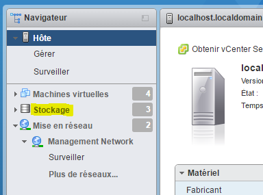
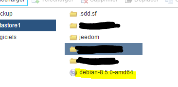
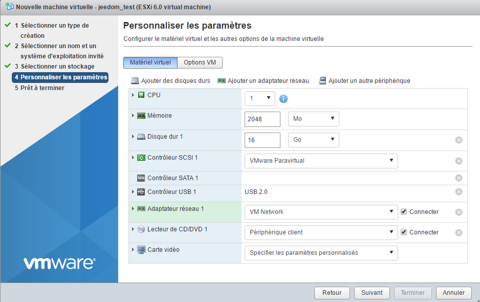
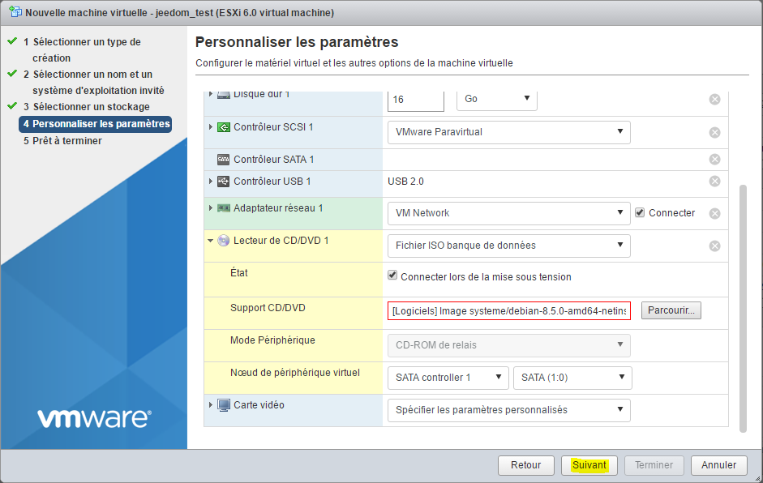
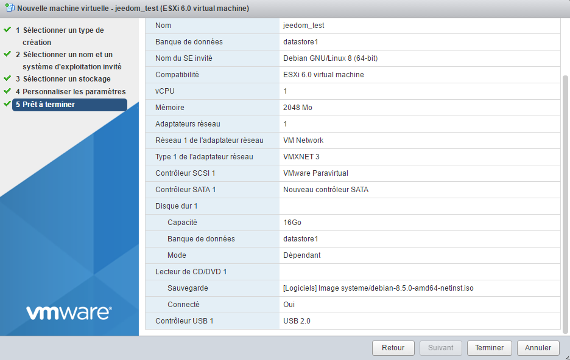

Veremos cómo crear una máquina virtual de VMware bajo.

Hay una pequeña cosa hacia adelante importante saber acerca de VMware hace 2
utilizando el administrador:

-   la interfaz web (presente de forma predeterminada en 6.0 actualización 2, o la
    a través de un Vib para otras versiones) y se accede por
    IP \ _ESXI / ui

-   pesado e histórico VMware cliente (cliente vSphere)

Aquí, he utilizado principalmente la interfaz web porque creo que es
el futuro de VMware al que deja al cliente cada vez más pesada
(Además de todos los nuevos artículos de la 5.1 no son utilizables
con el cliente pesado).

También tenga en cuenta que la interfaz web se sigue aplicando
VMware, de hecho, también se puede encontrar algunos errores o
desaceleraciones pero con un poco Scuba Review de la página y se
deja sin preocupaciones.

Inicia sesión para la interfaz web
===========================

Ir a la IP \ _ESXI / UI con su navegador web, debe tener:

> **Nota**
>
> Si usted no tiene que sugeriría que hacer la instalación de
> La interfaz web, toda la información
> [Aquí] (https://jeedom.github.io/documentation/howto/fr_FR/doc-howto-vmware.trucs_et_astuces.html)

Introduzca su nombre de usuario con ESXi:

Como se puede ver la interfaz es bastante agradable y permite
hacer un montón de cosas, no voy a entrar en detalles pero
ya pueda de esta pantalla:

-   detener / reiniciar las ESXi

-   ver el uso de recursos (CPU, memoria y disco)

-   obtener información sobre su sistema (tiempo de funcionamiento,
    VMware versión, la versión del BIOS, almacenes de datos de visualización)

-   botón para crear una máquina virtual (lo vamos a utilizar justo después)

-   un botón de acción que permite a otro para entrar en modo de mantenimiento
    (Útil si usted tiene un grupo de ESXi Si lo hace,
    Nunca sirva), activar / desactivar el servicio SSH (utilizado
    en las copias de seguridad de configuración tutorial)

El envío de la ISO de instalación
=============================

Tras descargar la ISO de instalación
([Aquí] (http://cdimage.debian.org/debian-cd/8.5.0/amd64/iso-cd/debian-8.5.0-amd64-netinst.iso)
por ejemplo, en Debian 8.5 netinstall), hay que ponerla en
el almacén de datos.

Para ello haga clic almacén de datos:

Seleccione el almacén de datos (por lo general se le llama datastore1)

Haga clic en "Database Browser":

Haga clic en "Download" (el primero):

Seleccione previamente iso subido y validar:

A continuación, puede seguir el progreso del envío:

Una vez terminado se puede ver que su iso ha llegado a la
almacén de datos:

Creación de la primera máquina virtual
=============================

Haga clic en "Crear / guardar una máquina virtual":

Haga clic en Siguiente:

A continuación, dar un nombre a su máquina y especificar su Sytem
operativo (en este caso vamos a instalar una Debian):

Indicar el almacén de datos de destino:

Aquí puede configurar la configuración de su máquina (disco
duro, CPU, memoria ...)

> **Nota**
>
> Todos estos parámetros son modificables nota después sin preocupaciones
> De todos modos, no es realmente posible reducir el tamaño
> Una unidad de disco duro, puede ser aumentado (pero hay que gestionarla de
> Nivel continuación OS), pero no reducirlo.

En la unidad de CD / DVD, seleccione "banco archivo ISO
datos "

A continuación, seleccione la ubicación donde guardó el ISO (véase
capítulo anterior) y valide:

A continuación, haga lo siguiente:

A continuación, tiene un resumen de la configuración, haga clic
"Terminar":

Un mensaje en la parte superior le dirá que es bueno, a continuación, haga clic
"máquinas virtuales":

Usted debe ver a su máquina virtual (si este no es el caso, haga clic
"Actualizar"), haga clic en:

Debe tener una página como esta, haga clic en el botón Reproducir:

Su máquina se inicia y será capaz de instalar
Su sistema operativo:

> **Importante**
>
> Una vez que su máquina está instalada debe instalar ABSOLUTAMENTE
> herramientas de VMware (VMware que permite disponer de información sobre su VM
> Y extinguirlo correctamente). Debian sólo lo hacen
> "Sudo apt-get -y install-vm-herramientas abierta".

Para el resto de la instalación de los invito a leer este
[Tutorial] (https://jeedom.github.io/documentation/howto/fr_FR/doc-howto-debian.installation.html#_installation)

Instalar los periféricos USB en la máquina virtual
=======================================

> **Nota**
>
> Si usted no tiene las opciones de abajo es que haces
> Actualizar el ESXi Embedded anfitrión al cliente, toda la información
> [Aquí] (https://jeedom.github.io/documentation/howto/fr_FR/doc-howto-vmware.trucs_et_astuces.html)

Esta es una necesidad poco frecuente, pero tuve que usarlo para Jeedom en
efecto que tengo en mi llave Zwave ESXi, RFXCOM, edisio, EnOcean y GSM
moda y tuve que conectan con el fin VM Jeedom
usarlo.

> **Nota**
>
> Para Zwave, RFXCOM, edisio EnOcean y no hay preocupaciones para
> Teclas GSM que tiene que seguir
> [Tutorial] (https://jeedom.github.io/documentation/howto/fr_FR/doc-howto-gsm.huawei_mode_modem.html)
> Antes de forzar la llave como un módem sólo si es
> No ver correctamente la ESXi.

Cesta de la máquina virtual y luego hacer "Cambiar la configuración":

Haga clic en "Añadir otro dispositivo" y el controlador USB:

> **Nota**
>
> En el siguiente paso se debe repetir para cada dispositivo USB
> Usted desea conectar

Registrar, efectúe "Cambiar configuración" y luego "Añadir otro
Dispositivo "y" dispositivo USB ":

Seleccione el dispositivo USB de la lista desplegable:

Y que el dispositivo esté conectado a la máquina virtual. A cada
se reiniciará automáticamente vuelto a conectar a la máquina virtual y si
sign off / conectarse físicamente a continuación, se vuelve a conectar
su VM. En otras palabras, su uso es ahora totalmente
transparente.
