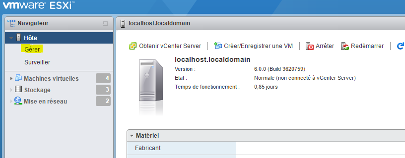
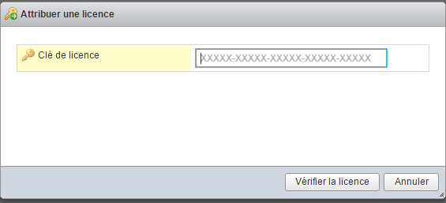
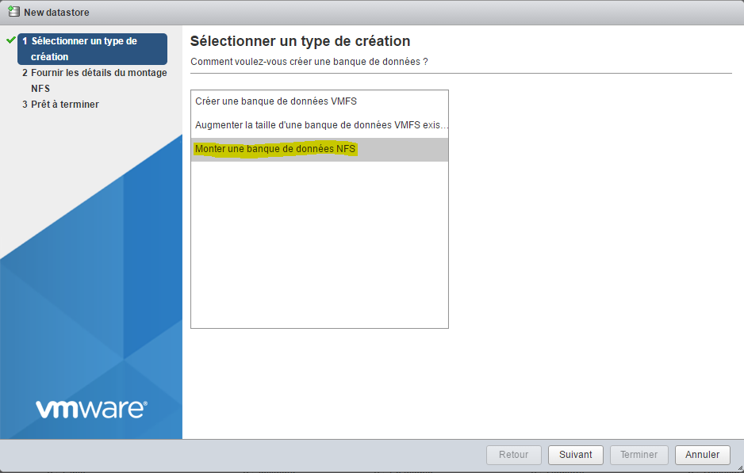
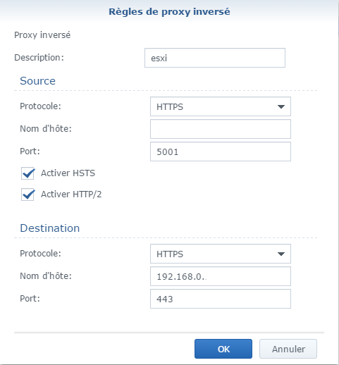

No es realmente un howto aquí, sino una colección de consejos y trucos
VMware

Añadir licencia
==================

Una vez conectado a la interfaz web (IP \ _ESXI / ui) debe continuar
"Administrar":

A continuación, "la licencia para la asignación" y haga clic en "Asignar licencia"

E introduzca su clave de licencia

> **Nota**
>
> A modo de recordatorio, si usted no hace sus ESXi ya no puede
> Trabajar después de 60 días

Montar un almacén de datos NFS Synology
========================================

Veremos cómo montar un recurso compartido de Synology en
VMware. Esto permite, por ejemplo, a las máquinas virtuales en el
Synology (que puede tener más espacio que el ESXi) o enviar
copias de seguridad de la máquina en Synology

Configuración de Synology
-------------------------

Tenemos que ir al Panel de control y luego "Servicios
Archivos "y marque la casilla" Habilitar NFS ":

A continuación, debe hacer clic en "Compartir carpeta", y luego elegir la carpeta en la
Compartir (en este caso copia de seguridad), a continuación, haga clic en editar "NFS Permiso" y
finalmente, crear (aquí ya tengo uno, su lista debe estar
vacío):

A continuación, poner la IP de su ESXi y "Squash" que ponen
"Mapeo de todos los usuarios admin" y luego se valida:

A continuación, debe recuperar la senda de la acción (aquí / Volume2 / Copia de seguridad):

Eso es parte de Synology, ahora irá ESXi secundarios

Configuración de ESXi
-----------------------

Hay que seguir adelante "almacenamiento":

A continuación, haga clic en "Nueva base de datos":

No se ha seleccionado "Montaje de una almacén de datos NFS" y luego hacer
Próximo :

Introduzca el nombre del almacén de datos para crear (cuidado de evitar espacios
caracteres especiales), establecen el IP de nuestra Synology y establecer la ruta
compartir (véase más arriba) y finalmente validar:

Haga clic en Finalizar:

Y aparecerá ahora su nuevo almacén de datos (en caso contrario, haga clic
"Actualizar").

Añadido plugin para el montaje VAAI Synology NFS
==============================================

La adición de este plugin permite la aceleración de hardware en
NFS (véanse las notas explicativas
[Aquí] (http://www.virtual-sddc.ovh/exploiter-les-vaai-nfs-avec-un-nas-synology/))

Para ver si lo tiene, usted tiene que conectar con el cliente pesado
(No he encontrado la información en el cliente web) y vaya a Configuración →
de almacenamiento:

La instalación es muy simple, primero debe activar el servicio
SSH ESXi (la interfaz web debe ir Servicio de Acción ⇒
⇒ Activar Secure Shell) y luego conectarse a través de SSH (la
ID son los mismos que para acceder a la interfaz). entonces él
Sólo hacer:

    esxcli VIB instalar el software -v -f https://global.download.synology.com/download/Tools/NFSVAAIPlugin/1.0-0001/VMware_ESXi/esx-nfsplugin.vib

Usted debe tener :

A continuación, debe reiniciar el ESXi, para comprobar que está bien que debe
a continuación, volver a la configuración del cliente pesado → Almacenamiento:

Instalar / Actualizar ESXi Embedded Client Host
================================================== =

ESXi Embedded host de cliente es una interfaz web (HTML5) para ESXi
deja en el 95% de los casos ocurrió cliente pesado. Está presente
por defecto en la versión de actualización 6.0 2, pero en la versión 1.0, es
actualización muy recomendable.

Encontrará toda la información
[Aquí] (https://labs.vmware.com/flings/esxi-embedded-host-client)

Para ver si tiene la interfaz web, sólo tiene que ir con
su navegador IP \ _ESXI / ui si no tienen nada debe
instalar, primero tiene que conectarse a través de SSH en ESXi puede hacer:

    esxcli VIB instalar el software -v http://download3.vmware.com/software/vmw-tools/esxui/esxui-signed-latest.vib

Si ya tienes que actualizarlo para hacerlo:

    actualización de software vib esxcli -v http://download3.vmware.com/software/vmw-tools/esxui/esxui-signed-latest.vib

Instalación del cliente pesado
============================

Esto es opcional si no se necesita para administrar USB.

Tienes que ir con su navegador web, la dirección IP del ESXi
a continuación, haga clic en el enlace "Descargar el vSphere Client para Windows":

Una vez descargado, simplemente ejecuta la instalación (Paso
voluntariamente en esta parte, ya que sólo acepta todo).

A continuación, ejecute VMware vSphere Client, debe tener:

Sólo tienes que introducir la IP de su servidor ESXi, nombre de usuario y
contraseña y aquí se inicia la sesión:

Actualizar el ESXi
=====================

El procedimiento es bastante fácil, en primer lugar es necesario recuperar el parche
haciendo clic [aquí] (https://my.vmware.com/group/vmware/patch#search) (hay
que seguramente va a conectar con su cuenta de VMware). En la
lista "Seleccione un producto" put "ESXi (Embedded e instalable)" en
cara dejar que la última versión de VMware y no "Buscar". Después
descargar el parche necesario (por lo general el último). El número de compilación (la
primer paso número uno empezando por KB) le da la versión de
parche se puede comparar con el número de compilación.

A continuación, sube la cremallera en uno de sus almacenes de datos y hacer:

    actualización de software vib esxcli -d /vmfs/volumes/576c8ab3-fdf64d2f-091b-b8aeedeb87fb/ESXi600-201605001.zip

> **Nota**
>
> Sustituir si bien la ruta y el nombre de la cremallera en función de su
> control

> **Importante**
>
> Tenga cuidado de poner la ruta completa de la cremallera o lo hará
> No funciona

El comando anterior no actualiza el Vib tener necesidad,
puede forzar la instalación de todo el paquete de Vib (por lo tanto
Atención que puede hacer un downgrade) por:

    esxcli VIB instalar el software -d /vmfs/volumes/576c8ab3-fdf64d2f-091b-b8aeedeb87fb/ESXi600-201605001.zip

Configuración NTP
====================

Por defecto ESXi no utiliza NTP por lo que no es
el tiempo y que las máquinas virtuales no están a tiempo de corregirlo es muy
sencillo. Usted tiene que ir de la versión web de Manejo de Sistema → →
Fecha y hora, a continuación, hacer clic en "Editar configuración":

Y en el "servidor NTP" hay que poner: 0.debian.pool.n,
1.debian.pool.n, 2.debian.pool.n, 3.debian.pool.n, time.nist.gov

Luego, en Acciones → → NTP Servicio Estrategia clic en "Inicio y
parar con el host ":

También en acciones NTP Servicio → haga clic en "Inicio"

Aquí está su ESXi deben tomar temprano solos ahora.

el acceso externo a la ESXi
========================

Para acceder a los ESXi fuera que necesita:

-   puerto abierto 443 al 443 de ESX

-   puerto abierto 902 a 902 del ESXi

Y eso es todo. Un pequeño consejo si tiene un NAS de Synology se
puede (tener cuidado de seguir bien):

-   abrir a 443 el 5001 de la NAS de Synology

-   abrir 80-80 NAS (útil sólo para generar
    de dejar que los certificados de cifrar)

-   puerto abierto 902 a 902 del ESXi

Luego, en el NAS en el panel de control y, a continuación portal
Aplicación y proxy inverso (tenga en cuenta que es esencial DSM 6):

Haga clic en crear e implementar:

En "Nombre de host" (en la fuente) que tiene que poner el DNS requerido
(Ej monesxi.mondsn.synology.me) y en "Nombre de host" (en
destino) que tiene que poner la IP de la ESX

> **Nota**
>
> También puede hacer lo mismo, pero para acceder a jeedom
> Esta vez con el IP jeedom (la máquina virtual si está
> Virtualizados) y el puerto 80

> **Nota**
>
> Una vez hecho esto y su DNS apunta correctamente
> En el NAS se puede generar un certificado SSL válido gratuita
> Con cifrar Vamos, yendo Sécruité ⇒ certificado y hacer
> Agregar. Entonces no olvide hacer clic para configurar
> Asignar a su proxy inverso

A continuación, para acceder a su ESXi simplemente con el navegador
Cesta de la DNS o la adición de IP externa / ui en el final y que es
buena.

> **Importante**
>
> Si usted va a través de la consola basada en web proxy inverso para NAS
> Máquinas virtuales no funciona (porque va a través de la WebSocket), sin embargo
> Si vas a través de VMware todo consola remota debe ser aceptable (se
> Pasa a través del puerto 902)

> **Nota**
>
> También hay una aplicación en Android VMware a la Lista de Seguimiento
> Acceso a la consola ESXi, así como máquinas virtuales

certificado SSL
==============

Es posible importar el certificado VMware directamente
su PC por no tener la alerta.

En el orden debe:

-   tener una url (DNS) el acceso a sus ESXi, aquí tomaremos
    esxi1.lan

-   establecer el nombre de su ESXi, ssh a:

<! - ->

    sistema esxcli conjunto hostname --host = esxi1

-   configurar el FQDN:

<! - ->

    establece esxcli hostname sistema --fqdn = esxi1.lan

-   Recuperar el certificado raíz ESXi, es en
    /etc/vmware/ssl/castore.pem

En un trabajo bien hecho clic e instalar el certificado, lo puso en
"Autoridad de certificación raíz de confianza"
