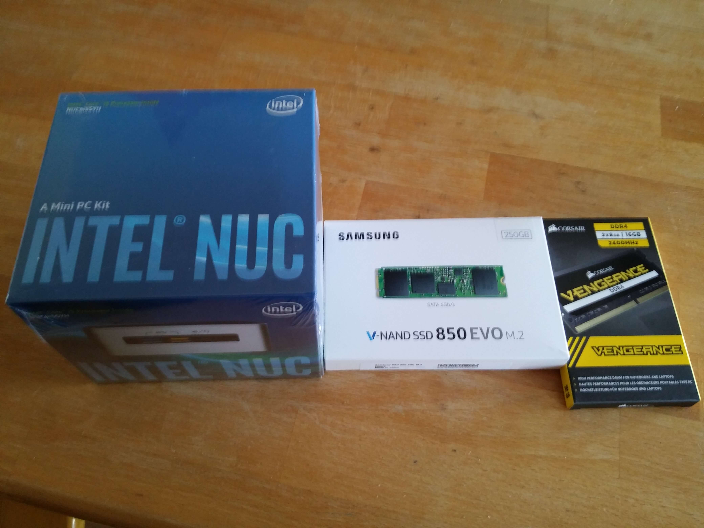
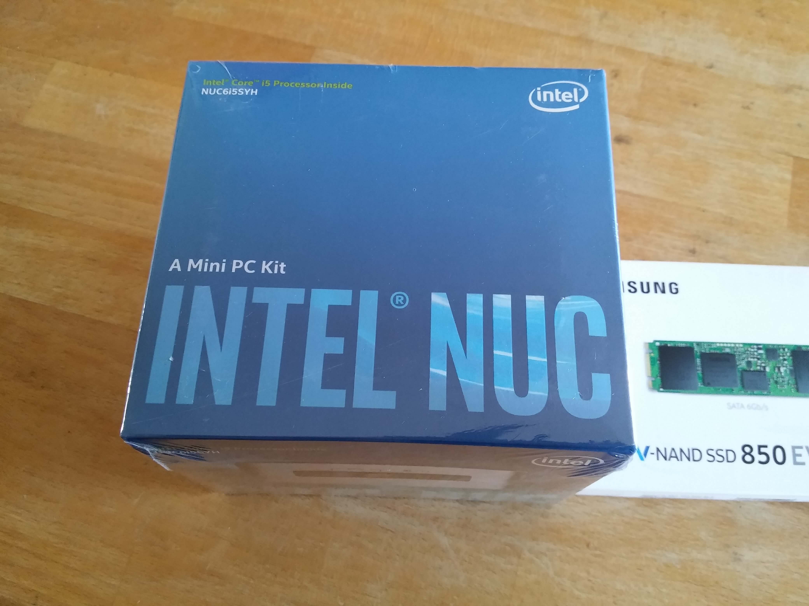
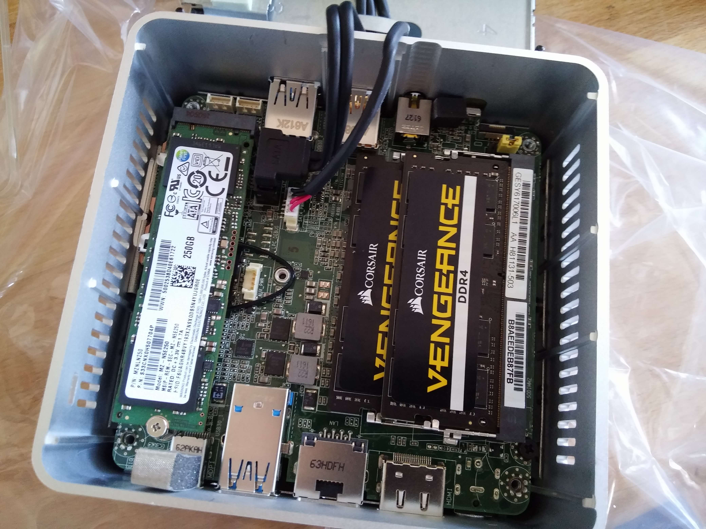
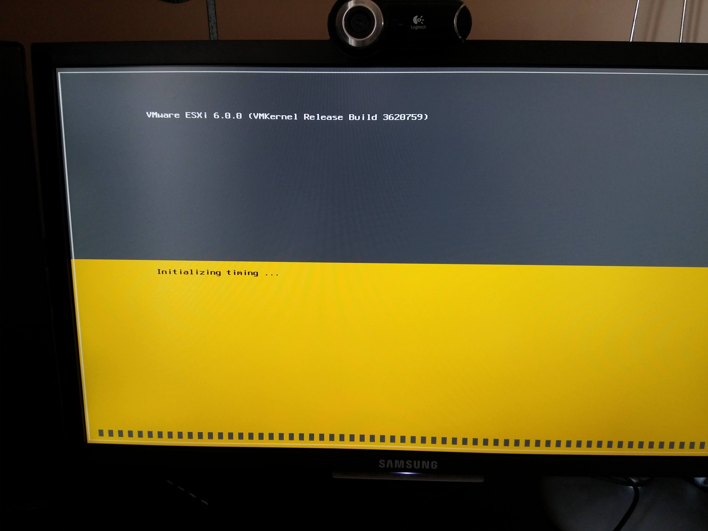

Here is a tutorial to install VMware on an Intel NUC (gen6). We
will see later how to add Jeedom on

Equipment
===========

Intel NUC
---------

The Intel NUC is a small PC, not the most powerful, but very economical
energy and small dimensions. This makes it a perfect little server
virtualization based on VMware.

There are currently 2 NUCs of 6th generation (the others are working
also for VMware but need to put more drivers on the
VMware kernel):

-   Intel Core i3-6100U (Dual-Core 2.3 GHz - 4 threads - 3 MB Cache -
    TDP 15W)

-   Intel Core i5-6260U (Dual-Core 1.8 GHz - Turbo 2.9 GHz - 4 threads -
    Cache 4 MB)

The i5 is significantly more powerful because it has a little more cache
and especially a turbo mode that allows him to climb much higher in
frequency.

To this is added 2 types of case:

-   A thin box that can only contain a type M2 disk

-   A thicker case that can contain a type M2 disk and a
    2.5 inch disk

This is therefore 4 references:

-   i3 M2: [Intel NUC
    NUC6I3SYK](http://www.ldlc.com/fiche/PB00203086.html) \~ 320€

-   i3 M2 + 2.5inch: [Intel NUC
    NUC6I3SYH](http://www.ldlc.com/fiche/PB00203148.html) \~ 320€

-   i5 M2: [Intel NUC
    NUC6I5SYK](http://www.ldlc.com/fiche/PB00203084.html) \~ 460€

-   i5 M2 + 2.5inches: [Intel NUC
    NUC6I5SYH](http://www.ldlc.com/fiche/PB00202760.html) \~ 430€

SSD
---

This requires adding SSD and memory. SSD level I you
advises 240GB or more, unless you take the model with a
2.5 inch slot (which allows you to put hard drive in addition)
or to have a Synology NAS type to make the iSCSI LUN. Do not forget
a basic VM (no storage) is between 20 to 40 GB, add to
this 40GB for the VMware itself is filling up fast.

> **Important**
>
> VMware does not support adding USB disk, so it's difficult
> to expand the available space

-   [LDLC SSD M.2 2280 F6 PLUS 120
    GB](http://www.ldlc.com/fiche/PB00203635.html) \~ 55€

-   [Samsung SSD 850 EVO 120 GB
    M.2](http://www.ldlc.com/fiche/PB00185923.html) \~ 100€

-   [LDLC SSD M.2 2280 F6 PLUS 240
    GB](http://www.ldlc.com/fiche/PB00203636.html) \~ 105€

-   [Samsung SSD 850 EVO 250 GB
    M.2](http://www.ldlc.com/fiche/PB00185924.html) \~ 120€

-   [LDLC SSD M.2 2280 F6 PLUS 480
    GB](http://www.ldlc.com/fiche/PB00207301.html) \~ 190€

Memory
-------

Attention for the memory it is absolutely necessary of the DDR4 in So-DIMM 260
pins, it takes at least 4GB for VMware, but by experience I will
advise at least 8GB (personally I'm even up to 16GB,
the NUC supports up to 32GB). There, no memory recommended, the
less expensive is very good (attention I always take packs of 2
bars, this improves performance):

-   [Crucial SO-DIMM DDR4 8 GB (2 x 4 GB) 2133 MHz CL15 SR
    X8](http://www.ldlc.com/fiche/PB00204134.html) \~ 35€

-   [Crucial SO-DIMM DDR4 16 GB (2 x 8 GB) 2133 MHz CL15 DR
    X8](http://www.ldlc.com/fiche/PB00204135.html) \~ 65€

-   [Crucial SO-DIMM DDR4 32 GB (2 x 16 GB) 2133 MHz CL15 DR
    X8](http://www.ldlc.com/fiche/PB00204136.html) \~ 120€

Preparation of the installation
=============================

Before starting the installation itself it will first have to
recover VMware and put it on a USB key.

Download VMware
------------------------

> **Important**
>
> If you put vmware 6.5, there is a problem with the new management
> the USB and the keys Zwave, so that it works it is necessary to apply this
> [KB] (https://kb.vmware.com/selfservice/microsites/search.do?language=en_US&cmd=displayKC&externalId=2147650)

It's the hardest thing I think, to simplify your life you have to
:

-   go on
    [right here](https://my.vmware.com/en/web/vmware/evalcenter?p=free-esxi6)
    and register

-   wait for the email to validate the registration

-   return
    [right here](https://my.vmware.com/en/web/vmware/evalcenter?p=free-esxi6)
    and log in (you may be asked to accept
    conditions, you have to validate)

-   then go
    [the](https://my.vmware.com/fr/web/vmware/details?productId=491&downloadGroup=ESXI60U2)
    and add to your account "ESXi ISO image (Includes VMware Tools)"

-   finally return
    [right here](https://my.vmware.com/en/web/vmware/evalcenter?p=free-esxi6)
    and there you must have in "Downlaod Packages", a package "ESXi
    ISO image (Includes VMware Tools) "you need to download

Just above you also have your license key, you can in
enjoy to recover it.

Download rufus
-----------------------

It's much simpler, just click
[La] (http://rufus.akeo.ie/downloads/rufus-2.9.exe). Then you need
launch the .exe

Creating the bootable USB key
--------------------------------

Here too it's easy how to configure rufus:

All you have to do is click on start and wait.

Unpacking and assembling the NUC
==============================

Here are the 3 components for my NUC:

-   Intel NUC NUC6I5SYH

-   Samsung SSD 850 EVO 250 GB M.2

-   CORSAIR VENGEANCE SO-DIMM DDR4 16 GB (2 X 8 GB) 2400 MHZ CL16

The NUC box:

Opening of this one:

The components out of their box:

Opening the NUC, it's very simple, turn it upside down, unscrew
the 4 screws under the feet (they do not go out in full it's normal there
just unscrew them), then gently pull on the screws to open
the NUC:

The SSD installed (on the left), the end screw to lock it is a
little painful to put back, luckily we only do it once

Installing the memory (right):

And here you can close (unless of course you have taken a
SSD 2.5 inches that it is necessary in this case to insert in the lid).

Installing VMware
======================

It's very simple, just put the USB key on one of the ports
USB NUC, plug a screen to the HDMI port, a keyboard and
food. You turn on the NUC, the installation will launch any
alone :

> **Note**
>
> I forgot to capture the validation of the license, he
> just agree by following the instructions

Here, select the disk corresponding to the SSD (you can
identify by name or size)

Select "French":

Put a password, at first I advise you to put a simple trick
like "oooo" (we'll change it later):

Validate by doing F11:

The installation will take 10 to 20min, then you will have to remove
the USB key and wait for the reboot system

Once the reboot is over you must have:

Here is VMware is installed (in addition it is nice it gives you its IP),
More than play with !!!

For the continuation here is a
[Tutorial] (https://jeedom.github.io/documentation/howto/fr_FR/doc-howto-vmware.creer_une_vm.html)
for creating your first VM. And you will find
[Here] (https://jeedom.github.io/documentation/howto/fr_FR/doc-howto-vmware.trucs_et_astuces.html)
a tutorial of tips and tricks (for example to put your license
VMware)
