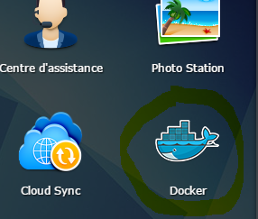
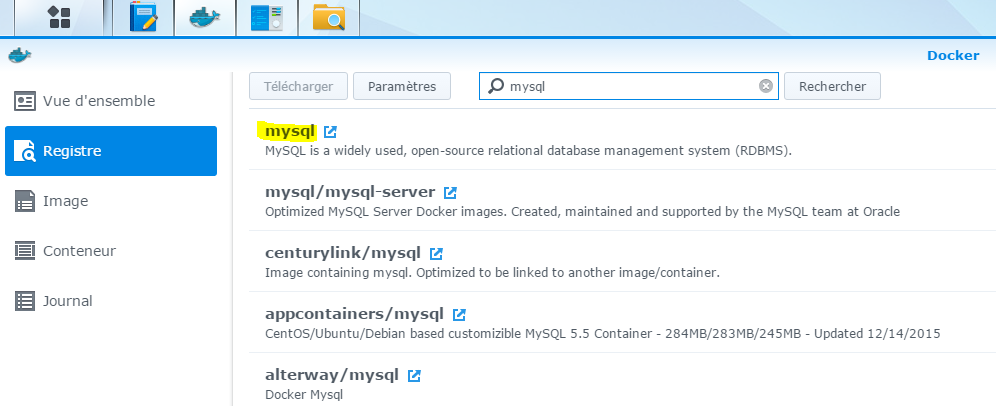
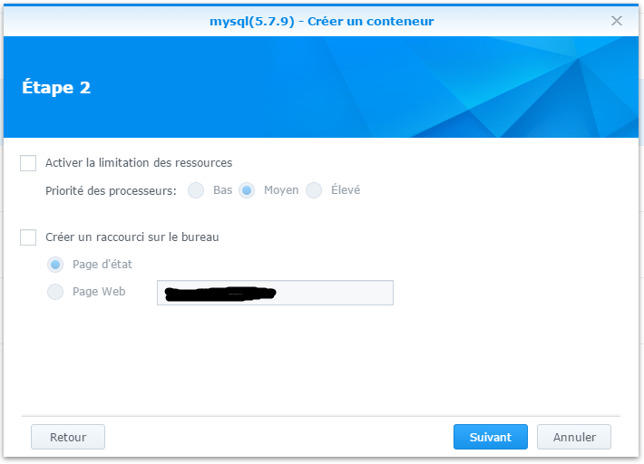
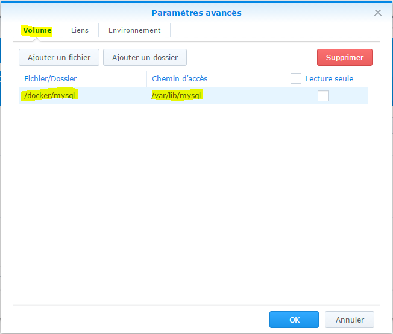
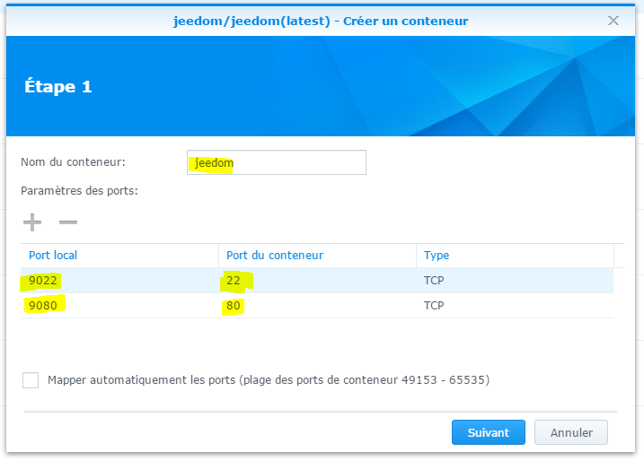
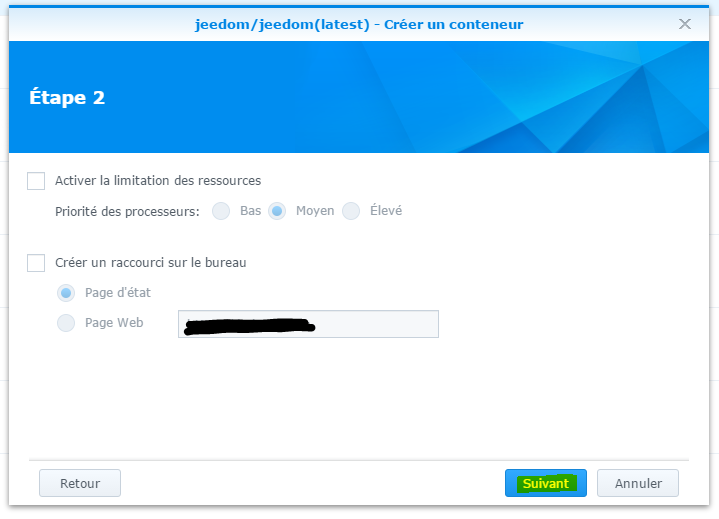
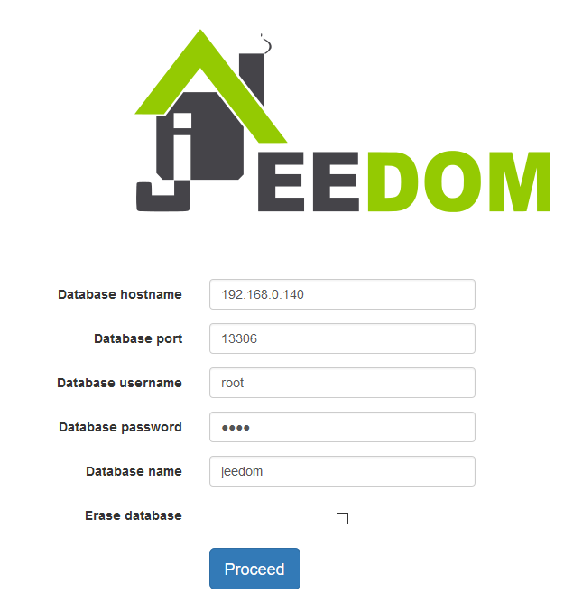

Hardware
========

Jeedom kann auf verschiedenen Hardware-Komponenten installiert werden:

-   ein Raspberry Pi 2 oder 3

-   eine Synology NAS

-   jedes Debian-basierte Linux-System

Sie können auch eine fertige Box mit vorinstalliertem Jeedom kaufen,
die auch ein Service Pack (mehr Unterstützung und Dienste) enthält und 
angebotenen Plugins :

-   [Jeedom Smart
    Z-Wave+](https://www.domadoo.fr/fr/box-domotique/3959-jeedom-controleur-domotique-jeedom-smart-z-wave.html)

-   [Jeedom Smart Z-Wave+ und
    RFXCOM](https://www.domadoo.fr/fr/box-domotique/4043-jeedom-controleur-domotique-jeedom-smart-z-wave-et-interface-rfxcom.html)

-   [Jeedom Smart
    EnOcean](https://www.domadoo.fr/fr/box-domotique/4041-jeedom-controleur-domotique-jeedom-smart-enocean.html)

-   [Jeedom Smart EnOcean und
    RFXCOM](https://www.domadoo.fr/fr/box-domotique/4044-jeedom-controleur-domotique-jeedom-smart-enocean-et-interface-rfxcom.html)

Hier ist ein Konfiguriertes "Beispiel" um gut mit Z-Wave in Jeedom zu starten :

1.  Raspberry Pi 3 :

    -   Ein Raspberry+Gehäuse ~ 50 €

    -   Ein Aeon-Stick Gen5 ~ 60 €

    -   Eine Micro SD Karte ~ 7 €

    -   Eine Stromversorgung über USB ~ 8 €

Insgesamt 125 € für eine Open-Source Haus-Automatisierungs Box mit
vollständiger Kontrolle der Installation.

> **Tipp**
>
> Es ist möglich, eine Rfxcom Antenne oder ein enOcean Schlüssel
> hinzuzufügen oder zu ändern.

> **Tipp**
>
>Jeedom ist eine Software, die Open Source ist und bleibt, ihre Nutzung ist
> völlig kostenlos und hängt nicht von einer Cloud oder einem Abonnement
> ab. Einige Plugins, die die Fähigkeiten von Jeedom oder dessen Nutzung
> erhöhen, können jedoch kostenpflichtig sein **und benötigen
> möglicherweise eine Internetverbindung**. Sie können die Liste der Plugins
> [hier](http://market.jeedom.fr/index.php?v=d&p=market&type=plugin)
> finden.

> **Tipp**
>
> Service pack ? Was bedeutet das ? Sie können 
> [hier](https://blog.jeedom.fr/?p=1215) die Vorteile von Service Packs sehen.

Jeedomboard
===========

Hier ist eine Schritt für Schritt Dokumentation um Jeedom auf das
Jeedomboard (oder Hummingboard) zu installieren.

> **Tipp**
>
> Der Name des heruntergeladenen Jeedom-Abbilds kann sich von dem in
> dieser Dokumentation unterscheiden.

Schritt 1 : Etcher installieren
---

Sie müssen die Etcher Software [hier](https://etcher.io/) herunterladen und auf Ihrem PC installieren.

Schritt 2 : Wiederherstellung Jeedom-Abbild
---

Sie müssen
[hier](https://www.amazon.fr/clouddrive/share/OwYXPEKiIMdsGhkFeI3eUQ0VcvTEBq0qxQevlXPvPIy/folder/IT3WZ3N0RqGzaLBnBo0qog) hin gehen,
dann im Ordner Images das Abbild jeedom-jeeboard-\*.rar oder
Jeedomboard\_\_Debian\_Jessie\*.rar herrunterladen.

Schritt 3 : Jeedom-Abbild Dekomprimieren

Das Jeedom-Abbild dekomprimieren (falls Sie nichts zum dekomprimieren haben können Sie hier [winrar](http://www.clubic.com/telecharger-fiche9632-winrar.html) herunterladen), Sie müssen erhalten : 

Schritt 4: Das Abbild auf die SD-Karte brennen
---

Legen Sie Ihre SD-Karte in Ihren Computer ein und starten Sie die Ether
Software, geben Sie den Pfad des Abbildes, den Pfad der SD-Karte und
klicken Sie auf "flash". Die Software wird die SD-Karte brennen und die
Gravur überprüfen 

Sie müssen nur die SD-Karte in das Jeedomboard stecken (oder Hummingboard), das Netzwerk und die Stromversorgung anschließen, Ihr Jeedom wird starten (5 min) und Sie sollen es im Netzwerk sehen.

> **Tipp**
>
> Die SSH Zugangsdaten sind jeedom/Mjeedom96.

Danach können Sie die Dokumentation [Erste Schritte mit Jeedom](https://jeedom.github.io/documentation/premiers-pas/fr_FR/index.html) folgen.

Miniplus/Hummingboard
=====================

Hier ist eine Schritt für Schritt Dokumentation um Jeedom auf das Miniplus
(Solid-Run Hummingboard Karte) zu installieren. 

Schritt 1 : Etcher installieren
---

Sie müssen die Etcher Software [hier](https://etcher.io/) herunterladen und auf Ihrem PC installieren.

Schritt 2 :
---

Jessie Abbild herunterladen. Achtung, das Humingboard ist kein
Raspberry. **Sie müssen diese ISO herunterladen, die speziell ein für Jessie
IMX6 ist.**

Sie müssen 
[hier](https://images.solid-build.xyz/IMX6/Debian/sr-imx6-debian-jessie-cli-20171108.img.xz)
hin gehen und dieses Abbild auf Ihren PC speichern.

Schritt 3 : Abbild Dekomprimieren
---

Das Jeedom-Abbild dekomprimieren (falls Sie nichts zum dekomprimieren haben können Sie hier [winrar](http://www.clubic.com/telecharger-fiche9632-winrar.html) herunterladen). 

Schritt 4: Das Abbild auf die SD-Karte brennen
---

Legen Sie Ihre SD-Karte in Ihren Computer ein und starten Sie die Ether
Software, geben Sie den Pfad des Abbildes, den Pfad der SD-Karte und
klicken Sie auf "flash". Die Software wird die SD-Karte brennen und die
Gravur überprüfen 

Sie müssen nur die SD-Karte in das Mini + stecken, das Netzwerk und die
Stromversorgung verbinden, Ihr Jeedom wird gestartet.

Schritt 5 : Jeedom Installieren - Starten des Skripts
---

Öffnen Sie eine SSH-Konsole, zum Beispiel mit Putty.

> **Tipp**
>
> Login debian / Passwort debian

> **Tipp**
>
> Das root Passwort ist debian

1/ Konfiguration des Swaps auf dem Mini +, da es bei dieser Distribution standardmäßig inaktiv ist.

Verbinden Sie sich in SSH mit Ihr System und tun Sie folgendes :

    sudo imx6-config

Geben Sie das Root-Passwort ein ("debian")

Klicken Sie auf "OK" (Ihre lokale IP erscheint - notieren Sie sich diese, zum verbinden am Ende)

Drücken Sie Enter

Wählen Sie das Thema 4 Swap mit den Pfeilen auf der Tastatur und dann
intall Swap (Ein Swap von 512 wird empfohlen, Sie können es am Ende der
Swap Erstellung standardmäßig ändern). Folgen Sie den Anweisungen.

**Neustart** und überprüfen Sie die Aktivierung mit dem Befehl

    sudo reboot

    free -  m

2/ Führen Sie das offizielle Skript mit diesen 3 Befehlen aus :

    wget https://raw.githubusercontent.com/jeedom/core/stable/install/install.sh

    chmod +x install.sh

    sudo ./install.sh

**Die Installationszeit variiert zwischen 60 und 120 Minuten**. Sie dürfen
diese Prozedur nicht unterbrechen. Wenn doch, müssen Sie von vorne
beginnen. Es wird dringend empfohlen, am Ende der Installation neu zu starten.

Die folgenden Argumente sind verwendbar :

-w = Ordner Webserver

-z = Installation Z-Wave Abhängigkeiten

-m = gewünschtes mysql root Passwort

    ./install.sh -w /var/www/html -z -m Jeedom

Es ist ratsam, den Mini+ neu zu starten.

    sudo reboot

Alles, was Sie tun müssen, ist IP\_MACHINE\_JEEDOM in Ihren Browser
einzugeben.

> **Notiz**
>
> Die standard Zugangsdaten sind admin/admin

> **Wichtig**
>
> Wenn Sie ein Backup wieder herstellen müssen, müssen Sie sich zwischen
> 5 und 10 Minuten gedulden, damit alles wieder in Ordnung ist (Ihr Benutzer
> admin/admin besteht nicht mehr…). Sie dürfen Ihr Mini-Plus nicht elektrisch
> ausschalten.

Danach können Sie die Dokumentation [Erste Schritte mit Jeedom]
(https://www.jeedom.fr/doc/documentation/premiers-pas/fr_FR/doc-premiers-pas.html) folgen.

Raspberry Pi
===========

Sie finden hier die Dokumentation, um Jeedom auf einem Raspberry PI **mit einer SD-Karte** zu installieren.

> **Wichtig**
>
> Debian 9 (Strecht) ist die offiziell unterstützte Distribution für Version 3.1.5
> von Jeedom (aber Jessie bleibt perfekt funktional).
>

**1/ Laden Sie das neueste Abbild "lite" herunter, das ist ohne Grafik 
Schnittstelle**
[Hier](https://downloads.raspberrypi.org/raspbian_lite/images/raspbian_lite-2017-12-01/2017-11-29-raspbian-stretch-lite.zip)

**2/ Dekomprimieren Sie das Abbild mit Winrar** [Hier](http://www.win-rar.com)

**3/ Brennen Sie dieses Abbild zum Beispiel mit Etcher auf eine SD-Karte**
[Hier](https://etcher.io/)

> **Notiz**
>
> Wenn Sie Etcher verwenden, um Ihr Abbild zu brennen, ist der
> Dekomprimierungsschritt nutzlos (Zip-Format wird direkt in der Auswahl
> der Abbilddatei erkannt).

**4/ Einen SSH-Zugriff aktivieren**

> **Warnung**
>
> Aus Sicherheitsgründen ist der SSH-Zugriff in dieser Distribution nicht mehr
> standardmäßig aktiviert. Es muss daher aktiviert werden.

Es ist notwendig, auf der boot Partition (dem einzigen unter Windows zugänglichen) eine leere Datei ssh zu erstellen.

Nur Rechtsklick : neues / Textdokument und umbenennen in "ssh" **ohne Erweiterung**

> **Wichtig**
>
> Unter Windows müssen Sie im Explorer Ihre Einstellungen 
> in der Ansicht / Optionen /  Ordner- und Suchenoptionen
>  ändern / überprüfen

**5/ PI starten**

Legen Sie Ihre SD-Karte ein, verbinden Sie das Netzwerkkabel und schließen Sie das Netzteil an.

**6/ Se verbinden in SSH**

Identifizieren Sie Ihr Pi im Netzwerk

Sie müssen die IP-Adresse Ihres Pi wissen. Mehrere Lösungen giebt es :

-   Sehen Sie sich die DHCP-Konfiguration in Ihrem Router an

-   Verwenden Sie einen Port-Scanner "Angyipscanner"
    [Hier](http://angryip.org/download/#windows)

Stellen Sie die Verbindung her

Verwenden Sie zum Beispiel putty, um Ihre Verbindung herstellen
[Hier](http://www.putty.org/)

Geben Sie die IP-Adresse Ihres PIs ein (hier 192.168.0.10) und klicken Sie auf
Öffnen. Akzeptieren Sie die Standardsicherheitsnachricht für die erste
Anmeldung.

Verbinden Sie sich mit den Anmeldedaten **pi / raspberry**

> **Wichtig**
>
> Aus Sicherheitsgründen muss das Standardkennwort unbedingt geändert
> werden. Hacking-Angriffe, die auf der Verwendung des Standard-Login/
> Passwort-Paares des Raspberry basieren, sind besonders weit verbreitet.
> (passwd und sudo passwd Befehl)                                                                                                                                                                                                               

**7/ Starten Sie das Jeedom Installationsskript**

    wget -O- https://raw.githubusercontent.com/jeedom/core/stable/install/install.sh | sudo bash

**Das sudo Passwort ist auch raspberry**

> **Notiz**
>
> Abhängig von Ihrer Internetgeschwindigkeit kann die Installation 45 bis 90 > Minuten dauern. Sie dürfen den Prozess vor dem Ende nicht unterbrechen. > Andernfalls muss das gesamte Verfahren wiederholt werden.

Sie müssen danach nur noch auf IP\_MACHINE\_JEEDOM gehen

> **Notiz**
>
> Die standard Zugangsdaten sind admin/admin

> **Notiz**
>
> Die folgenden Argumente sind verwendbar: -w = Datei-Webserver -z =
> Abhängigkeiten Installations z-wave -m = gewünschtes mysql root Passwort

    ./install.sh -w /var/www/html -z -m Jeedom

**8/ Systemoptimierung

Wenn Sie Ihren Raspberry für Jeedom ohne angeschlossenen Bildschirm verwenden, wird empfohlen, die Mindestmenge an RAM für den Videoteil zu verwenden.

Melden Sie sich einfach unter **SSH** an und bearbeiten Sie die Konfigurationsdatei : `sudo nano /boot/config.txt`

Hinzufügen **Und/oder**den-Kommentar (durch Entfernen von #)**und/oder** ändern der Zeilen :

`gpu_mem=16`

`disable_l2cache=0`

`gpu_freq=250`

Beenden durch Speichern : `CTRL+X` dann `N` dann `ENTER`

Starten Sie den RPI neu

Danach können Sie der Dokumentation [Erste Schritte mit
Jeedom](https://jeedom.github.io/documentation/premiers-pas/fr_FR/index) folgen.

VM
==

Wenn Sie Jeedom ohne Risiko entdecken möchten, können Sie es auch auf
Ihrem PC virtualisieren, dazu sind die folgenden Schritte auszuzführen. Sie
gehen kein Risiko in einer VM ein, die Integrität Ihres PCs ist geschützt :

Schritt 1 : Downloaden und installieren des VMware Player
---

Sie müssen die Virtual Box-Software
[HIER](http://download.virtualbox.org/virtualbox/5.1.28/VirtualBox-5.1.28-117968-Win.exe) herunterladen

Schritt 2 : Herunterladen eines Debian strecht-netinstall Abbildes
---

Laden Sie ein minimalistisches Abbild von debian 9 Strecht
[Hier](https://cdimage.debian.org/debian-cd/current/amd64/iso-cd/debian-9.3.0-amd64-netinst.iso) herunter 

Laden Sie das Erweiterungspaket herunter und installieren Sie es.
[HIER](http://download.virtualbox.org/virtualbox/5.1.28/Oracle_VM_VirtualBox_Extension_Pack-5.1.28.vbox-extpack)

Schritt 3 : VM-Umgebung Konfiguration
---

Klicken Sie auf neu und füllen Sie die Felder wie folgt aus :

-   Klicken Sie auf Weiter, passen Sie die Größe des Speichers relativ zu
    Ihrem System an (1024 sind ausreichend)

-   Klicken Sie auf Weiter, erstellen Sie jetzt eine virtuelle Festplatte

-   Klicken Sie auf Erstellen, wählen Sie VDI

-   Klicken Sie auf Weiter, erstellen Sie jetzt eine virtuelle Festplatte

-   Klicken Sie auf Weiter, wählen Sie eine Größe für den Speicher aus
    (4GB sind genug)

-   Klicken Sie auf Erstellen

Schritt 4 :  VM starten
---

-   Klicken Sie auf Konfiguration

-   Wählen Sie Speicherplatz

-   Fügen Sie ein optisches Laufwerk hinzu

-   Wähle eine CD aus

-   Geben Sie das zuvor heruntergeladene Abbild an

-   Wählen Sie dann Netzwerk und wählen Sie im Netzwerkzugriffsmodus 
    "access bridge".

-   Klicken Sie auf OK. \* Klicken Sie auf Start

Schritt 5 : Debian 9 installieren
---

Es ist das klassische ...

-   Wählen Sie Grafische Installation

-   Installieren Sie den Debian vorzugsweise ohne grafische Benutzeroberfläche, 
    da dies nutzlos ist. Der Benutzername spielt keine Rolle. In den meisten 
    Bildschirmen bestätigen Sie einfach die Standardauswahl. Sie können 
    leere Felder lassen, diese sind nicht störend.

-   Für die Softwareauswahl :

-   Wegen Grub, machen Sie sich keine Sorgen, der Bootsektor ist von der VM, 
    nicht von Ihrem PC. Es besteht keine Gefahr etwas zu zerstören.

Schritt 6 : Jeedom installieren
---

-   Starten Sie Ihre VM

-   Melden Sie sich mit dem Benutzer und dem Kennwort an, das Sie sich während der
    Installation ausgewählt haben

-   Wechseln zu root Modus

<!-- -->

    su

-   Geben Sie das während der Installation festgelegte root-Passwort ein

-   Das Jeedom-Skript abzurufen, es ausführbar machen, es starten

<!-- -->

    wget https://raw.githubusercontent.com/jeedom/core/stable/install/install.sh

    chmod +x install.sh

    ./install.sh

-   und arbeiten lassen...

Schritt 7 : Jeedom starten
---

-   Um die Lan IP Adresse der VM herauszufinden

<!-- -->

    ip -s -c -h a

Ihre IP-Adresse, Typisch 192.168.0.XX, wird rot angezeigt. Geben Sie sie
einfach in Ihren Browser ein.

> **Warnung**
>
> Wenn dies nicht funktioniert, haben Sie nicht die Netzwerkkarte in der Netzwerk-Bridge
> eingerichtet, wie eingangs gesagt.

Danach können Sie der Dokumentation [Erste Schritte mit 
Jeedom](https://jeedom.github.io/documentation/premiers-pas/fr_FR/index) folgen.

Docker
======

> **Important**
>
> Achtung, wir gehen hier davon aus, dass Sie bereits, Docker kennen

Um Jeedom kennen zu lernen, können Sie es auch in einem Docker-Container ausführen :

> **Important**
>
> Voraussetzung : Mit einer Maschine oder einer unter Linux arbeitender VM 

Schritt 1 : Docker installieren
---

Docker ist jetzt in allen aktuellen Distributionen verfügbar. Um es auf einer Distribution zu installieren, folgendes eingeben ....

-   mit Basis rpm

<!-- -->

    $ yum install docker

-   * mit Basis deb

<!-- -->

    $ apt-get update
    $ apt-get install docker
    $ apt-get install docker.io

Schritt 2 : Ein MySQL-Abbild installieren
---

> **Note**
>
> Alternativ können Sie Mysql direkt auf dem Hostcomputer installieren,
> in diesem Fall sollten Sie diesen Schritt überspringen.

Ich benutze [dieses hier](https://hub.docker.com/_/mysql/). So installieren Sie es
:

    docker pull mysql:latest

Führen Sie dann aus :

    sudo docker run --name jeedom-mysql -v /opt/jeedom/mysql:/var/lib/mysql -e MYSQL_ROOT_PASSWORD=your-mysql-password -d mysql:latest

Mit :

-   jeedom-mysql : der Name des mysql-Containers

-   /opt/jeedom/mysql : der Ordner des Hosts, in dem man die Daten von 
    MySql speichern muss

-   your-mysql-password : das root-Passwort der MySql-Instanz

Schritt 3 : Ein Jeedom Abbild installieren
---

Abbild installieren :

    docker pull jeedom/jeedom

Starten Sie dann :

    sudo docker run --name jeedom-server --link jeedom-mysql:mysql --privileged -v /your/jeedom/path:/var/www/html -e ROOT_PASSWORD=your-root-password -p 9080:80 -p 9022:22 jeedom/jeedom

Mit :

-   jeedom-server : Name des gewünschten Jeedom-Docker

-   /your/jeedom/path : Verzeichnis, in dem Jeedom-Daten auf dem Host 
    abgelegt werden

-   your-root-password : Root-Passwort für den SSH Zugriff auf Jeedom

Dann müssen Sie Jeedom installieren, indem Sie : IP\_DOCKER:9080 und
die Verbindungsinformationen zu mysql eingeben :

Danach können Sie die Dokumentation [Erste Schritte mit Jeedom](https://jeedom.github.io/documentation/premiers-pas/fr_FR/index) folgen.

> **Wichtig**
>
> Für den Namen des MySql-Hosts müssen Sie jeedom-mysql eingeben

Synology
========

Hier ist eine Schritt für Schritt Dokumentation um Jeedom auf eine Synology
(DSM 5.2 minimum) zu installieren.

Schritt 1 : Docker installieren
================================

Gehen Sie zum Paketzentrum :

Klicken Sie auf Alle, und installieren Sie das Paket Docker

Warten Sie, bis die Installation abgeschlossen ist :

> **Wichtig**
>
> Um auf das Docker Paket zuzugreifen ist es wichtig, DSM 5.2 und eine
> kompatible NAS zu haben

Schritt 2 : Wiederherstellung und die Installation des Jeedom Abbilds
========================================================

Er ist Docker notwendig, damit Jeedom arbeiten kann, als erstes Docker mit
Mysql, welches die Datenbank enthält und 2. welches Jeedom enthält

Starten Sie die Docker Anwendung :

MYSQL 
-----

Klicken Sie auf "Anmelden"

Im Suchfeld geben sie "mysql" ein, wählen mysql und klicken 
auf Download :

Bestätigen sie dann die Version der Anwendung, es ist ratsam die letzte Version zu übernehmen :

Klicken Sie dann auf das Bild, hier können Sie den Fortschritt des Downloads
verfolgen (kann mehr als zehn Minuten dauern) :

Wenn Sie fertig sind, klicken Sie auf das Abbild zum ausführen :

Geben sie ihr mysql einen Namen und einen lokalen Port auf Port 3306
des umgeleiteten Containers, dann weiter klicken :

Dann  weiter :

Klicken Sie auf "erweiterte Einstellungen" :

Dann auf „Ordner hinzufügen“ und legen Sie dort den gewünschten Ordner
auf der Synology Seite fest  (In diesem Ordner befinden sich alle Dateien der 
Datenbank) und /var/lib/mysql die Containerseite (Achtung, "nur Lesen"
ankreuzen)

Klicken Sie auf "Umgebung" und dann "Variable hinzufügen" und geben in
"Variable" : "MYSQL\_ROOT\_PASSWORD" und in Wert geben Sie das
entsprechende BDD-Kennwort ein (es wird später verwendet). Dann bestätigen :

Kreuzen sie "Diesen Container ausführen, wenn der Assistent beendet ist"
an und klicken sie auf "Übernehmen".

Jeedom 
------

Klicken Sie auf "Anmelden"

Im Suchfeld geben Sie "jeedom" ein, wählen Sie jeedom/jeedom 
und klicken Sie auf Download :

Bestätigen sie dann die Version der Anwendung, es ist ratsam die letzte
Version zu übernehmen :

Klicken Sie dann auf das Bild, hier können Sie den Fortschritt des Downloads
verfolgen (kann mehr als zehn Minuten dauern) :

Wenn Sie fertig sind, klicken Sie auf das Abbild zum ausführen :

Geben Sie einen Namen für Ihre Jeedom und einen lokalen Port auf 
Port 80 (hier 9080 und einen auf 22 (hier 9022) des Containers, dann 
weiter klicken :

Dann  weiter :

Klicken Sie auf "erweiterte Einstellungen"

Klicken Sie "Ordner hinzufügen"

Wählen Sie einen Ordner auf Ihrer Synology (in diesem Fall sind es
alle jeedom-Dateien), vorsichtig "Read Only" 
deaktivieren

Dann gehen sie zum Pfad /var/www/html und klicken auf "Umgebung" :

Kreuzen Sie "Den Behälter mittels hohen Privilegien ausführen" an und
bestätigen Sie alles :

Kreuzen sie "Diesen Container ausführen, wenn der Assistent beendet ist" an und klicken sie auf "Übernehmen".

Schritt 3 : Jeedom Konfiguration
---

Sie müssen jetzt Jeedom installieren, es ist sehr einfach, gehen Sie auf
IP\_NAS:9080

Füllen Sie die Felder entsprechend Ihrer Konfiguration (Docker konfigurieren,
mysql muß zuvor installiert sein) aus und bestätigen sie.

> **Wichtig**
> 
> Die IP-Adresse der DB ist die IP-Adresse der NAS, der Port ist derjenige,
> der vom Mysql-Docker umgeleitet wird, das Passwort ist jenes, das in
> Mysql-Docker festgelegt wurde. Der Benutzername ist root und der
> Datenbankname, ist wie Sie möchten (empfohlen Jeedom)

> **Tipp**
>
> Wenn Sie SSH Zugang haben wollen, müssen Sie den Port umleiten, den
> lokalen Port zu Port 22 des Containers,  die SSH-Anmeldeinformationen
> sind root/jeedom. Sie können das Passwort ändern, indem Sie die
> Umgebungsvariable ROOT\_PASSWORD auf den Wert das gewünschte
> Passwort setzen.

Danach können Sie der Dokumentation [Erste Schritte mit Jeedom]
(https://jeedom.github.io/documentation/premiers-pas/fr_FR/index) folgen.

Andere
======

Hier finden Sie die Dokumentation um Jeedom auf den meisten Linux Systemen zu installieren (auf der Debian Distribution geprüfte und zugelassen)

> **Wichtig**
>
> Debian 9 (Stretch) ist die offiziell unterstützte Distribution für Version 3.1.7
> von Jeedom (aber Jessie ist noch voll funktionsfähig).
> Wenn Sie Linux-Umgebungen nicht unbedingt verstehen, empfehlen wir
> Ihnen, zu einem offiziellen Image (OVF) zu wechseln oder ein Mini+ oder
> Smart (bald verfügbar) zu verwenden.

> **Important**
>
> Das Installationsskript kann gefährlich sein, da davon ausgegangen wird,
> dass Ihr System leer ist. Wenn nicht, bitte lesen Sie das Skript und
> installieren Sie es von Hand.

Verbinden Sie sich in SSH mit Ihr System und tun Sie folgendes :

    wget https://raw.githubusercontent.com/jeedom/core/stable/install/install.sh
    chmod +x install.sh
    ./install.sh

Sie müssen danach nur noch IP\_MACHINE\_JEEDOM in Ihren Internet
Browser eingeben.  

> **Notiz**
>
> Die standard Zugangsdaten sind admin/admin

> **Notiz**
>
> Die folgenden Argumente sind verwendbar: -w = Datei-Webserver -z =
> Abhängigkeiten Installations z-wave -m = gewünschtes mysql root Passwort

    ./install.sh -w /var/www/html -z -m Jeedom

Danach können Sie der Dokumentation [Erste Schritte mit Jeedom]
(https://jeedom.github.io/documentation/premiers-pas/fr_FR/index) folgen.
