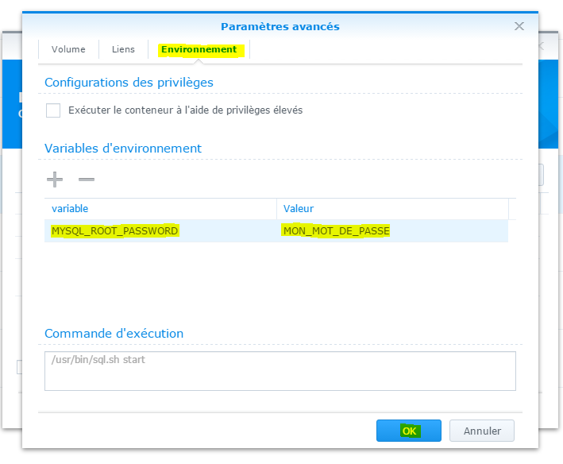
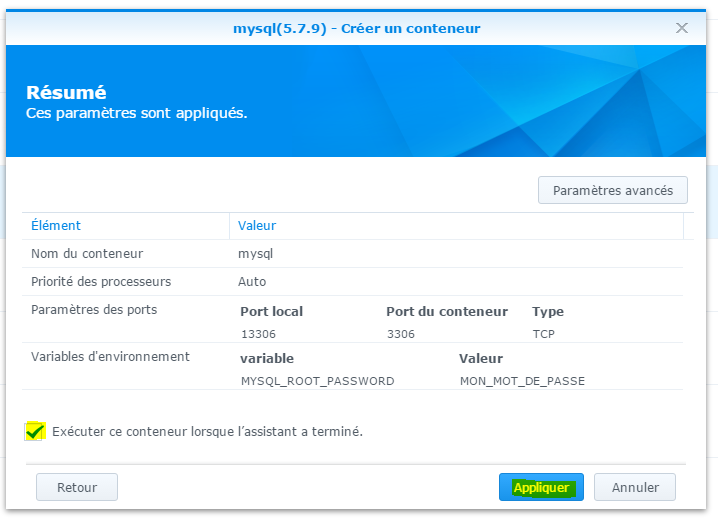
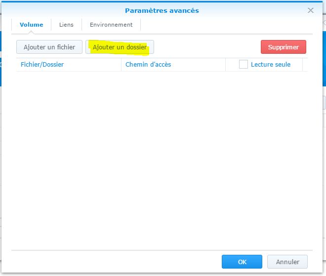
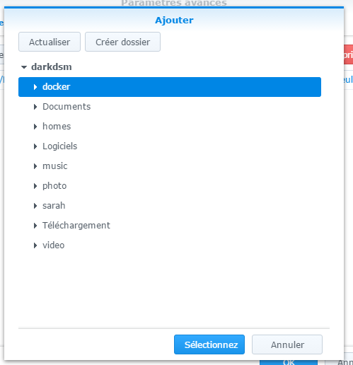

Hardware
========

Jeedom kann auf verschiedenen Hardware-Komponenten installiert werden:

-   ein Raspberry Pi 2 oder 3

-   eine Synology NAS

-   jedes Debian-basierte Linux-System

Sie können auch eine fertige Box mit vorinstalliertem Jeedom kaufen,
die auch ein Service Pack (mehr Unterstützung und Dienste) enthält und 
angebotenen Plugins :

-   [Jeedom Smart
    Z-Wave+](https://www.domadoo.fr/fr/box-domotique/3959-jeedom-controleur-domotique-jeedom-smart-z-wave.html)

-   [Jeedom Smart Z-Wave+ und
    RFXCOM](https://www.domadoo.fr/fr/box-domotique/4043-jeedom-controleur-domotique-jeedom-smart-z-wave-et-interface-rfxcom.html)

-   [Jeedom Smart
    EnOcean](https://www.domadoo.fr/fr/box-domotique/4041-jeedom-controleur-domotique-jeedom-smart-enocean.html)

-   [Jeedom Smart EnOcean und
    RFXCOM](https://www.domadoo.fr/fr/box-domotique/4044-jeedom-controleur-domotique-jeedom-smart-enocean-et-interface-rfxcom.html)

Hier ist ein Konfiguriertes "Beispiel" um gut mit Z-Wave in Jeedom zu starten :

1.  Raspberry Pi 3 :

    -   Ein Raspberry+Gehäuse ~ 50 €

    -   Ein Aeon-Stick Gen5 ~ 60 €

    -   Eine Micro SD Karte ~ 7 €

    -   Eine Stromversorgung über USB ~ 8 €

Insgesamt 125 € für eine Open-Source Haus-Automatisierungs Box mit
vollständiger Kontrolle der Installation.

> **Tipp**
>
> Es ist möglich, eine Rfxcom Antenne oder ein enOcean Schlüssel
> hinzuzufügen oder zu ändern.

> **Tipp**
>
>Jeedom ist eine Software, die Open Source ist und bleibt, ihre Nutzung ist
> völlig kostenlos und hängt nicht von einer Cloud oder einem Abonnement
> ab. Einige Plugins, die die Fähigkeiten von Jeedom oder dessen Nutzung
> erhöhen, können jedoch kostenpflichtig sein **und benötigen
> möglicherweise eine Internetverbindung**. Sie können die Liste der Plugins
> [hier](http://market.jeedom.fr/index.php?v=d&p=market&type=plugin)
> finden.

> **Tipp**
>
> Service pack ? Was bedeutet das ? Sie können 
> [hier](https://blog.jeedom.fr/?p=1215) die Vorteile von Service Packs sehen.

Jeedomboard
===========

Hier ist eine Schritt für Schritt Dokumentation um Jeedom auf das
Jeedomboard (oder Hummingboard) zu installieren.

> **Tipp**
>
> Der Name des heruntergeladenen Jeedom-Abbilds kann sich von dem in
> dieser Dokumentation unterscheiden.

Schritt 1 : Etcher installieren
---

Sie müssen die Etcher Software [hier](https://etcher.io/) herunterladen und auf Ihrem PC installieren.

Schritt 2 : Wiederherstellung Jeedom-Abbild
---

Sie müssen
[hier](https://www.amazon.fr/clouddrive/share/OwYXPEKiIMdsGhkFeI3eUQ0VcvTEBq0qxQevlXPvPIy/folder/IT3WZ3N0RqGzaLBnBo0qog) hin gehen,
dann im Ordner Images das Abbild jeedom-jeeboard-\*.rar oder
Jeedomboard\_\_Debian\_Jessie\*.rar herrunterladen.

Schritt 3 : Jeedom-Abbild Dekomprimieren

Décompresser l’image de Jeedom (si vous n’avez rien pour la décompresser
vous pouvez installer
[winrar](http://www.clubic.com/telecharger-fiche9632-winrar.html)), vous
devez obtenir :

Schritt 4: Das Abbild auf die SD-Karte brennen
---

Insérez votre carte SD dans votre ordinateur puis lancez le logiciel
Etcher, donnez-lui le chemin de l’image, le chemin de la carte SD et
cliquez sur "Flash!". Le logiciel va graver la carte SD et vérifier la
gravure.

Sie müssen nur die SD-Karte in das Jeedomboard stecken (oder Hummingboard), das Netzwerk und die Stromversorgung anschließen, Ihr Jeedom wird starten (5 min) und Sie sollen es im Netzwerk sehen.

> **Tipp**
>
> Die SSH Zugangsdaten sind jeedom/Mjeedom96.

Pour la suite, vous pouvez suivre la documentation [Premier pas avec
Jeedom](https://jeedom.github.io/documentation/premiers-pas/fr_FR/index.html)

Miniplus/Hummingboard
=====================

Hier ist eine Schritt für Schritt Dokumentation um Jeedom auf das Miniplus
(Solid-Run Hummingboard Karte) zu installieren. 

Schritt 1 : Etcher installieren
---

Sie müssen die Etcher Software [hier](https://etcher.io/) herunterladen und auf Ihrem PC installieren.

Schritt 2 :
---

Récupération de l’image Jessie. Attention la humingboard n’est pas
un raspberry. **Vous devez impérativement récupérer cet iso spécifique
qui est une jessie pour IMX6.**

Sie müssen 
[hier](https://images.solid-build.xyz/IMX6/Debian/sr-imx6-debian-jessie-cli-20171108.img.xz)
hin gehen und dieses Abbild auf Ihren PC speichern.

Schritt 3 : Abbild Dekomprimieren
---

Décompresser l’image de Jeedom (si vous n’avez rien pour la décompresser,
vous pouvez installer
[winrar](http://www.clubic.com/telecharger-fiche9632-winrar.html)).

Schritt 4: Das Abbild auf die SD-Karte brennen
---

Insérer votre carte SD dans votre ordinateur puis lancer le logiciel
Etcher, donnez-lui le chemin de l’image, le chemin de la carte SD et
cliquez sur "Flash!". Le logiciel va graver la carte SD et vérifier la
gravure.

Sie müssen nur die SD-Karte in das Mini + stecken, das Netzwerk und die
Stromversorgung verbinden, Ihr Jeedom wird gestartet.

Schritt 5 : Jeedom Installieren - Starten des Skripts
---

Öffnen Sie eine SSH-Konsole, zum Beispiel mit Putty.

> **Tipp**
>
> Login debian / Passwort debian

> **Tipp**
>
> Das root Passwort ist debian

1/ Konfiguration des Swaps auf dem Mini +, da es bei dieser Distribution standardmäßig inaktiv ist.

Verbinden Sie sich in SSH mit Ihr System und tun Sie folgendes :

    sudo imx6-config

Geben Sie das Root-Passwort ein ("debian")

Klicken Sie auf "OK" (Ihre lokale IP erscheint - notieren Sie sich diese, zum verbinden am Ende)

Drücken Sie Enter

Wählen Sie das Thema 4 Swap mit den Pfeilen auf der Tastatur und dann
intall Swap (Ein Swap von 512 wird empfohlen, Sie können es am Ende der
Swap Erstellung standardmäßig ändern). Folgen Sie den Anweisungen.

**Neustart** und überprüfen Sie die Aktivierung mit dem Befehl

    sudo reboot

    free -  m

2/ Führen Sie das offizielle Skript mit diesen 3 Befehlen aus :

    wget https://raw.githubusercontent.com/jeedom/core/stable/install/install.sh

    chmod +x install.sh

    sudo ./install.sh

**La durée d’installation varie de 60 à 120 minutes**. Vous ne devez pas
interrompre cette procédure. A défaut il faut tout reprendre. Il est
vivement conseillé de rebooter à la fin de l’installation.

Die folgenden Argumente sind verwendbar :

-w = Ordner Webserver

-z = Installation Z-Wave Abhängigkeiten

-m = gewünschtes mysql root Passwort

    ./install.sh -w /var/www/html -z -m Jeedom

Es ist ratsam, den Mini+ neu zu starten.

    sudo reboot

Alles, was Sie tun müssen, ist IP\_MACHINE\_JEEDOM in Ihren Browser
einzugeben.

> **Notiz**
>
> Die standard Zugangsdaten sind admin/admin

> **Wichtig**
>
> Wenn Sie ein Backup wieder herstellen müssen, müssen Sie sich zwischen
> 5 und 10 Minuten gedulden, damit alles wieder in Ordnung ist (Ihr Benutzer
> admin/admin besteht nicht mehr…). Sie dürfen Ihr Mini-Plus nicht elektrisch
> ausschalten.

Danach können Sie die Dokumentation [Erste Schritte mit Jeedom]
(https://www.jeedom.fr/doc/documentation/premiers-pas/fr_FR/doc-premiers-pas.html) folgen.

Raspberry Pi
===========

Sie finden hier die Dokumentation, um Jeedom auf einem Raspberry PI **mit einer SD-Karte** zu installieren.

> **Important**
>
> Debian 9 (Stretch) est la distribution officiellement supportée pour
> la version 3.1.5 de jeedom (mais Jessie reste parfaitement
> fonctionnelle).

**1/ Laden Sie das neueste Abbild "lite" herunter, das ist ohne Grafik 
Schnittstelle**
[Hier](https://downloads.raspberrypi.org/raspbian_lite/images/raspbian_lite-2017-12-01/2017-11-29-raspbian-stretch-lite.zip)

**2/ Dekomprimieren Sie das Abbild mit Winrar** [Hier](http://www.win-rar.com)

**3/ Gravez cette image sur une SD avec etcher par exemple**
[ici](https://etcher.io/)

> **Notiz**
>
> Wenn Sie Etcher verwenden, um Ihr Abbild zu brennen, ist der
> Dekomprimierungsschritt nutzlos (Zip-Format wird direkt in der Auswahl
> der Abbilddatei erkannt).

**4/ Einen SSH-Zugriff aktivieren**

> **Warnung**
>
> Aus Sicherheitsgründen ist der SSH-Zugriff in dieser Distribution nicht mehr
> standardmäßig aktiviert. Es muss daher aktiviert werden.

Es ist notwendig, auf der boot Partition (dem einzigen unter Windows zugänglichen) eine leere Datei ssh zu erstellen.

Nur Rechtsklick : neues / Textdokument und umbenennen in "ssh" **ohne Erweiterung**

> **Wichtig**
>
> Unter Windows müssen Sie im Explorer Ihre Einstellungen 
> in der Ansicht / Optionen /  Ordner- und Suchenoptionen
>  ändern / überprüfen

**5/ PI starten**

Insérez votre carte SD, branchez le cable réseau, branchez
l’alimentation.

**6/ Se verbinden in SSH**

Identifiez votre Pi sur le réseau

Il faut connaître l’adresse Ip de votre PI. Plusieurs solutions :

-   Consultez la configuration DHCP dans votre routeur

-   Utilisez un scanner de port type "angyipscanner"
    [Hier](http://angryip.org/download/#windows)

Stellen Sie die Verbindung her

Ensuite utilisez par exemple putty pour établir votre connexion
[Ici](http://www.putty.org/)

Geben Sie die IP-Adresse Ihres PIs ein (hier 192.168.0.10) und klicken Sie auf
Öffnen. Akzeptieren Sie die Standardsicherheitsnachricht für die erste
Anmeldung.

Verbinden Sie sich mit den Anmeldedaten **pi / raspberry**

> **Wichtig**
>
> Aus Sicherheitsgründen muss das Standardkennwort unbedingt geändert
> werden. Hacking-Angriffe, die auf der Verwendung des Standard-Login/
> Passwort-Paares des Raspberry basieren, sind besonders weit verbreitet.
> (passwd und sudo passwd Befehl)                                                                                                                                                                                                               

**7/ Starten Sie das Jeedom Installationsskript**

    wget -O- https://raw.githubusercontent.com/jeedom/core/stable/install/install.sh | sudo bash

**Das sudo Passwort ist auch raspberry**

> **Notiz**
>
> Abhängig von Ihrer Internetgeschwindigkeit kann die Installation 45 bis 90 > Minuten dauern. Sie dürfen den Prozess vor dem Ende nicht unterbrechen. > Andernfalls muss das gesamte Verfahren wiederholt werden.

Sie müssen danach nur noch auf IP\_MACHINE\_JEEDOM gehen

> **Notiz**
>
> Die standard Zugangsdaten sind admin/admin

> **Notiz**
>
> Die folgenden Argumente sind verwendbar: -w = Datei-Webserver -z =
> Abhängigkeiten Installations z-wave -m = gewünschtes mysql root Passwort

    ./install.sh -w /var/www/html -z -m Jeedom

**8/ Systemoptimierung

Si vous utilisez votre Raspberry pour Jeedom sans écran connecté, il est recommandé d'effectuer le minimum de RAM à la partie vidéo.

Melden Sie sich einfach unter **SSH** an und bearbeiten Sie die Konfigurationsdatei : `sudo nano /boot/config.txt`

Hinzufügen **Und/oder**den-Kommentar (durch Entfernen von #)**und/oder** ändern der Zeilen :

`gpu_mem=16`

`disable_l2cache=0`

`gpu_freq=250`

Quittez en sauvegardant : `CTRL+X` puis `O `puis `ENTREE`

Rebootez votre RPI

Ensuite, vous pouvez suivre la documentation [Premier pas avec
Jeedom](https://jeedom.github.io/documentation/premiers-pas/fr_FR/index)

VM
==

Wenn Sie Jeedom ohne Risiko entdecken möchten, können Sie es auch auf
Ihrem PC virtualisieren, dazu sind die folgenden Schritte auszuzführen. Sie
gehen kein Risiko in einer VM ein, die Integrität Ihres PCs ist geschützt :

Schritt 1 : Downloaden und installieren des VMware Player
---

Sie müssen die Virtual Box-Software
[HIER](http://download.virtualbox.org/virtualbox/5.1.28/VirtualBox-5.1.28-117968-Win.exe) herunterladen

Schritt 2 : Herunterladen eines Debian strecht-netinstall Abbildes
---

Téléchargez une image minimaliste debian 9 Stretch
[Ici](https://cdimage.debian.org/debian-cd/current/amd64/iso-cd/debian-9.3.0-amd64-netinst.iso)

Téléchargez le pack d’extensions, et installez-le.
[ICI](http://download.virtualbox.org/virtualbox/5.1.28/Oracle_VM_VirtualBox_Extension_Pack-5.1.28.vbox-extpack)

Schritt 3 : VM-Umgebung Konfiguration
---

Klicken Sie auf neu und füllen Sie die Felder wie folgt aus :

-   Klicken Sie auf Weiter, passen Sie die Größe des Speichers relativ zu
    Ihrem System an (1024 sind ausreichend)

-   Klicken Sie auf Weiter, erstellen Sie jetzt eine virtuelle Festplatte

-   Klicken Sie auf Erstellen, wählen Sie VDI

-   Klicken Sie auf Weiter, erstellen Sie jetzt eine virtuelle Festplatte

-   Klicken Sie auf Weiter, wählen Sie eine Größe für den Speicher aus
    (4GB sind genug)

-   Klicken Sie auf Erstellen

Schritt 4 :  VM starten
---

-   Klicken Sie auf Konfiguration

-   Sélectionnez stockage

-   Ajoutez un lecteur optique

-   Choisissez un disque

-   Geben Sie das zuvor heruntergeladene Abbild an

-   Sélectionnez ensuite réseau et choisissez "accès par pont" dans le mode
    "access bridge".

-   Klicken Sie auf OK. \* Klicken Sie auf Start

Schritt 5 : Debian 9 installieren
---

Es ist das klassische ...

-   Choisissez Graphical install

-   Installez la debian de préférence sans interface graphique
    da dies nutzlos ist. Der Benutzername spielt keine Rolle. In den meisten 
    plupart des écrans, il suffit de valider le choix par défaut. Vous
    pouvez laissez des champs vides, ce n’est pas bloquant.

-   Für die Softwareauswahl :

-   Wegen Grub, machen Sie sich keine Sorgen, der Bootsektor ist von der VM, 
    nicht von Ihrem PC. Es besteht keine Gefahr etwas zu zerstören.

Schritt 6 : Jeedom installieren
---

-   Starten Sie Ihre VM

-   Melden Sie sich mit dem Benutzer und dem Kennwort an, das Sie sich während der
    Installation ausgewählt haben

-   Passez en root

<!-- -->

    su

-   Geben Sie das während der Installation festgelegte root-Passwort ein

-   Récupérez le script jeedom, le rendre exécutable, le lancer

<!-- -->

    wget https://raw.githubusercontent.com/jeedom/core/stable/install/install.sh

    chmod +x install.sh

    ./install.sh

-   und arbeiten lassen...

Schritt 7 : Jeedom starten
---

-   Um die Lan IP Adresse der VM herauszufinden

<!-- -->

    ip -s -c -h a

Ihre IP-Adresse, Typisch 192.168.0.XX, wird rot angezeigt. Geben Sie sie
einfach in Ihren Browser ein.

> **Warning**
>
> Si cela ne fonctionne pas, vous n’avez pas configuré votre carte
> réseau en Pont réseau comme indiquée au départ.

Ensuite, vous pouvez suivre la documentation [Premier pas avec
Jeedom](https://jeedom.github.io/documentation/premiers-pas/fr_FR/index)

Docker
======

> **Important**
>
> Attention, nous partons ici du principe que vous maîtrisez déjà Docker

Pour découvrir Jeedom, vous pouvez aussi le faire tourner dans un
conteneur Docker :

Etape 1 : Installation de docker 
---

Docker est maintenant disponible sur toutes les distributions récentes.
Pour l’installer sur une distribution

-   à base de rpm

<!-- -->

    $ yum install docker

-   à base de deb

<!-- -->

    $ apt-get update
    $ apt-get install docker
    $ apt-get install docker.io

Etape 2 : Installation d’une image mysql 
---

> **Note**
>
> Vous pouvez aussi installer mysql directement sur la machine hôte,
> dans ce cas, il faut sauter cette étape.

J’utilise [celle-ci](https://hub.docker.com/_/mysql/). Pour l’installer
:

    docker pull mysql:latest

Puis la lancer :

    sudo docker run --name jeedom-mysql -v /opt/jeedom/mysql:/var/lib/mysql -e MYSQL_ROOT_PASSWORD=your-mysql-password -d mysql:latest

Avec :

-   jeedom-mysql : le nom du conteneur mysql

-   /opt/jeedom/mysql : le dossier de l’hote ou l’on doit stoker les
    données de MySql

-   your-mysql-password : le mot de passe root de l’instance MySql

Etape 3 : Installation d’une image Jeedom 
---

Installation de l’image :

    docker pull jeedom/jeedom

Puis lancez la :

    sudo docker run --name jeedom-server --link jeedom-mysql:mysql --privileged -v /your/jeedom/path:/var/www/html -e ROOT_PASSWORD=your-root-password -p 9080:80 -p 9022:22 jeedom/jeedom

Avec :

-   jeedom-server : nom du Docker jeedom voulu

-   /your/jeedom/path : répertoire où les données de Jeedom sont mises
    sur l’hôte

-   your-root-password : mot de passe root pour accéder à Jeedom en SSH

Il vous faut ensuite installer Jeedom en allant sur : IP\_DOCKER:9080 et
entrer les informations de connexion vers mysql :

Pour la suite, vous pouvez suivre la documentation [Premier pas avec
Jeedom](https://jeedom.github.io/documentation/premiers-pas/fr_FR/index)

> **Important**
>
> Pour le nom de l’hote MySql, il faut mettre jeedom-mysql

Synology
========

Vous trouverez ici la documentation pas à pas pour installer Jeedom sur un
Synology (DSM 5.2 minimum).

Etape 1 : Installation de Docker 
================================

Allez sur le centre des paquets :

Cliquez sur tous, puis installez le paquet Docker

Attendez jusqu’à ce que l’installation soit finie :

> **Important**
>
> Pour avoir accès au paquet Docker, il faut absolument avoir DSM 5.2 et
> un NAS compatible

Etape 2 : Récupération et installation des images Jeedom 
========================================================

Il faut Docker pour faire tourner Jeedom, le premier un Docker Mysql qui
contiendra la base de données et un 2ème qui contient Jeedom

Lancez l’application Docker :

MYSQL 
-----

Cliquez sur "Registre" :

Dans le champ de recherche tapez "mysql", selectionnez mysql et cliquez
sur télécharger :

Validez ensuite la demande de version, le mieux étant de prendre la
version latest :

Cliquez ensuite sur image, ici vous pouvez suivre l’avancement du
téléchargement (peut prendre plusieurs dizaines de minutes) :

Une fois terminé, cliquez sur l’image puis lancer :

Donnez un nom à votre mysql ainsi qu’un port local redirigé vers le port
3306 du conteneur, puis faites suivant :

Faites suivant :

Cliquez sur "Paramètres avancés" :

Puis sur "Ajouter un dossier", et là, mettez le dossier voulu côté
Synology (c’est dans ce dossier qu’il y aura tous les fichiers de la
base de données) et /var/lib/mysql côté conteneur (attention à bien
décocher "Lecture seule")

Cliquez sur "Environnement" puis "Ajoutez une variable" et mettant dans
"Variable" : "MYSQL\_ROOT\_PASSWORD" et dans valeur mettez le mot de
passe de BDD voulu (il servira plus tard). Puis validez :

Cochez "Exécuter ce conteneur lorsque l’assistant a terminé" puis
cliquez sur "Appliquer".

Jeedom 
------

Cliquez sur "Registre" :

Dans le champ de recherche, tapez "jeedom", sélectionnez jeedom/jeedom
et cliquez sur télécharger :

Validez ensuite la demande de version, le mieux étant de prendre la
dernière.

Cliquez ensuite sur image, ici vous pouvez suivre l’avancement du
téléchargement (peut prendre plusieurs dizaines de minutes) :

Une fois terminé, cliquez sur l’image puis lancez :

Donnez un nom à votre jeedom ainsi qu’un port local redirigé vers le
port 80 (ici 9080) et un vers le 22 (ici 9022) du conteneur, puis faites
suivant :

Faites suivant :

Cliquez sur "Paramètres avancés"

Puis sur "Ajouter un dossier"

Choisissez un dossier sur votre Synology (c’est dans ce dossier qu’il y
aura tous les fichiers jeedom), attention à bien décocher "Lecture
seule"

Dans chemin d’accès, mettez /var/www/html puis cliquez sur
"Environnement" :

Cochez "Exécuter le conteneur à l’aide de privilèges élevés" puis
validez le tout :

Cochez "Exécuter ce conteneur lorsque l’assistant a terminé" puis
cliquez sur "Appliquer".

> **Paramètre de configuration avancé**
>
> Il existe 3 paramètres optionnel de configuration, ces paramètres doivent etre passé en variable d'environement
> - APACHE_PORT : permet de changer le port par défaut (80) d'écoute du serveur web
> - SSH_PORT : permet de changer le port par défaut (22) d'écoute du ssh
> - MODE_HOST : indique que le résaux est en mode host

> **IMPORTANT**
>
> Certain plugin on besoin d'avoir le broadcast du réseaux (type plugin Xioami), pour cela il faut ABSOLUMENT passer en le réseaux en mode host (possible uniquement lors de la création), changer le port d'écoute par defaut du serveur web et ssh par des ports non utilisé (type 9080 pour le serveur web et 9022 pour le ssh), et mettre la variable MODE_HOST à 1

Schritt 3 : Jeedom Konfiguration
---

Sie müssen jetzt Jeedom installieren, es ist sehr einfach, gehen Sie auf
IP\_NAS:9080

Remplissez les champs en fonction de votre configuration (configuration
du Docker mysql installé précédemment) et validez.

> **Important**
>
> L’addresse IP de la BDD est l’addresse IP du NAS, le port est celui
> redirigé du Docker Mysql, le mot de passe est celui mis dans le Docker
> Mysql. Le nom d’utilisateur est root et le nom de la base celui que
> vous voulez (conseillé Jeedom)

> **Tipp**
>
> Wenn Sie SSH Zugang haben wollen, müssen Sie den Port umleiten, den
> lokalen Port zu Port 22 des Containers,  die SSH-Anmeldeinformationen
> sind root/jeedom. Sie können das Passwort ändern, indem Sie die
> Umgebungsvariable ROOT\_PASSWORD auf den Wert das gewünschte
> Passwort setzen.

Danach können Sie der Dokumentation [Erste Schritte mit Jeedom]
(https://jeedom.github.io/documentation/premiers-pas/fr_FR/index) folgen.

Andere
======

Hier finden Sie die Dokumentation um Jeedom auf den meisten Linux Systemen zu installieren (auf der Debian Distribution geprüfte und zugelassen)

> **Important**
>
> Debian 9 (Stretch) est la distribution officiellement supportée pour
> la version 3.1.7 de Jeedom (mais Jessie reste parfaitement
> fonctionnelle). Si vous ne maîtrisez pas un minimum les environnements
> Linux, nous vous conseillons de partir sur une image officielle (OVF)
> ou l’utilisation d’une Mini+ ou Smart (disponible prochainement).

> **Important**
>
> Le script d’installation peut être dangereux, car il part du principe
> que votre système est vierge. Si ce n’est pas le cas merci de lire le
> script et de faire une installation à la main.

Verbinden Sie sich in SSH mit Ihr System und tun Sie folgendes :

    wget https://raw.githubusercontent.com/jeedom/core/stable/install/install.sh
    chmod +x install.sh
    ./install.sh

Sie müssen danach nur noch IP\_MACHINE\_JEEDOM in Ihren Internet
Browser eingeben.  

> **Notiz**
>
> Die standard Zugangsdaten sind admin/admin

> **Notiz**
>
> Die folgenden Argumente sind verwendbar: -w = Datei-Webserver -z =
> Abhängigkeiten Installations z-wave -m = gewünschtes mysql root Passwort

    ./install.sh -w /var/www/html -z -m Jeedom

Ensuite, vous pouvez suivre la documentation [Premier pas avec
Jeedom](https://jeedom.github.io/documentation/premiers-pas/fr_FR/index).
