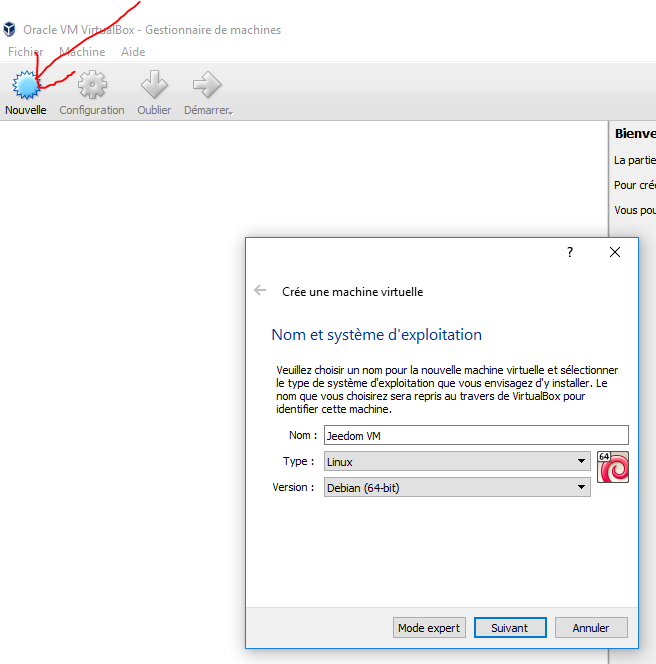
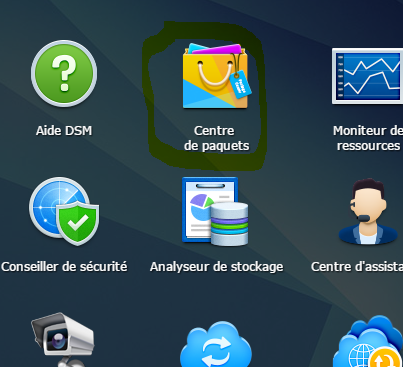
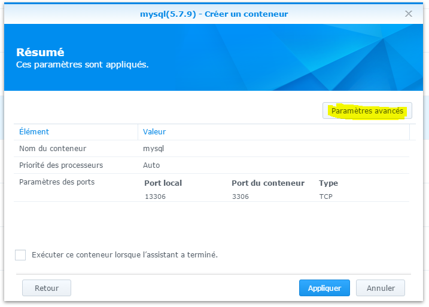
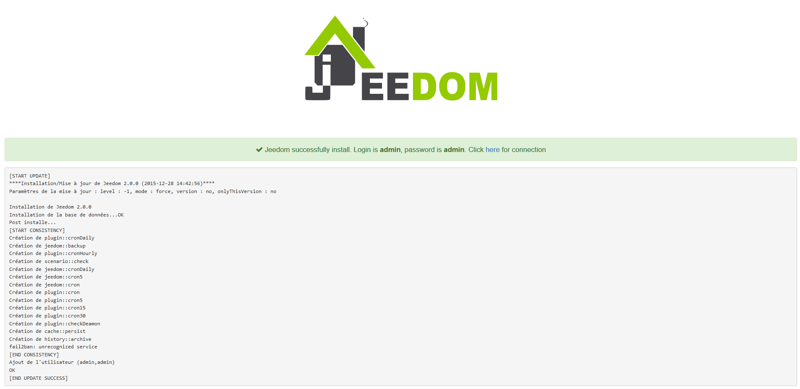

Hardware
========

Jeedom can be installed on different hardware components:

-   a Raspberry pi 2 or 3

-   a Synology NAS

-   any Debian-based Linux system

You can also buy a ready made box with Jeedom preinstalled
which also contains a service pack (more support and services) and
Plugins offered:

-   [Jeedom Smart
    Z-Wave +](https://www.domadoo.fr/fr/box-domotique/3959-jeedom-controleur-domotique-jeedom-smart-z-wave.html)

-   [Jeedom Smart Z-Wave + and
    RFXCOM](https://www.domadoo.fr/fr/box-domotique/4043-jeedom-controleur-domotique-jeedom-smart-z-wave-et-interface-rfxcom.html)

-   [Jeedom Smart
    EnOcean](https://www.domadoo.fr/fr/box-domotique/4041-jeedom-controleur-domotique-jeedom-smart-enocean.html)

-   [Jeedom Smart EnOcean and
    RFXCOM](https://www.domadoo.fr/fr/box-domotique/4044-jeedom-controleur-domotique-jeedom-smart-enocean-et-interface-rfxcom.html)

Here is a configuration "type" to start well with Jeedom Z-Wave:

1.  Raspberry pi 3:

    -   Un raspberry+boitier \~ 50 €

    -   Une clef Aeon Gen 5 \~ 60 €

    -   Une micro carte SD \~ 7 €

    -   Une alimentation USB \~ 8 €

That's a total of 125 € for an open source home automation box with a
complete control of his installation.

> **Tip**
>
> It is possible to add or change via an Rfxcom antenna, or a
> key inOcean.

> **Tip**
>
> Jeedom is software that is and will remain open source, its use
> is completely free and does not depend on a cloud or a
> subscription. However, some plugins that allow to increase the
> Jeedom's capabilities or usage may be subject to pay ** and
> may need an internet connection **. You can find
> the list of plugins
> [here](http://market.jeedom.fr/index.php?v=d&p=market&type=plugin).

> **Tip**
>
> Service pack? Quezako? You can see
> [here](https://blog.jeedom.fr/?p=1215) the benefits of service packs.

Jeedomboard
===========

You will find here the documentation step by step to install Jeedom on
the Jeedomboard (or Hummingboard).

> **Tip**
>
> The name of the Jeedom image may be different from that of the captures
> made in this documentation

Step 1: Install Etcher
---

You must download the Etcher software [here] (https://etcher.io/) then
install it on your pc

Step 2: Retrieving the Jeedom image
---

You have to go
[Here](https://www.amazon.fr/clouddrive/share/OwYXPEKiIMdsGhkFeI3eUQ0VcvTEBq0qxQevlXPvPIy/folder/IT3WZ3N0RqGzaLBnBo0qog)
then in the images folder get the image jeedom-jeeboard - \ *. rar or
Jeedomboard \ _ \ _ Debian \ _Jessie \ *. Rar

Step 3: Decompression of the Jeedom image
---

Decompress the image of Jeedom (if you have nothing to decompress it
you can install
[winrar](http://www.clubic.com/telecharger-fiche9632-winrar.html)), you
must obtain:

Step 4: Burn the image on the SD card
---

Insert your SD card into your computer and launch the software
Ether, give him the path of the image, the path of the SD card and
click on "flash". The software will burn the SD card and check the
engraving

All you have to do is put the SD card in the Jeedomboard (or
Hummingboard), to connect the network and the power supply, your Jeedom goes
start (5 min) and you should see it on the network.

> **Tip**
>
> The SSH credentials are jeedom / Mjeedom96

For the continuation you can follow the documentation [First step with
Jeedom](https://jeedom.github.io/documentation/premiers-pas/fr_FR/index.html)

Miniplus / Hummingboard
=====================

You will find here the documentation step by step to install Jeedom on
the mini plus (Hummingboard Solid-Run card).

Step 1: Install Etcher
---

You must download the Etcher software [here](https://etcher.io/) then
install it on your pc

2nd step :
---

Jessie image recovery. Attention humingboard is not not
a raspberry. ** You must recover this specific iso
which is a jessie for IMX6. **

You have to go
[Here](https://images.solid-build.xyz/IMX6/Debian/sr-imx6-debian-jessie-cli-20171108.img.xz)
and save this image on your PC.

Step 3: Decompression of the image
---

Decompress the image of Jeedom (if you have nothing to decompress it
you can install
[Winrar](http://www.clubic.com/telecharger-fiche9632-winrar.html)).

Step 4: Burn the image on the SD card
---

Insert your SD card into your computer and launch the software
Ether, give him the path of the image, the path of the SD card and
click on "flash". The software will burn the SD card and check the
engraving

You just have to put the SD card in the Mini + to connect the
network and power, your Jeedom will start.

Step 5: Jeedom installation - Launching the script
---

Open an SSH console with putty for exemmple.

> **Tip**
>
> login debian / debian password

> **Tip**
>
> the root password is debian

1 / Configuration of the swap on the Mini + because it is inactive by default with this
distribution.

Log in SSH to your system and do:

    sudo imx6-config

Enter the root password ("debian")

Click OK (your local IP appears - note it to connect to
the end)

Press Enter

Choose the topic 4 swap with the arrows on the keyboard, then intall
Swap (a Swap of 512 is recommended, you can change it at the end of
creating the default swap). Follow the procedure.

**Reboot** and check Swap activation with the command

    sudo reboot

    free - m

2 / Finally run the official script with these 3 commands:

    wget https://raw.githubusercontent.com/jeedom/core/stable/install/install.sh

    chmod + x install.sh

    sudo ./install.sh

**Installation time varies from 60 to 120 minutes**. You must not
interrupt this procedure. If not, we must start all over again. It is
strongly advise to reboot at the end of the installation.

The following arguments are usable:

-w = webserver folder

-z = installation dependencies z-wave

-m = desired mysql root password

    ./install.sh -w / var / www / html -z -m Jeedom

It is advisable to do a reboot of the mini +

    sudo reboot

Then you just have to go to IP \ _MACHINE \ _JEEDOM in your
Navigator.

> **Note**
>
> The default credentials are admin / admin

> **Important**
>
> If you need to re-inject a backup, you must wait between 5 and 10
> minutes to get everything back in order (your admin user /
> admin does not exist anymore ...). You must not turn off
> electrically your mini-plus.

For the continuation you can follow the documentation [First step with
Jeedom] (https://www.jeedom.fr/doc/documentation/premiers-pas/fr_FR/doc-premiers-pas.html)

Raspberry Pi
===========

You will find here the documentation to install Jeedom on a
raspberry PI **with an SD card.**

> **Important**
>
> Debian 9 (Strecht) is the officially supported distribution for
> version 3.1.5 of jeedom (but jessie remains perfectly
> functional).

**1 / Download the latest image "lite", ie without interface
graphic**
[HERE](https://downloads.raspberrypi.org/raspbian_lite/images/raspbian_lite-2017-12-01/2017-11-29-raspbian-stretch-lite.zip)

**2 / Decompress the image with winrar** [Here](http://www.win-rar.com)

**3 / Burn this image on an SD with etcher for example**
[Here](https://etcher.io/)

> **Note**
>
> If you use Etcher to burn your image, the step of
> decompression is useless (Zip format recognized directly in the
> selection of the image file).

**4 / Enable SSH Access**

> **Warning**
>
> For security reasons, SSH access is no longer enabled by default
> on this distribution. It must therefore be activated.

You have to create on the boot partition (the only one accessible under windows)
an empty ssh file.

Just right click: new / text document and the
rename to "ssh" **without extension**

> **Important**
>
> In windows, in the explorer, you have to check your
> setting in display / options / change options of
> records and research /

**5 / Start the PI**

Insert your SD card, connect the network cable, connect
food.

**6 / Login in SSH**

Identify your Pi on the network

You need to know the IP address of your IP. Many solutions :

-   View the DHCP configuration in your router

-   Use a port scanner type "angyipscanner"
    [right here](http://angryip.org/download/#windows)

Establish the connection

Then use for example putty to establish your connection
[Here](http://www.putty.org/)

Enter the IP address of your IP (here 192.168.0.10) and click on
open. Accept the default message about security when
first connection.

Sign in with the **pi / raspberry** credentials

> **Important**
>
> For security reasons, it is imperative to modify the word
> passes by default. Cases of piracy based on the exploitation of
> default login / password of the Raspberry are
> particularly widespread. (passwd and sudo passwd command)

**7 / Run the jeedom installation script**

    wget -O- https://raw.githubusercontent.com/jeedom/core/stable/install/install.sh | sudo bash

**The sudo password is also raspberry**

> **Note**
>
> Depending on your internet speed, the installation may take 45
> 90 minutes. You should not interrupt the process before
> the end. Otherwise, it will be necessary to resume the entire procedure.

Then you just have to go to IP \ _MACHINE \ _JEEDOM

> **Note**
>
> The default credentials are admin / admin

> **Note**
>
> The following arguments are usable: -w = webserver folder -z =
> installation dependencies z-wave -m = desired mysql root password

    ./install.sh -w / var / www / html -z -m Jeedom

Ensuite vous pouvez suivre la documentation [Premier pas avec
Jeedom](https://jeedom.github.io/documentation/premiers-pas/fr_FR/index)

VM
==

If you want to discover Jeedom without risk, you can also
virtualize on your PC, here is the procedure to follow. You do not take
no risk in a VM, the integrity of your PC is protected:

Step 1: Download and install VMware Player
---

You must download the Virtual Box software
[HERE](http://download.virtualbox.org/virtualbox/5.1.28/VirtualBox-5.1.28-117968-Win.exe)

Step 2: Download a Debian image strecht - netinstall
---

Download a minimalist image debian 9 Strecht
[Here](https://cdimage.debian.org/debian-cd/current/amd64/iso-cd/debian-9.3.0-amd64-netinst.iso)

Download the extension pack, and install it.
[HERE](http://download.virtualbox.org/virtualbox/5.1.28/Oracle_VM_VirtualBox_Extension_Pack-5.1.28.vbox-extpack)

Step 3: Configure the VM Environment
---

Click on new and fill in the fields as below:

-   Click Next, adjust the size of memory relative to
    your system (1024 are sufficient)

-   Click Next, create a virtual disk now

-   Click Create, choose VDI

-   Click next, dynamically allocated

-   Click Next, Choose a size for the space
    (4GB are enough)

-   Click create

Step 4: Launch the VM
---

-   Click on configuration

-   Select storage

-   Add an optical drive

-   Choose a disc

-   Indicate the previously downloaded image

-   Then select network and choose "bridge access" in the mode
    network access.

-   Click OK \ * Click Start

Step 5: Installing debian 9
---

It's classic ...

-   Choose Graphical install

-   Install the debian preferably without GUI
    because useless. The username does not matter. In the
    most screens just validate the default choice. You
    can leave empty fields this is not blocking.

-   For software selection:

-   For Grub, no worries, the startup sector is the one of the
    VM, not your PC's. No risk of breaking anything.

Step 6: Installing Jeedom
---

-   Launch your VM

-   Identify yourself with the chosen user and password
    during installation

-   Go as root

<! - ->

    knew

-   Enter the root password set during the installation

-   Get the jeedom script, make it executable, launch it

<! - ->

    wget https://raw.githubusercontent.com/jeedom/core/stable/install/install.sh

    chmod + x install.sh

    ./install.sh

-   and let it go ...

Step 7: Launch of Jeedom
---

-   To know the Ip Lan address of the VM

<! - ->

    ip -s -c -h

Your IP address, type 192.168.0.XX appears in red. Simply
enter it in your browser.

> **Warning**
>
> If it does not work, you do not have to configure your card
> network bridge network as indicated at the beginning.

Ensuite vous pouvez suivre la documentation [Premier pas avec
Jeedom](https://jeedom.github.io/documentation/premiers-pas/fr_FR/index)

Docker
======

> **Important**
>
> Attention we leave here the principle that you already master docker

To discover Jeedom you can also run it in a
Docker container:

> **Important**
>
> Prerequisites: Have a machine running on Linux

Step 1: Docker installation
---

docker is now available on all recent distributions.
To install it on a distribution

-   based on rpm

<! - ->

    $ yum install docker

-   based on deb

<! - ->

    $ apt-get update
    $ apt-get install docker
    $ apt-get install docker.io

Step 2: Installing a mysql image
---

> **Note**
>
> You can also install mysql directly on the host machine,
> In this case, skip this step.

I use [this one](https://hub.docker.com/_/mysql/). To install it
:

    docker sweater mysql: latest

Then throw it:

    sudo docker run --name jeedom-mysql -v / opt / jeedom / mysql: / var / lib / mysql -e MYSQL_ROOT_PASSWORD = your-mysql-password -d mysql: latest

With:

-   jeedom-mysql: the name of the mysql container

-   / opt / jeedom / mysql: the file of the host where one must store the
    MySql data

-   your-mysql-password: the root password of the MySql instance

Step 3: Installing a Jeedom Image
---

Installing the image:

    docker sweater jeedom / jeedom

Then start the:

    sudo docker run --name jeedom-server --link jeedom-mysql: mysql --privileged -v / your / jeedom / path: / var / www / html -e ROOT_PASSWORD = your-root-password -p 9080: 80 - p 9022: 22 jeedom / jeedom

With:

-   jeedom-server: name of the docker jeedom wanted

-   / your / jeedom / path: directory where Jeedom data is put
    on the host

-   your-root-password: root password to access Jeedom in SSH

Then you need to install Jeedom by going to: IP \ _DOCKER: 9080 and
enter login information to mysql:

Pour la suite vous pouvez suivre la documentation [Premier pas avec
Jeedom](https://jeedom.github.io/documentation/premiers-pas/fr_FR/index)

> **Important**
>
> For the name of the MySql host you have to put jeedom-mysql

Synology
========

You will find here the documentation step by step to install Jeedom a
Synology (DSM 5.2 minimum).

Step 1: Installing Docker
================================

Go to the center of the packages:

Click on all, then install the Docker package

Wait until the installation is finished:

> **Important**
>
> To have access to the Docker package, you must have DSM 5.2 and
> a compatible NAS

Step 2: Recovery and installation of Jeedom images
================================================== ======

Docker is needed to run Jeedom, the first a Mysql docker who
will contain the database and a 2nd that contains Jeedom

Launch the Docker application:

MYSQL
-----

Click on "Registry":

In the search field type "mysql", select mysql and click
on download:

Then validate the version request, the best is to take the
latest version:

Then click on image, here you can follow the progress of the
download (may take several tens of minutes):

Once done, click on the image then launch:

Give a name to your mysql and a local port redirected to the port
3306 of the container, then do next:

Do next:

Click on "Advanced Settings":

Then on "Add a folder", and there, put the desired folder side
Synology (it's in this folder that there will be all the files of the
database) and / var / lib / mysql container side (be careful
uncheck "Read only")

Click on "Environment" then "Add a variable" and putting in
"Variable": "MYSQL \ _ROOT \ _PASSWORD" and in value put the word of
pass BDD wanted (it will serve later). Then confirm:

Check "Run this container when the wizard has finished" and then
click on "Apply".

Jeedom
------

Click on "Registry":

In the search field, type "jeedom", select jeedom / jeedom
and click on download:

Then validate the version request, the best is to take the
last.

Then click on image, here you can follow the progress of the
download (may take several tens of minutes):

Once done, click on the image then launch:

Give your jeedom a name and a local port redirected to the
port 80 (here 9080) and one to the 22 (here 9022) of the container, then make
following :

Do next:

Click on "Advanced Settings"

Then on "Add a folder"

Choose a folder on your Synology (it is in this folder that there is
will have all the jeedom files), be careful to uncheck "Play
alone"

In path, put / var / www / html and then click
"Environment":

Check "Run container with elevated privileges" then
confirm it all:

Check "Run this container when the wizard has finished" and then
click on "Apply".

Step 3: Configuring Jeedom
---

Now you have to install Jeedom, it's very simple, go on
IP \ _NAS: 9080

Fill in the fields according to your configuration (configuration
previously installed mysql docker) and validate.

> **Important**
>
> The IP address of the DB is the IP address of the NAS, the port is the one
> redirected from the docker Mysql, the password is the one put in the docker
> Mysql. The user name is root and the name of the database is the one
> you want (recommended Jeedom)

> **Tip**
>
> If you want SSH access, you need to redirect ports
> local port to port 22 of the container, SSH IDs are
> root / jeedom. You can change the password by setting the password
> environment variable ROOT \ _PASSWORD at the value of the password
> wanted.

Ensuite, vous pouvez suivre la documentation [Premier pas avec
Jeedom](https://jeedom.github.io/documentation/premiers-pas/fr_FR/index)

Other
======

You will find here the documentation to install Jeedom on most
linux systems (tested and approved on the Debian distribution)

> **Important**
>
> Debian 9 (Stretch) is the officially supported distribution for
> version 3.1.7 of Jeedom (but Jessie remains perfectly
> functional). If you do not control the environments
> Linux, we advise you to leave on an official image (OVF)
> or the use of a Mini + or Smart (available soon).

> **Important**
>
> The installation script can be dangerous because it starts with the principle
> that your system is blank. If this is not the case please read the
> script and make an installation by hand.

Log in SSH to your system and do:

    wget https://raw.githubusercontent.com/jeedom/core/stable/install/install.sh
    chmod + x install.sh
    ./install.sh

Then you just have to go to IP \ _MACHINE \ _JEEDOM from your
Web browser.

> **Note**
>
> The default credentials are admin / admin

> **Note**
>
> The following arguments are usable: -w = webserver folder -z =
> installation dependencies z-wave -m = desired mysql root password

    ./install.sh -w / var / www / html -z -m Jeedom

Ensuite vous pouvez suivre la documentation [Premier pas avec
Jeedom](https://jeedom.github.io/documentation/premiers-pas/fr_FR/index).
