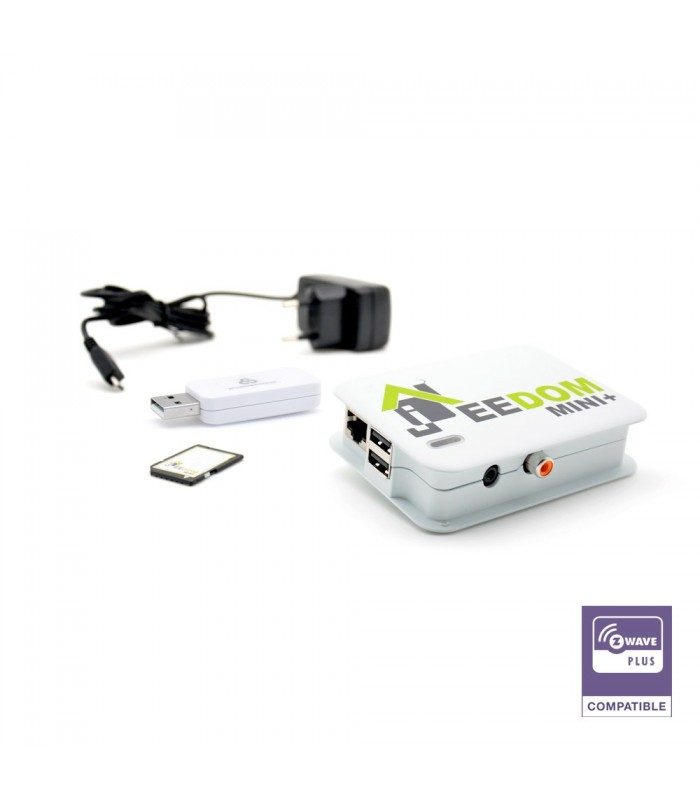
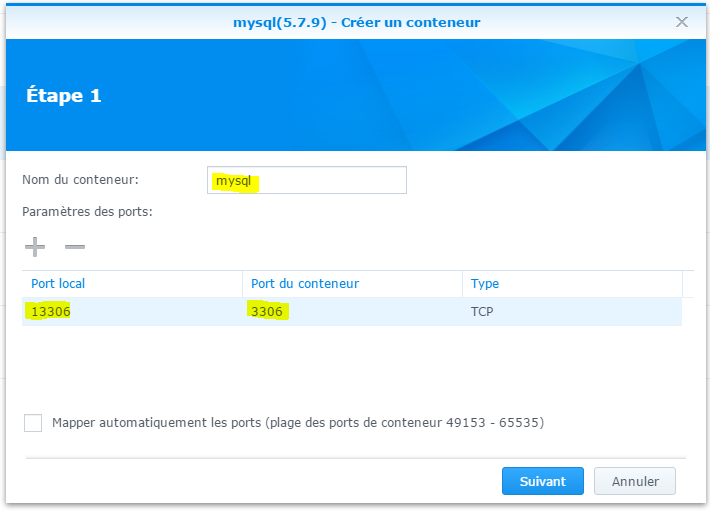
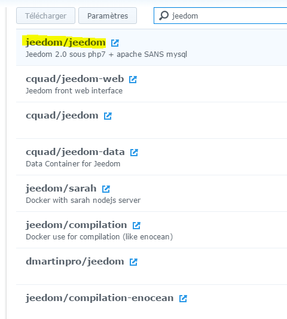
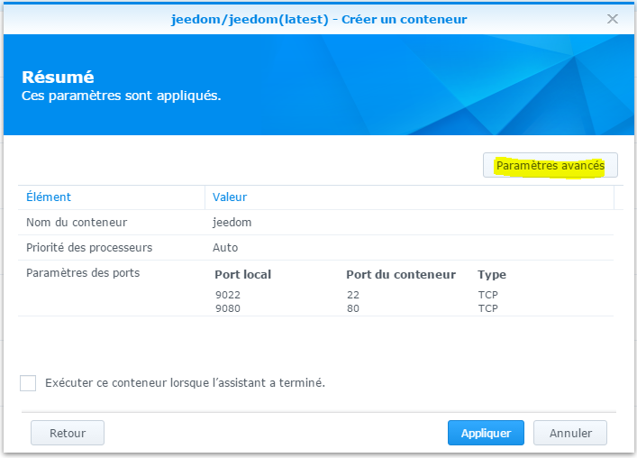

hardware
========

Jeedom se puede instalar en varios componentes de hardware:

-   un ft frambuesa 2 o 3

-   Synology NAS

-   cualquier sistema Linux basado en Debian

También puede comprar una caja confeccionada con Jeedom preinstalado
que adicionalmente contiene un paquete de servicio (más apoyo y servicios)
plugins disponibles de:

-   [Inteligente Jeedom
    Z-Wave +] (https://www.domadoo.fr/fr/box-domotique/3959-jeedom-controleur-domotique-jeedom-smart-z-wave.html)

-   [Jeedom Smart + y Z-Wave
    RFXCOM] (https://www.domadoo.fr/fr/box-domotique/4043-jeedom-controleur-domotique-jeedom-smart-z-wave-et-interface-rfxcom.html)

-   [Inteligente Jeedom
    EnOcean] (https://www.domadoo.fr/fr/box-domotique/4041-jeedom-controleur-domotique-jeedom-smart-enocean.html)

-   [Jeedom y EnOcean inteligente
    RFXCOM] (https://www.domadoo.fr/fr/box-domotique/4044-jeedom-controleur-domotique-jeedom-smart-enocean-et-interface-rfxcom.html)

Aquí es una configuración de "tipo" para un buen comienzo con Jeedom Z-Wave:

1.  Pi frambuesa 3:

    -   Una caja de frambuesa + \ ~ 50 €

    -   Una clave Aeon Gen 5 \ ~ 60 €

    -   Una tarjeta micro SD \ ~ 7 €

    -   Un USB de potencia \ ~ € 8

Un total de € 125 para una caja con domótica de código abierto
el control completo de su instalación.

> ** Tip **
>
> Es posible añadir o cambiar una antena RFXCOM, o
> Clave EnOcean.

> ** Tip **
>
> Jeedom es un software que es y seguirá siendo de código abierto, su uso
> Es completamente gratuito y no depende de una nube o
> Suscripción. Sin embargo, algunos plugins que aumentan la
> Capacidad de Jeedom o su uso puede ser gravosos y **
> Es posible que tenga una conexión a Internet **. Puede encontrar
> La lista de plugins
> [Aquí] (http://market.jeedom.fr/index.php?v=d&p=market&type=plugin).

> ** Tip **
>
> Service Pack? Quézako? Podéis ver
> [Aquí] (https://blog.jeedom.fr/?p=1215) los beneficios de los paquetes de servicio.

Jeedomboard
===========

Aquí se encuentra el paso a paso la documentación para instalar en Jeedom
la Jeedomboard (o Hummingboard).

> ** Tip **
>
> El nombre de la imagen Jeedom puede ser diferente de la captura
> Hecho en esta documentación

Paso 1: Instalar Etcher
---

Debe descargar el Etcher logicel [aquí] (https://etcher.io/), entonces
instalarlo en su PC

Paso 2: Recuperación Jeedom Imagen
---

Tiene que ir
[Aquí] (https://www.amazon.fr/clouddrive/share/OwYXPEKiIMdsGhkFeI3eUQ0VcvTEBq0qxQevlXPvPIy/folder/IT3WZ3N0RqGzaLBnBo0qog)
a continuación, en la carpeta Imágenes recuperar la imagen jeedom-jeeboard - \ *. rar o
Jeedomboard \ _ \ _ Debian \ _Jessie \ *. Rar

Paso 3: Descompresión imagen Jeedom
---

Descomprimir la imagen Jeedom (si no tiene nada para descomprimir el
puede instalar
[WinRAR] (http://www.clubic.com/telecharger-fiche9632-winrar.html) usted)
deberán reunir:

Paso 4: La quema de la imagen en la tarjeta SD
---

Inserte la tarjeta SD en su ordenador y ejecutar el software
Éter, dar a la ruta de la imagen, el camino de la tarjeta SD y
haga clic en "flash". El software va a quemar la tarjeta SD y compruebe el
aguafuerte

Sólo hay que poner la tarjeta SD en la Jeedomboard (o
Hummingboard) para conectar la red y la potencia, su voluntad Jeedom
empezar (5 min) y debería ver en la red.

> ** Tip **
>
> identificadores SSH son jeedom / Mjeedom96

Para el resto se puede seguir la documentación [Introducción a
Jeedom] (https://jeedom.github.io/documentation/premiers-pas/fr_FR/index.html)

Miniplus / Hummingboard
=====================

Aquí se encuentra el paso a paso la documentación para instalar en Jeedom
Mini más (mapa Hummingboard Solid-Run).

Paso 1: Instalar Etcher
---

Debe descargar el Etcher logicel [aquí] (https://etcher.io/), entonces
instalarlo en su PC

Paso 2:
---

Recuperación de la imagen de Jessie. Advirtiendo al humingboard no hay
una frambuesa. ** Es necesario conseguir que la ISO específica
que es un jessie para IMX6. **

Tiene que ir
[Aquí] (https://images.solid-build.xyz/IMX6/Debian/sr-imx6-debian-jessie-cli-20171108.img.xz)
y guardar la imagen en su PC.

Paso 3: La descompresión de la imagen
---

Descomprimir la imagen Jeedom (si no tiene nada para descomprimir el
puede instalar
[Winrar] (http://www.clubic.com/telecharger-fiche9632-winrar.html)).

Paso 4: La quema de la imagen en la tarjeta SD
---

Inserte la tarjeta SD en su ordenador y ejecutar el software
Éter, dar a la ruta de la imagen, el camino de la tarjeta SD y
haga clic en "flash". El software va a quemar la tarjeta SD y compruebe el
aguafuerte

Sólo hay que poner la tarjeta SD en el Mini + para conectar el
la red y la potencia, su Jeedom se iniciará.

Paso 5: Instalar jeedom - Guión lanzamiento
---

Abra una consola SSH con masilla por exemmple.

> ** Tip **
>
> Debian de usuario / contraseña debian

> ** Tip **
>
> La contraseña de root es debian

1 / Configuración de intercambio el Mini + como inactiva por defecto con este
distribución.

Conectar con SSH a su sistema y hacer:

    sudo imx6-config

Introduzca la contraseña de root ( "debian")

Haga clic en OK (aparece su IP local - la nota a continuación para conectarse a
el fin)

pulse Intro

Elige la categoría 4 de intercambio con las teclas de flecha y luego intall
Se recomienda de intercambio (SWAP un 512, se puede cambiar al final de
crear el canje por defecto). Siga el procedimiento.

** ** Reiniciar y comprobar la activación del intercambio con el comando

    reinicio sudo

    gratis - m

2 / Finalmente inicie la escritura oficial con estos tres comandos:

    wget https://raw.githubusercontent.com/jeedom/core/stable/install/install.sh

    chmod + x install.sh

    sudo ./install.sh

<Clase Div = "informalexample">

** El tiempo de instalación varía de 60 a 120 minutos **. Usted no debe
interrumpir este procedimiento. De lo contrario debe empezar de nuevo. El es
recomiendo vivamente que reiniciar al final de la instalación.

</ Div>

Los siguientes argumentos pueden ser utilizados:

-w fichero = servidor web

dependencias z = sistema de onda z

-m = raíz contraseña de MySQL requiere

    ./install.sh -w / var / www / html z -m Jeedom

Es recomendable hacer un reinicio de la mini +

    reinicio sudo

Después, simplemente ir a IP \ _MACHINE \ _JEEDOM en su
navegador.

> ** Nota **
>
> La contraseña por defecto es admin / admin

> ** Importante **
>
> Si necesita inyectar una copia de seguridad, usted tiene que esperar entre 5 y 10
> minutos para conseguir todo en orden (el usuario admin /
> Administración ya no existe ...). Especialmente tienes que no fuera
> Eléctricamente su mini más.

Para el resto se puede seguir la documentación [Introducción a
Jeedom] (https://www.jeedom.fr/doc/documentation/premiers-pas/fr_FR/doc-premiers-pas.html)

frambuesa Pi
===========

Aquí encontrará la documentación de la instalación de un Jeedom
PI frambuesa ** con una tarjeta SD. **

> ** Importante **
>
> Debian 9 (Strecht) es la distribución con apoyo oficial para
> Versión 3.1.5 jeedom (pero perfectamente Jessie
> Funcional).

** 1 / Descarga la última foto "light", es decir, sin interfaz
** gráfico
[Aquí] (https://downloads.raspberrypi.org/raspbian_lite/images/raspbian_lite-2017-12-01/2017-11-29-raspbian-stretch-lite.zip)

** 2 / descomprimir la imagen con winrar ** [Aquí] (http://www.win-rar.com)

** 3 / Grabar imagen en SD con grabador por ejemplo **
[Aquí] (https://etcher.io/)

> ** Nota **
>
> Si utiliza Etcher para quemar su imagen, la etapa
> La descompresión se innecesarias (reconocida directamente en formato Zip
> Seleccione el archivo de imagen).

** 4 / Habilitar el acceso SSH **

> ** Aviso **
>
> Por razones de seguridad, el acceso SSH no está activado por defecto
> Esta distribución. así que hay que activarlo.

Hay que crear la partición de arranque (la única disponible en Windows)
ssh un archivo vacío.

clic justo: nueva / texto y
cambiar el nombre de "ssh" ** ** sin extensión

> ** Importante **
>
> En Windows, en el Explorador de fin de comprobar su
> Configuración de visualización / Opciones / Opciones de cambio
> Carpeta y Búsqueda /

** 5 / IP de inicio **

Inserte la tarjeta SD, conecte el cable de red, conecte
los alimentos.

** 6 / sesión SSH **

Identificar su pi en la red

Se debe conocer la dirección IP de su Ip. Varias soluciones:

-   Compruebe la configuración de DHCP en el router

-   Utilizar un escáner de puertos, tales como "angyipscanner"
    [aquí](http://angryip.org/download/#windows)

establecer la conexión

A continuación, utilice por ejemplo masilla para establecer la conexión
[Aquí] (http://www.putty.org/)

Retraer la dirección IP de su IP (192.168.0.10 aquí) y haga clic
abierta. Aceptar el mensaje predeterminado por la seguridad en el
primera conexión.

ID de sesión con ** pies / frambuesa **

> ** Importante **
>
> Por razones de seguridad, es imprescindible para cambiar la contraseña
> Predeterminados. Los casos de piratería basan en la explotación de
> Inicio de sesión / contraseña por defecto son frambuesa
> Particularmente frecuente. (Passwd y sudo passwd)

** 7 / Iniciar el jeedom script de instalación **

    wget -O https://raw.githubusercontent.com/jeedom/core/stable/install/install.sh | fiesta sudo

** La contraseña sudo es frambuesa **

> ** Nota **
>
> Dependiendo de su velocidad de Internet, la instalación puede tardar 45
> 90 minutos. Usted Particularmente, no debe interrumpir el proceso antes
> El final. De lo contrario, se repetirá el procedimiento completo.

Después, simplemente ir a IP \ _MACHINE \ _JEEDOM

> ** Nota **
>
> La contraseña por defecto es admin / admin

> ** Nota **
>
> Los siguientes argumentos pueden ser utilizados: w = z = archivo de servidor web
> -m dependencias de instalación de onda z = contraseña root mysql deseada

    ./install.sh -w / var / www / html z -m Jeedom

A continuación, puede seguir la documentación [Cómo comenzar a usar
Jeedom] (https://github.com/jeedom/documentation/blob/master/premiers-pas/fr_FR/index.asciidoc)

VM
==

Si quieres descubrir Jeedom con seguridad, también puede
virtualizar su PC, estos son los pasos a seguir. Se toma
hay riesgo en una máquina virtual, la integridad de su PC está protegido:

Paso 1: Descargar e instalar VMware Player
---

Es necesario descargar logicel Virtual Box
[Aquí] (http://download.virtualbox.org/virtualbox/5.1.28/VirtualBox-5.1.28-117968-Win.exe)

Paso 2: Descargar una imagen de Debian Strecht - netinstall
---

Descargar la imagen minimalista debian 9 Strecht
[Aquí] (https://cdimage.debian.org/debian-cd/current/amd64/iso-cd/debian-9.3.0-amd64-netinst.iso)

Descargar el paquete de extensiones, e instalarlo.
[Aquí] (http://download.virtualbox.org/virtualbox/5.1.28/Oracle_VM_VirtualBox_Extension_Pack-5.1.28.vbox-extpack)

Paso 3: Configurar el entorno VM
---

Haga clic en Nuevo y rellene los campos mencionados a continuación:

-   Haga clic en Siguiente, ajustar el tamaño de la memoria en comparación con
    su sistema (1024 es suficiente)

-   Haga clic en Siguiente, crear un disco virtual ahora

-   Haga clic en Crear, seleccione VDI

-   Haga clic en Siguiente, asignado dinámicamente

-   Haga clic en Siguiente, seleccione un tamaño para el espacio
    (4 GB es suficiente)

-   Haga clic en Crear

Paso 4: Lanzamiento de VM
---

-   Haga clic en control

-   Seleccione el almacenamiento

-   Añadir una unidad óptica

-   La elección de un disco

-   Introduzca la imagen previamente cargada

-   A continuación, seleccione la red y seleccione "Acceso puente" en el modo de
    acceso a la red.

-   Haga clic en OK \ * Haga clic en Inicio

Paso 5: instalación debian 9
---

Este es el clásico ...

-   Seleccione la instalación gráfica

-   Instalar debian preferiblemente sin GUI
    como inútil. El nombre de usuario no es importante. En la
    La mayoría de las pantallas simplemente validar la opción por defecto. Usted
    puede dejar los campos en blanco no está bloqueando.

-   Para la selección de software:

-   Para Grub, no se preocupe, el sector de arranque es el de
    VM, no el PC. No hay riesgo de romper nada.

Paso 6: Instalación de jeedom
---

-   Poner en marcha su máquina virtual

-   Identificarse con el usuario y la contraseña seleccionada
    durante la instalación

-   Cambiar a la raíz

<! - ->

    sabía

-   Entrar en el set durante la instalación contraseña de root

-   Obtener el jeedom guión, hacerlo ejecutable, ejecutarlo

<! - ->

    wget https://raw.githubusercontent.com/jeedom/core/stable/install/install.sh

    chmod + x install.sh

    ./install.sh

-   y dejar hacer ...

Paso 7: Lanzamiento de jeedom
---

-   Para conocer la dirección IP LAN de la máquina virtual

<! - ->

    ip -s -c -H tiene

Su dirección IP, el tipo 192.168.0.XX aparece en rojo. justo
introducirla en su navegador.

> ** Aviso **
>
> Si esto no funciona, no configura su tarjeta
> Red de puente de red, como se indica al principio.

A continuación, puede seguir la documentación [Cómo comenzar a usar
Jeedom] (https://github.com/jeedom/documentation/blob/master/premiers-pas/fr_FR/index.asciidoc)

estibador
======

> ** Importante **
>
> Tenga en cuenta que vayamos de aquí se supone que ya controlar ventana acoplable

Para descubrir Jeedom también puede convertirlo en una
Acoplable contenedor:

> ** Importante **
>
> Requisitos previos: una máquina o una máquina virtual de Linux en ejecución

Paso 1: Instalar ventana acoplable
---

cargador de muelle ya está disponible en todas las distribuciones recientes.
Para instalar en una distribución

-   rpm-basado

<! - ->

    $ Yum instalar ventana acoplable

-   deb basada

<! - ->

    $ Apt-get update
    $ Apt-get install ventana acoplable
    $ Apt-get install docker.io

Paso 2: Instalar una imagen mysql
---

> ** Nota **
>
> También puede instalar MySQL directamente en el ordenador central,
> En este caso debe saltar.

Utilizo [la] (https://hub.docker.com/_/mysql/). para instalar
:

    suéter ventana acoplable mysql: últimas

A continuación, ejecute:

    sudo ventana acoplable plazo --name jeedom-mysql -v / opt / jeedom / mysql / var / lib / mysql -e MYSQL_ROOT_PASSWORD = su-MySQL-contraseña -d mysql: últimas

Con :

-   jeedom-mysql: el nombre del contenedor de MySQL

-   / Opt / jeedom / mysql: alojar la carpeta o uno tiene el fogonero
    de datos MySQL

-   tu-MySQL-contraseña: la contraseña de root de la instancia de MySQL

Paso 3: Instalación de una imagen Jeedom
---

instalación de la imagen:

    cargador de muelle tire jeedom / jeedom

A continuación, iniciar:

    sudo ventana acoplable plazo --name jeedom-servidor --link jeedom-MySQL: MySQL --privileged -v / tu / jeedom / ruta: / var / www / html = -e contraseña_root su-root-p contraseña 9080: 80 - p 9022: 22 jeedom / jeedom

Con :

-   jeedom-servidor: nombre de la ventana acoplable jeedom deseada

-   / Su / jeedom / ruta: Jeedom directorio en el que se establece de datos
    en el host

-   tu-root-contraseña: contraseña de root para acceder a Jeedom SSH

A continuación, deberá instalar Jeedom yendo a: IP \ _DOCKER 9080 y
introducir la información de conexión a mysql:

Para el resto se puede seguir la documentación [Introducción a
Jeedom] (https://github.com/jeedom/documentation/blob/master/premiers-pas/fr_FR/index.asciidoc)

> ** Importante **
>
> En el nombre del anfitrión MySQL debe ser puesto jeedom-mysql

Synology
========

Aquí se encuentra el paso a paso la documentación para instalar un Jeedom
Synology (DSM 5.2 mínimo).

Paso 1: Instalar acoplable
================================

Ir al centro del paquete:

Haga clic en todas, a continuación, instalar el paquete acoplable

Espere hasta que finalice la instalación:

> ** Importante **
>
> Para acceder al paquete del estibador, es esencial tener DSM 5.2 y
> NAS compatible

Paso 2: Recuperación y la instalación de imágenes Jeedom
================================================== ======

Tenemos que convertir Jeedom estibador, el primer Mysql una ventana acoplable
contendrá la base de datos y un segundo que contiene Jeedom

Lanzar la aplicación acoplable:

MYSQL
-----

Haga clic en "Register":

En la búsqueda de tipo de campo "mysql", seleccione MySQL y haga clic
descargar en:

A continuación, confirmar la versión de la aplicación, lo mejor es tomar la
última versión:

A continuación, haga clic en la imagen aquí se puede seguir el progreso de la
descarga (puede tardar varias decenas de minutos)

Cuando haya terminado, haga clic en la imagen y funcionamiento:

Dar un nombre a su mysql y un puerto local redirigido al puerto
3306 del contenedor y, a continuación, de acuerdo con:

Hacer lo siguiente:

Haga clic en "Configuración avanzada":

A continuación, "Agregar carpeta", y luego establecer la carpeta lado deseado
Synology (que es en este caso no habrá todos los archivos de la
base de datos) y var / lateral / contenedor mysql / lib (cuidado de
Desactive la opción "sólo lectura")

Haga clic en "medio ambiente" y luego "Añadir variable" y poniendo en
"Variable": "MYSQL \ _root \ _contraseña" valor y poner la palabra
Contraseña quería BDD (usó más adelante). A continuación, valide:

Seleccione "Ejecutar este recipiente cuando el asistente ha terminado", entonces
haga clic en "Aplicar".

Jeedom
------

Haga clic en "Register":

En el campo de búsqueda, escriba "jeedom" seleccione jeedom / jeedom
y haga clic de descarga:

A continuación, confirmar la versión de la aplicación, lo mejor es tomar la
última.

A continuación, haga clic en la imagen aquí se puede seguir el progreso de la
descarga (puede tardar varias decenas de minutos)

Cuando haya terminado, haga clic en la imagen y funcionamiento:

Dar un nombre a su jeedom y un puerto local redirigido a la
el puerto 80 (en este caso 9080) y alrededor de 22 (en este caso 9022) del contenedor de nosotros,
Próximo :

Hacer lo siguiente:

Haga clic en "Configuración avanzada"

A continuación, "Agregar carpeta"

Elija una carpeta en su Synology (que es en este caso hay
serán todos los archivos jeedom), con cuidado para desactivar "Leer
Sólo "

En ruta, poner / var / www / html a continuación, haga clic
"Medio ambiente" :

Seleccione "Ejecutar el recipiente con privilegios elevados", entonces
confirma en su totalidad:

Seleccione "Ejecutar este recipiente cuando el asistente ha terminado", entonces
haga clic en "Aplicar".

Paso 3: Configuración de Jeedom
---

Ahora es necesario instalar Jeedom, es muy simple, ir a
IP \ _NAS: 9080

Rellene los campos según su configuración (Configuration
estibador MySQL instalado previamente) y confirme.

> ** Importante **
>
> La dirección IP de la base de datos es la dirección IP del NAS, el puerto se
> Ventana acoplable Redirigido MySQL, la contraseña es la establecida en la ventana acoplable
> MySQL. El nombre de usuario es la raíz y el nombre de base de datos uno
> Quiere (Jeedom recomendado)

> ** Tip **
>
> Si desea tener acceso SSH, necesita una redirección de puertos
> Puerto local al puerto 22 del recipiente, los identificadores son SSH
> Raíz / jeedom. Puede cambiar la contraseña de inicialización
> Variable de entorno ROOT \ _password el valor de la contraseña
> Se busca.

A continuación, puede seguir la documentación [Cómo comenzar a usar
Jeedom] (https://github.com/jeedom/documentation/blob/master/premiers-pas/fr_FR/index.asciidoc)

otro
======

Aquí encontrará la documentación para instalar en la mayoría Jeedom
sistemas Linux (probado y aprobado en la distribución Debian)

> ** Importante **
>
> Debian 9 (estiramiento) es la distribución con apoyo oficial para
> 3.1.7 versión Jeedom (pero perfectamente Jessie
> Funcional). Si no dominar una ambientes mínimos
> Linux, se recomienda que usted deja en una foto oficial (OVF)
> O usando un Mini o Smart + (disponible en breve).

> ** Importante **
>
> El script de instalación puede ser peligroso porque se supone
> Su sistema está en blanco. Si este no es el caso, gracias a leer
> Guión y realizar una instalación con la mano.

Conectar con SSH a su sistema y hacer:

    wget https://raw.githubusercontent.com/jeedom/core/stable/install/install.sh
    chmod + x install.sh
    ./install.sh

Después, simplemente ir a IP \ _MACHINE \ _JEEDOM de su
navegador de Internet.

> ** Nota **
>
> La contraseña por defecto es admin / admin

> ** Nota **
>
> Los siguientes argumentos pueden ser utilizados: w = z = archivo de servidor web
> -m dependencias de instalación de onda z = contraseña root mysql deseada

    ./install.sh -w / var / www / html z -m Jeedom

A continuación, puede seguir la documentación [Cómo comenzar a usar
Jeedom] (https://github.com/jeedom/documentation/blob/master/premiers-pas/fr_FR/index.asciidoc).
