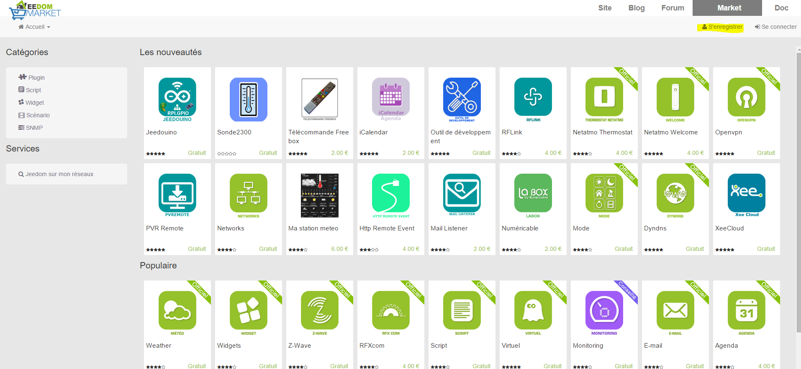
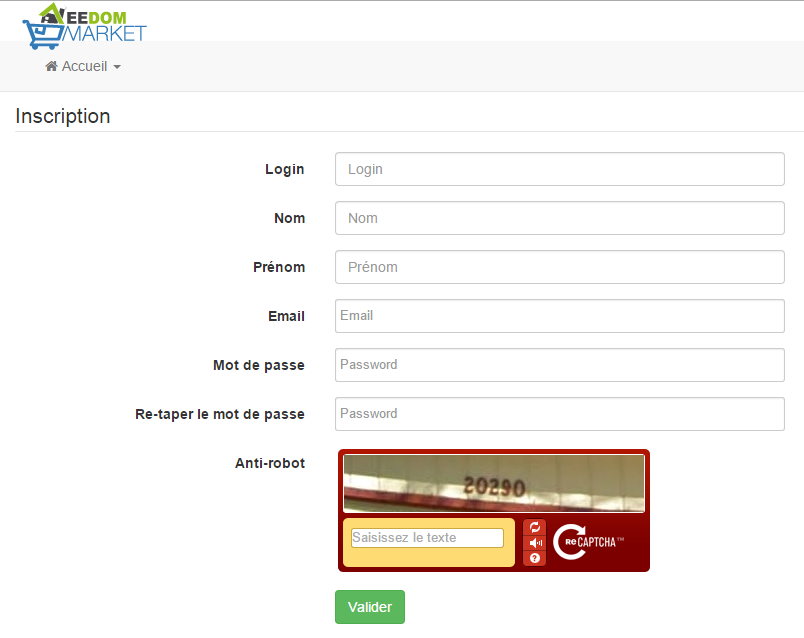
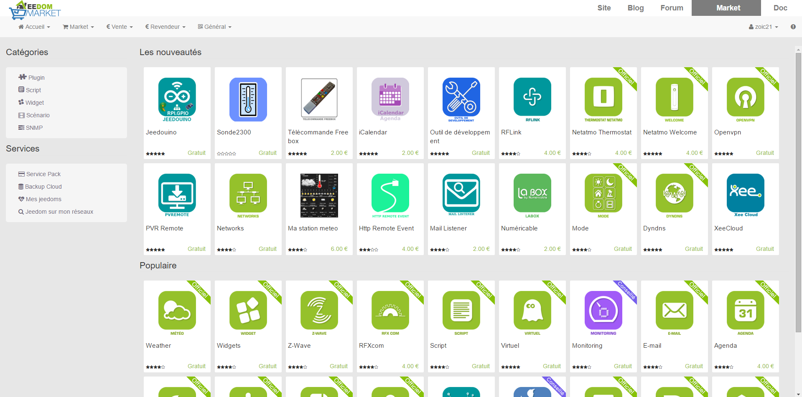
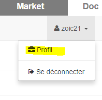
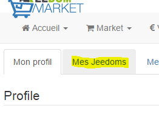
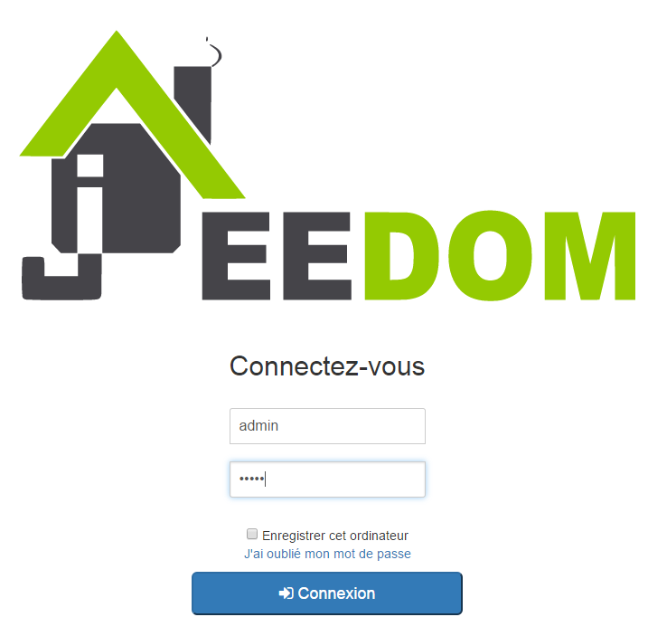
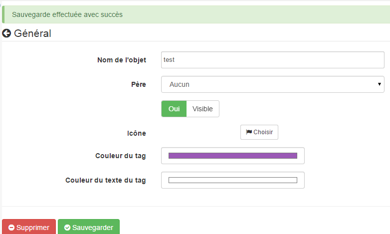

Welcome to this documentation of first steps, this one will you
help put your Jeedom into operation.

> **Tip**
>
> This guide is not meant to replace the complete documentation
> available on the Jeedom site [here] (https://jeedom.fr/doc).

Registration on the market
=========================

The first thing to do is to create an account on the Market for
to be able to record your Jeedom on this one, click
[here] (https://market.jeedom.fr) to get started

Click on the "Register" button at the top right:

Fill in the different fields and validate. You will then fall on
this page :

Here is your Market account is created, for more details on the market
click
[Here] (https://www.jeedom.fr/doc/documentation/core/fr_FR/doc-core-market.html)

Adding your service pack code
================================

If you bought a Jeedom box then you should have received an email
containing a code for your service pack.

> **Important**
>
> It is important to inform it because this code gives you access to
> some plugins for free, as well as exclusive services.

> **Important**
>
> If you buy a service pack from Market Jeedom you do not have
> nothing to do, it is automatically assigned to you.

Once the code recovered in the mail you just have to go on the
[market Jeedom] (https://market.jeedom.fr) and to identify you.

Then go to your profile page:

Then click on the tab "My Jeedoms"

Fill in your service pack number and confirm:

Here is your service pack is saved. For more details on the
Market click
[Here] (https://github.com/jeedom/core/blob/stable/doc/fr_FR/market.asciidoc)

> **Tip**
>
> If you bought an official Jeedom box, the service number
> pack must have been sent to you by email. If you have not received anything, thank you
> to contact the store where you bought your box.

Find your Jeedom on the network
==================================

Once Jeedom electrically connected and connected to your local network,
here is how to connect to this one.

Find Jeedom
--------------

### By the market

The simplest solution (but does not work in 100% of cases in
depending on the configuration of your internet access), you have to start
the box, wait about 10 minutes (be careful if you use a
image type netinstallation, it will be rather 30min) and go
[Here] (https://www.jeedom.com/market/index.php?v=d&p=find)

> **Tip**
>
> Be careful, you have to be on the same network as the Jeedom box for
> this method works.

> **Important**
>
> Depending on your ADSL box, this feature may not work.
> If this is the case, nothing serious, you just have to connect to
> your ADSL box and find the ip of jeedom in this one. This step
> does nothing more than give you the local IP of your Jeedom.
> It's not at this point that adding your Jeedom to your account
> market is done.

### By your internet box

-   Go to the administration interface of your internet box and
    look for Jeedom in your network devices.

-   Get his IP.

-   Put this IP in your internet browser. You should be
    on the Jeedom interface.

First connection
------------------

Whichever method you use, you then come to the page of
login. By default the login and password are "admin".

Link my Jeedom to my account market
===================================

We will see here how to link your Jeedom to your Market account.

-   Once connected to your jeedom, you must go on
    Administration → Configuration

-   Click on the **Updates** tab

-   Below, click the **Market** tab

-   Check the box **activate**

-   Fill in the address: `https: // www.jeedom.com / market`

-   Also fill in the field "Username" and "Password"
    according to your identifiers (market identifiers and not
    from Jeedom)

-   You can test to verify that the connection
    is done correctly.

-   Do not forget to save!

For more details on the configuration page click
[Here] (https://github.com/jeedom/core/blob/stable/doc/fr_FR/administration.asciidoc)
.

Get my direct access URL
==============================

If you have a service pack, Jeedom provides you with a URL
direct access to your Jeedom without you having to open ports on
your box or other.

To configure it, just go to
General Administration → Configuration →

Then go to the "Network Configuration" section

Once here, just activate "Use DNS Jeedom" then
on the line "Management" to do "Restart" and your URL will appear at
HTTP status level, you can of course customize it from
the Market profile page

> **Important**
>
> If you have just linked your Jeedom to your Market account you must
> wait 24 to 48 hours before you can use the DNS service

Change Jeedom's default password
============================================

One of the important steps is to change the default password of
your Jeedom account, click on Administration → Users
(top right) :

Once on you just have to choose the line with the user
**admin** and click **change password**:

A window will ask you for the password. Be careful
remember, otherwise you will not be able to access your Jeedom:

That's it, you changed the password of the admin account, for more
information on this page click
[Here] (https://github.com/jeedom/core/blob/stable/doc/fr_FR/user.asciidoc).

Create my first object
=======================

You will create your first object, but first you have to know what
what is an object.

In Jeedom, it can be anything and everything, but it is
recommended to do it according to your parts.

> **Tip**
>
> It is possible to define relations between the objects, example:
> the living room belongs to the ground floor object which belongs to itself
> to the house object.

To create an object, nothing is easier:

-   Go to Tools → Objects

-   Click the add button:

-   Jeedom will ask you the name of this one:

-   Confirm. This is your first created object:

For more information on this part click
[Here] (https://github.com/jeedom/core/blob/stable/doc/fr_FR/object.asciidoc)

Install my first plugin
============================

A plugin allows adding features to Jeedom. There are
hundreds. Many are free, others may be paying.
To access the plugins page go to Plugins → Manage
plugins.

Then click on Market:

You will then have the list of all the plugins that it is possible
install.

> **Important**
>
> Warning, some are official and others are not. In case of concern
> with an unofficial plugin, the Jeedom team can not be held for
> responsible.

By clicking on a plugin you get the form:

Vous retrouvez alors : \* des boutons pour installer le plugin : la
version stable est fortement recommandée, \* un bouton pour supprimer le
plugin, \* une brève description, \* un lien vers la documentation du
plugin, \* un lien vers le changelog (les dernières modifications
apportées), \* la compatibilité avec les différentes plateformes, \* les
avis des utilisateurs, \* la façon d’utiliser le plugin, \* des
informations complémentaires comme l’auteur, le lien vers la discussion
du forum concernant ce plugin, la date de dernière mise à jour, etc.

Pour plus d’informations sur les plugins cliquez
[ici](https://jeedom.github.io/core/fr_FR/plugin)
.

Support
=======

Jeedom approaches very large fields and evolving from day to day.
However, many ways are available to you to find
help and ask your questions.

The Jeedom documentation
--------------------------

You will find a complete documentation [here] (https://jeedom.fr/doc):

This one consists of several categories:

-   Core: a part for the "heart" of Jeedom,

-   First steps: A part (where you are currently) for
    first things to know,

-   Installation: Everything about installing Jeedom,

-   Howto: Tutorials to progress in various areas,

-   Plugins: The documentation of the different official plugins of
    Jeedom,

-   the others: various pages on the different protocols used
    in Jeedom, Jeedom's presentation, lists of
    compatibility, etc.

You will also find below the list of documentation for
third party plugins.

Feel free to use **search** at the top right of
the page to find the pages according to a specific word.

The forum
--------

You'll find it [here] (https://jeedom.com/forum).

The forum is very active and contains a lot of information. If you
have a question, do not hesitate to ask it. You will have an answer in
less than an hour (on average). Be careful though, the forum is
maintained by the Jeedom community, composed of volunteers, and not by the
Jeedom company.

Support requests (or tickets)
------------------------------------

> **Important**
>
> Attention, any request of support requires obligatorily to have
> an account on the Market.

If you have not found a solution to your problem, last
recourse, you can make a support request to the Jeedom team.
This request goes through a ticket. It is possible to open one of
many ways :

-   Directly from Jeedom (recommended method): wherever you
    be in Jeedom, there is an exclamation mark on the top right
    which makes it possible to make a request for support:

-   If for one reason or another you do not have access to your
    Jeedom, you can always open a ticket from the Market:

    -   with the exclamation mark at the top right,

    -   either by going to your profile (then click on the button
        "Open a support request").

All the following exchanges will be made by mail.

> **Tip**
>
> If, when opening a ticket, you get an error indicating
> that you have reached your quota is that you are limited to one
> number of support requests per month, depending on your
> service pack.

The different service packs are: \ * Community (free): 2
tickets / month (on paid plugins only) \ * Power: 10 tickets / month
\ * Pro: 100 tickets / month

You can find the details of the service packs
[Here] (https://www.jeedom.com/site/fr/soft.html#obtenir)
