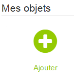
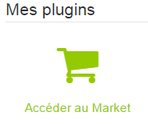
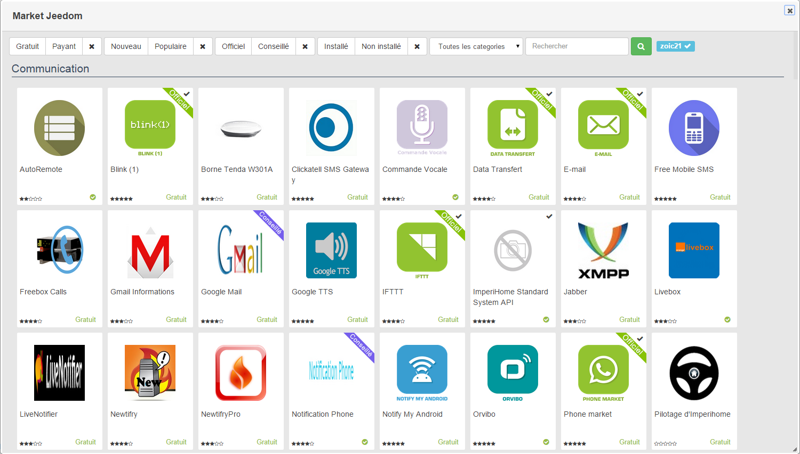
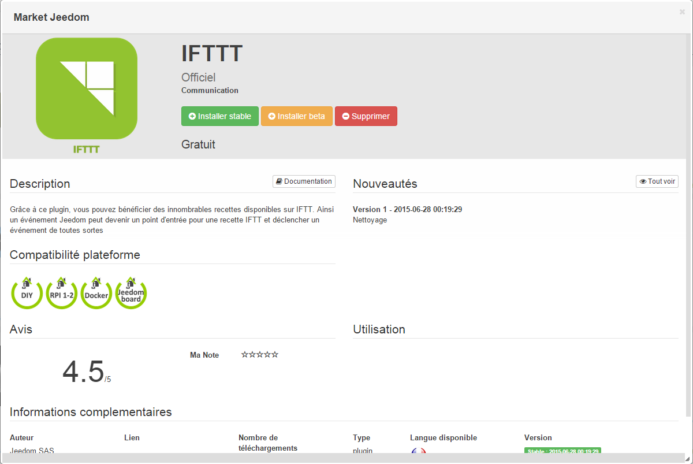
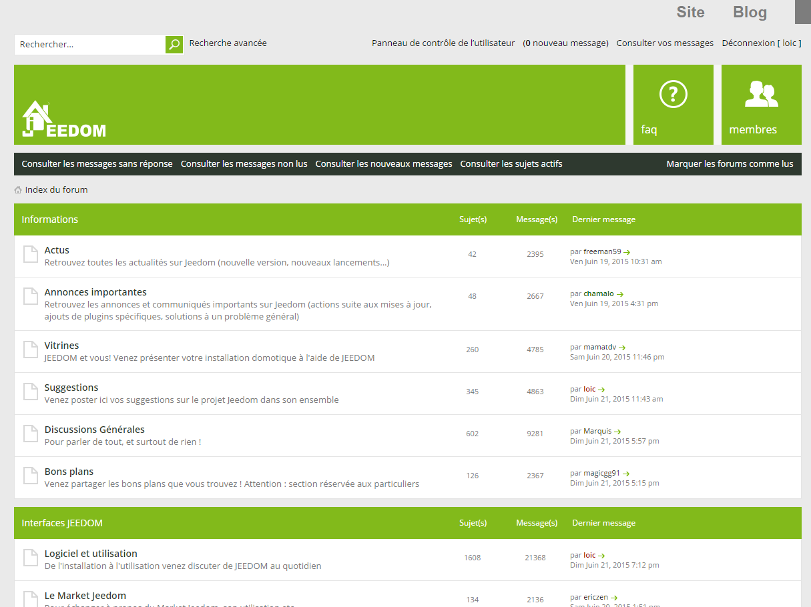
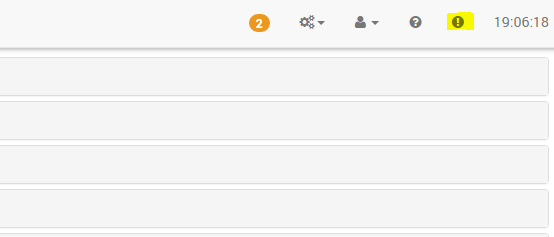
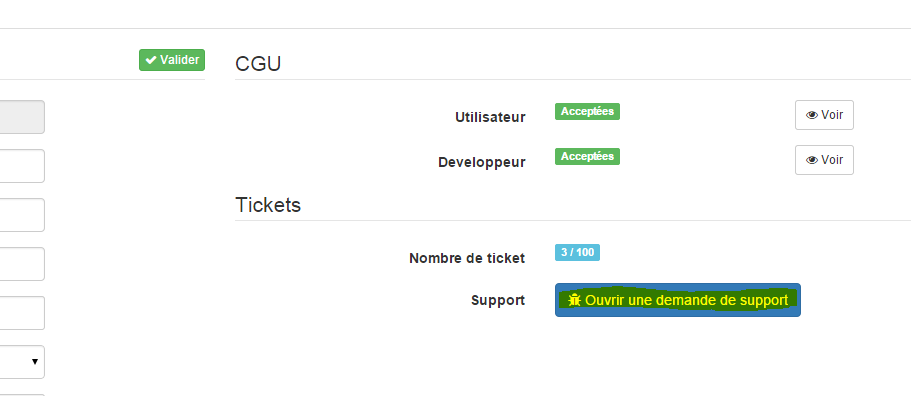

Bienvenido a la primera documentación pasos, éste se
ayudar a configurar su Jeedom.

> **Tip**
>
> Esta guía no pretende sustituir la documentación completa
> Disponible en el sitio web Jeedom [aquí] (https://jeedom.fr/doc).

Registro de empresa en el mercado
=========================

Lo primero que debe hacer es crear una cuenta en el mercado de
para registrar su Jeedom en él, haga clic
[Aquí] (https://market.jeedom.fr) para comenzar

Haga clic en el botón "Registrarse" en la parte superior derecha:

Rellene los detalles y presentar. A continuación, se encuentra con
esta página :

Se crea voila cuenta de su mercado, para más detalles sobre el mercado
clic
[Aquí] (https://www.jeedom.fr/doc/documentation/core/fr_FR/doc-core-market.html)

Añadiendo su código de paquete de servicio
================================

Si ha comprado un cuadro Jeedom entonces usted debería haber recibido un correo electrónico
que contiene un código para su paquete de servicios.

> **Importante**
>
> Es importante aprender ya que este código le da acceso a
> Algunos plugins de forma gratuita, así como servicios exclusivos.

> **Importante**
>
> Si usted compra un paquete de servicio de la Jeedom mercado que tiene
> No hay nada que hacer, se le asigna automáticamente a usted.

Una vez recuperado el código en el correo electrónico que acaba de ir en
[Mercado Jeedom] (https://market.jeedom.fr) y identificarle.

A continuación, vaya a su página de perfil:

A continuación, haga clic en la pestaña "Mis Jeedoms"

Pida su número de paquete de servicio y validar:

Este es el paquete de servicio se guarda. Para más detalles sobre la
haga clic en el mercado
[Aquí] (https://github.com/jeedom/core/blob/stable/doc/fr_FR/market.asciidoc)

> **Tip**
>
> Si ha comprado un cuadro oficial Jeedom, el número de servicio
> Paquete tuvo que ser enviado a usted por correo electrónico. Si no ha recibido nada, gracias
> Póngase en contacto con la tienda donde compró el cuadro.

Encontrar su Jeedom en la red
==================================

Una vez Jeedom conectado y conectado a la red local de electricidad,
aquí es cómo conectarse a ella.

encontrar Jeedom
--------------

### por mercados

La solución más sencilla (pero no funciona en el 100% de los casos
Dependiendo de la configuración de su conexión a Internet), debe iniciar
la caja, espere unos 10 minutos (tenga cuidado si utiliza una
netinstallation tipo de imagen, que será más bien 30min) e ir
[Aquí] (https://www.jeedom.com/market/index.php?v=d&p=find)

> **Tip**
>
> La atención debe estar en la misma red que el cuadro de Jeedom
> Este método funciona.

> **Importante**
>
> Dependiendo de su caja ADSL esta funcionalidad puede no funcionar.
> Si este es el caso, nada serio, sólo tiene que conectar a
> Su caja de DSL y encontrar IP jeedom en ella. este paso
> No hace más que darle IP local Jeedom.
> Este no es el momento de que la adición de su cuenta a su Jeedom
> Mercado está hecho.

### Para su cuadro internet

-   Ir a la interfaz de administración de su caja de Internet y
    Mirando Jeedom sus dispositivos de red.

-   Recuperar IP.

-   Ponga esta IP en el navegador de Internet. Usted debe ser
    en la interfaz de Jeedom.

primer inicio de sesión
------------------

Cualquiera que sea el método utilizado, a continuación, llegue a la página
inicio de sesión. El nombre de usuario y contraseña por defecto son "admin".

Jeedom vinculo mi cuenta a mi mercado
===================================

Veremos cómo vincular su Jeedom su cuenta de mercado.

-   Una vez conectado a su jeedom, debe seguir
    Administración → Configuración

-   Haga clic en la pestaña Actualizaciones ** **

-   A continuación, haga clic en la pestaña Mercado ** **

-   Marque la casilla para activar ** **

-   Complete la dirección `https: // www.jeedom.com / market`

-   También llenar el campo "Nombre de usuario" y "contraseña"
    de acuerdo a sus identifants (identificadores de mercado y no
    de Jeedom)

-   Puede probar para verificar que la conexión
    es exitosa.

-   No se olvide de guardar!

Para más detalles, haga clic en la página de configuración
[Aquí] (https://github.com/jeedom/core/blob/stable/doc/fr_FR/administration.asciidoc)
.

Consigue la URL de acceso directo
==============================

Si usted tiene un paquete de servicios, Jeedom pone a su disposición una URL
acceso directo a su Jeedom sin tener que abrir puertos en
su caja o en otro.

Para configurar simplemente vaya
Administración general → Configuración →

A continuación, vaya a "Configuración de Redes"

Una vez aquí, sólo tiene que activar "Usar DNS Jeedom", entonces
en la "gestión" a "Reiniciar" y su URL aparecerá en
nivel de estado HTTP, puede personalizar por supuesto, de
la página de perfil del Mercado

> **Importante**
>
> Si sólo enlazar su Jeedom su cuenta de mercado debe
> Espere 24 a 48 horas antes de usar el servicio DNS

Cambiar la contraseña por defecto Jeedom
============================================

Un paso importante es cambiar la contraseña por defecto
Jeedom su cuenta para que haga clic en Administración → Usuarios
(arriba a la derecha) :

Una vez que usted sólo tiene que elegir la línea con el usuario
**** administrador y haga clic con el cambio** ** Contraseña:

Una ventana le pedirá la contraseña. Tenga cuidado de la
recuerde, si usted no puede acceder a su Jeedom:

Bueno, ha cambiado la contraseña de la cuenta de administrador para obtener más
La información en esta página, haga clic
[Aquí] (https://github.com/jeedom/core/blob/stable/doc/fr_FR/user.asciidoc).

Crear mi primer objeto
=======================

Vamos a crear su primer objeto, pero primero debe saber qué
lo que un objeto.

En Jeedom, esto puede ser todo y nada, pero es
se recomienda hacer en función de sus partes.

> **Tip**
>
> Es posible definir las relaciones entre los objetos, tales como:
> El espectáculo pertenece al objeto en sí pertenece la planta baja
> Para el hogar tema.

Para crear un objeto, nada más simple:

-   Vaya a Herramientas → Objetos

-   Haga clic en el botón Añadir:

-   Jeedom le pedirá el nombre de la misma:

-   Confirmar. Aquí está el primer objeto creado:

Para obtener más información haga click en esta parte
[Aquí] (https://github.com/jeedom/core/blob/stable/doc/fr_FR/object.asciidoc)

Instalar mi primer plugin
============================

Un plugin añade funcionalidad a Jeedom. hay
cientos. Muchos de ellos son gratuitos, otros son pagados.
Para acceder a la página de plugins de ir a la Gestión de plugins →
plugins.

A continuación, simplemente haga clic en el mercado:

A continuación, obtener una lista de todos los plugins que pueden
instalar.

> **Importante**
>
> Advertencia, algunos oficiales y otros no. En caso de problemas
> Con un plugin oficial, Jeedom el equipo no puede ser considerado
> Responsable.

Al hacer clic en un plugin se obtiene su tarjeta:

Volverá: \ * Botones para instalar el plugin: la
versión estable es muy recomendable, \ * un botón para borrar el
plug-in \ * una breve descripción, \ * un enlace a la documentación
plug-in \ * Enlace a la lista de cambios (últimos cambios
hecho), \ * compatibilidad con diferentes plataformas, \ * la
Comentario de usuario, \ * cómo utilizar el plug-in, \ * la
información adicional, como el autor, el enlace a la discusión
Foro sobre este plugin, fecha de última actualización, etc.

Para obtener más información, haga clic en complementos
[Aquí] (https://github.com/jeedom/core/blob/master/doc/fr_FR/plugin.asciidoc)
.

apoyo
=======

Jeedom cubre campos muy amplios y que evoluciona cada día.
Sin embargo, numerosos medios están a su disposición para encontrar
ayudar y hacer preguntas.

La documentación Jeedom
--------------------------

Encontrará documentación completa [aquí] (https://jeedom.fr/doc)

Se compone de varias categorías:

-   Núcleo: un partido para el "corazón" de Jeedom,

-   Primer paso: Una parte (donde está ahora) para
    primeras cosas a saber,

-   Instalación: Todo lo relacionado con la instalación de Jeedom,

-   COMO: tutoriales para el progreso en diversos campos,

-   Plugins: La documentación de los diversos plugins oficiales
    Jeedom,

-   otros: varias páginas en los diferentes protocolos utilizados
    en Jeedom, presentando Jeedom, listas de
    compatibilidad, etc.

También a encontrar más adelante la lista de documentos para
plugins de terceros.

No dude en utilizar el ** ** de búsqueda en la parte superior derecha de
página para encontrar las páginas en base a una palabra específica.

El foro
--------

Usted encontrará que es [aquí] (https://jeedom.com/forum).

El foro es muy activo y tiene un montón de información. Si usted
¿Tiene alguna pregunta, no dude en preguntar. Tendrá una respuesta
menos de una hora (en promedio). Tenga cuidado sin embargo, es el foro
Jeedom mantenido por la comunidad de voluntarios y no por el
la sociedad Jeedom.

Las solicitudes de soporte (o entradas)
------------------------------------

> **Importante**
>
> Atención a todos solicitud de soporte requiere necesariamente tener
> Una cuenta en el mercado.

Si no ha encontrado una solución a su problema, la última
recurso, puede hacer una solicitud de asistencia al equipo de Jeedom.
Esta aplicación requiere un boleto. Es posible abrir una de
varias maneras:

-   Directamente desde Jeedom (método): donde
    Jeedom se encuentra, hay un signo de exclamación parte superior derecha
    lo que permite una solicitud de soporte:

-   Si por una razón u otra no tiene acceso a su
    Jeedom, siempre se puede abrir un ticket de Mercado:

    -   ya sea con el signo de exclamación en la parte superior derecha,

    -   ya sea yendo a su perfil (clic en el botón
        "Abrir una solicitud de soporte").

Todos los siguientes intercambios serán por correo electrónico.

> **Tip**
>
> Si, en la apertura de un billete, se obtiene un error diciendo
> Ha llegado a su cuota es que está limitado a una
> El número de solicitudes de soporte al mes, dependiendo de su
> Service pack.

Los diferentes paquetes de servicios son: \ * Comunidad (gratis): 2
entradas / mes (plugins pagados solamente) \ * alimentación: 10 entradas / mes
\ * Pro: 100 entradas / mes

Puede encontrar los detalles de los paquetes de servicios
[Aquí] (https://www.jeedom.com/site/fr/soft.html#obtenir)
