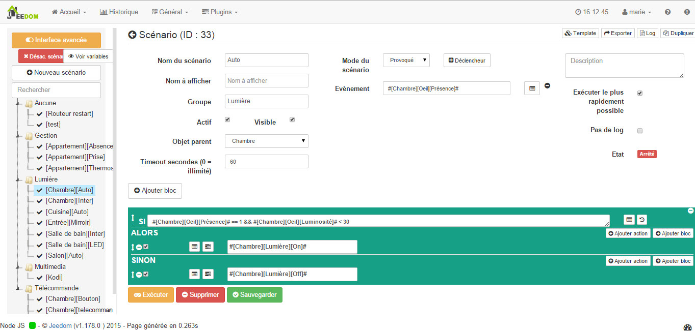
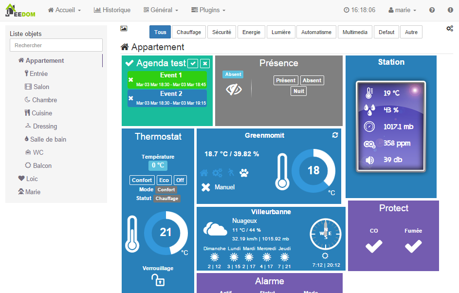
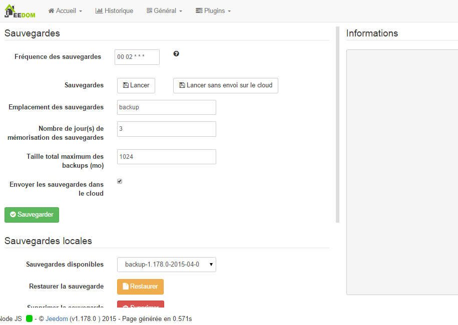
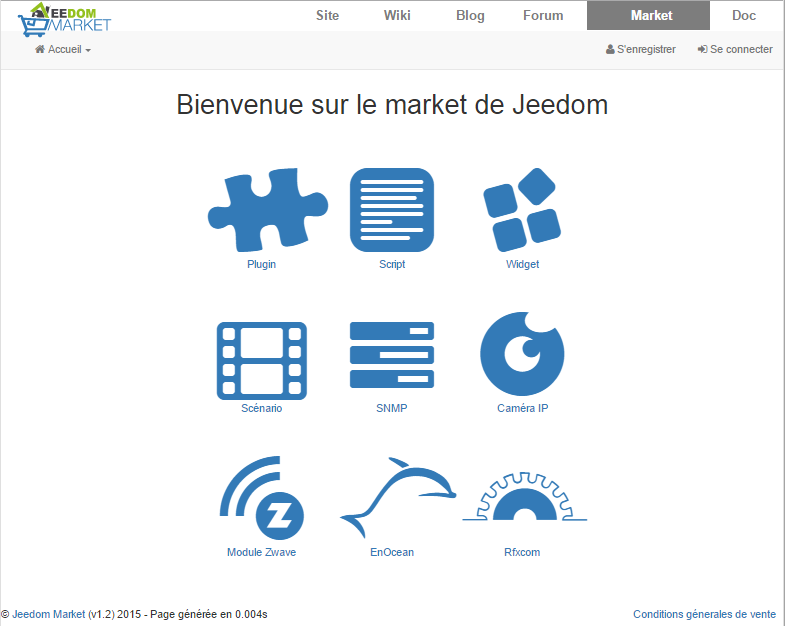

Präsentation
===

Jeedom besteht aus einem zentralen Teil (genannt Kern), der sich um die
grundlegenden Funktionen kümmert.

-   *Szenario,*

-   *Chronik,*

-   *Ansicht,*

-   *Interaktion,*

-   *Update und Sicherung.*

Um diesen Kern herum kommen Plugins hinzu, die verschieden sein 
können : 

-   Home-Automatisierungs Protokolle (Z-Wave, RFXcom, EnOcean...),

-   IP Protokolle (KNX,xPL...),

-   Kommunikationsobjekte (Nest, Netatmo ...),

-   hohes Niveau (Alarm, Thermostat...), 

-   Schnittstelle (widget),

-   Organisation (Kalender, Google Kalender),

-   Entwicklung (Skript).

Diese Plugins können vom Markt herunter geladen werden und ermöglichen
Jeedom zu erweitern.  

Jeedom erlaubt jedem Plugin, sich standardmäßig mit anderen zu
unterhalten. So können beispielsweise die Thermostat- oder Alarm-Plugins
mit jedem Hausautomationsprotokoll oder sogar einem IP-Plugin oder einem
Kommunikationsobjekt verwendet werden ...

Prinzip
===

Jeedom hat die Besonderheit, ohne Abo und ohne Cloud zu sein, wodurch
das Funktionieren Ihrer Hause-Automatisierung garantiert wird, auch wenn
Sie kein Internet mehr haben. Dadurch wird auch die Sicherheit Ihrer Daten
garantiert (vermeidet die Risiken der massenhaften Konten Piraterie).

Das Projekt ist offen und Open-Source das gewährleistet auch eine hohe
Rate der Entwicklung, dank der vielen Entwickler die teilnehmen.  

Links
===

Mehrere Video-Tutorials wurden erstellt, die die wichtigsten Merkmale von
Jeedom zeigen, um die Benutzung zu erleichtern und den Benutzer mit der
Software vertraut zu machen.

Seit der Realisierung dieses Tutorials konnte sich das Jeedom Interface
weiterentwickeln und es wurden Funktionalitäten hinzugefügt. Die
Dokumentation bleibt die Referenz, um bei Bedarf nachzulesen, Fragen, usw.

Hier ist die Liste der verfügbaren Tutorials :

-   [Jeedom Tuto \#1 : Erster
    Start](https://www.youtube.com/watch?v=UTECRBGEUtI)

-   [Jeedom Tuto \#2 : Erste Schritte mit Jeedom (Objekt, Markt, Plugin,
    Module)](https://www.youtube.com/watch?v=2LU1neNvbus)

-   [Jeedom Tuto \#3 : Jeedom, Widget, E-Mails und
    Szenarien](https://www.youtube.com/watch?v=OJn33XbpiH8)

-   [Jeedom Tuto \#4 : Jeedom, Benutzung des Agenda
    Plugins](https://www.youtube.com/watch?v=EBuvIabg3Cc)

-   [Jeedom Tuto \#5 : Die Skripte in Jeedom mit Hilfe vom Skript
    Plugin](https://www.youtube.com/watch?v=FRbQILAogX0)

-   [Jeedom Tuto \#6 : Szenarien in Jeedom mit dem Wetter
    Plugin](https://www.youtube.com/watch?v=w0ErP3wyEoA)

-   [Jeedom Tuto \#7 : Vorstellung des Energy 
    Plugins](https://www.youtube.com/watch?v=DZfA_DxqbNs)

-   [Jeedom Tuto \#8 : Plan Modus
    entdecken](https://www.youtube.com/watch?v=2IkXF6CBCAE)

-   [Jeedom Tuto \#9 : Plugin DataTransfert, die Auto Backups und 
    Dropbox](https://www.youtube.com/watch?v=wLOfJygFc8k)

-   [Jeedom Tuto \#10 : Mit Jeedom 
    sprechen (Android)](https://www.youtube.com/watch?v=3Pc3VJFWHo4)

-   [Jeedom Tuto \#11 : Entdeckung einer standart
     Installation](https://www.youtube.com/watch?v=hW1d1FvkmSs)

-   [Jeedom Tuto \#12 : Entdeckung des Thermostat
     Plugin](https://www.youtube.com/watch?v=T21gqp1SQK0)

-   [Jeedom Tuto \#13 : Entdeckung des Alarm 
    Plugins](https://www.youtube.com/watch?v=JjnWeU614gc)

-   [Jeedom Tuto \#14 : Entdeckung der
    Interaktion](https://www.youtube.com/watch?v=Z8SHo_Xwk0Q) 