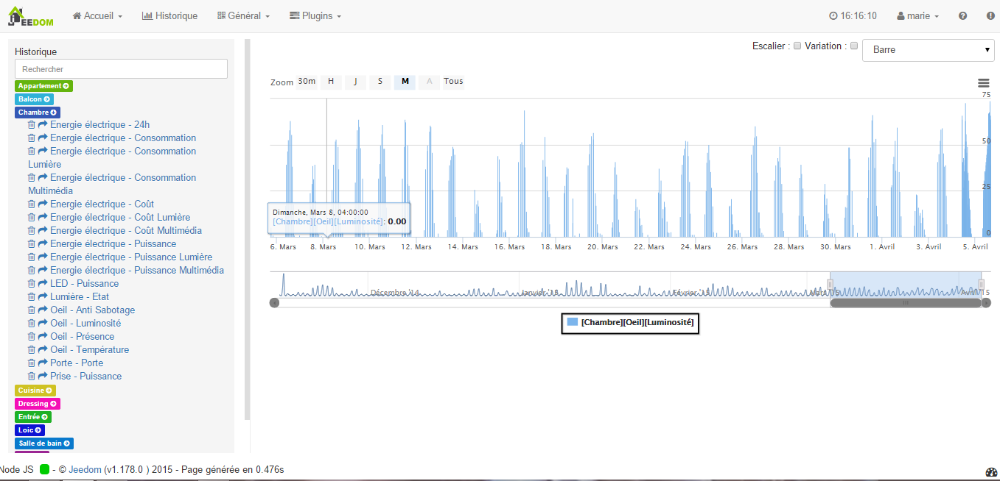

Presentation
===

Jeedom is composed of a central part (called core) which is responsible
basic functions.

-   *Scenario,*

-   * Logging *

-   * Display *

-   *Interaction,*

-   * Update and backup. *

Around this core are added plugins that can be
all kinds :

-   home automation protocol (Z-Wave, RFXcom, EnOcean ...),

-   IP protocol (KNX, xPL ...),

-   communicating object (Nest, Netatmo ...),

-   high level (alarm, thermostat ...),

-   interface (widget),

-   organization (agenda, Google calendar),

-   development (script).

These plugins can be recovered via Market and can extend
the possibilities of Jeedom.

Jeedom allows any plugin to chat with another on a
standardized basis. This allows for example to use plugins
thermostat or alarm with any home automation protocol or even a
IP plugin or communicating object ...

Principle
===

Jeedom has the distinction of being without subscription and without cloud, which
ensures the operation of your home automation even if you
do not have internet anymore. This also guarantees the security of your data
(avoids the risk of mass piracy accounts).

The project being open and open source it also guarantees a strong
rate of evolution thanks to the many developers who participate.

Connections
===

Several video tutorials have been made to show the
important features of Jeedom, facilitate its use and
familiarize the user with the software.

However since the realization of these tutorials, the interface of Jeedom
could evolve and features added. The documention remains
the reference to consult in case of needs, questions, etc.

Here is the list of available tutorials:

-   [Jeedom Tutorial \ # 1: First
    Start] (https://www.youtube.com/watch?v=UTECRBGEUtI)

-   [Jeedom Tutorial \ # 2: Starting with Jeedom (Object, Market, Plugin
    , Module)] (https://www.youtube.com/watch?v=2LU1neNvbus)

-   [Jeedom Tutorial # 3: Jeedom, Widgets, Mails and
    Scenarios] (https://www.youtube.com/watch?v=OJn33XbpiH8)

-   [Jeedom Tutorial \ # 4: Jeedom, Using the plugin
    Agenda] (https://www.youtube.com/watch?v=EBuvIabg3Cc)

-   [Jeedom Tutorial \ # 5: The scripts in Jeedom using the plugin
    Script] (https://www.youtube.com/watch?v=FRbQILAogX0)

-   [Jeedom Tutorial \ # 6: Scenarios in Jeedom with the plugin
    Weather] (https://www.youtube.com/watch?v=w0ErP3wyEoA)

-   [Jeedom Tutorial \ # 7: Plugin Overview
    Energy] (https://www.youtube.com/watch?v=DZfA_DxqbNs)

-   [Jeedom Tutorial \ # 8: Fashion Discovery
    Map] (https://www.youtube.com/watch?v=2IkXF6CBCAE)

-   [Jeedom Tutorial \ # 9: DataTransfert Plugin, Auto Backups and
    Dropbox] (https://www.youtube.com/watch?v=wLOfJygFc8k)

-   [Jeedom Tutorial \ # 10: Make Talking
    Jeedom (Android)] (https://www.youtube.com/watch?v=3Pc3VJFWHo4)

-   [Jeedom Tutorial \ # 11: Showcase discovering an installation
    standard] (https://www.youtube.com/watch?v=hW1d1FvkmSs)

-   [Jeedom Tutorial \ # 12: Finding the plugin
    Thermostat] (https://www.youtube.com/watch?v=T21gqp1SQK0)

-   [Jeedom Tutorial \ # 13: Finding the plugin
    Alarm] (https://www.youtube.com/watch?v=JjnWeU614gc)

-   [Jeedom Tutorial \ # 14: Discovering
    Interactions] (https://www.youtube.com/watch?v=Z8SHo_Xwk0Q)