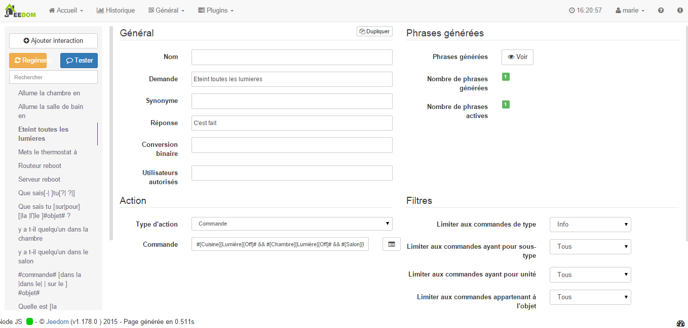

Presentación
===

Jeedom se compone de una parte central (denominado núcleo), que es responsable
funciones básicas.

-   * * Escenario

-   * Registro *

-   * Pantalla *

-   * Interacción *

-   * Actualización y copia de seguridad. *

Alrededor de este núcleo son plugins injertados que pueden ser
todo tipo :

-   Automation Protocol (Z-Wave, RFXCOM, EnOcean ...)

-   IP (KNX xPL ...)

-   objeto comunicativo (Nest Netatmo ...),

-   alto nivel (alarma, termostato ...)

-   interfaz (Widget)

-   organización (calendario, el calendario de Google)

-   desarrollo (script).

Estos complementos pueden ser recuperados a través del mercado y se pueden extender
Jeedom oportunidades.

Jeedom permite a cualquier plugin para hablar uno a uno
base normalizada. Esto permite por ejemplo utilizar plugins
termostato o de alarma con cualquier protocolo de automatización del hogar o incluso una
Plugin de IP o el objeto comunicativo ...

principio
===

Jeedom tiene la distinción de ser ninguna suscripción y ninguna nube, que
garantiza el funcionamiento de la automatización del hogar, incluso si
ya no en línea. Esto también garantiza la seguridad de sus datos
(Evita el riesgo de piratería en la masa de las cuentas).

El proyecto está abierto y de código abierto que también garantiza un alto
Cambios en los tipos gracias a los muchos desarrolladores que participan.

Vínculos
===

Se han hecho varios tutoriales en vídeo para mostrar
características importantes Jeedom, facilidad de uso y
familiarizar al usuario con el software.

Sin embargo, puesto que la aplicación de estos tutoriales, interfaz Jeedom
tienen características evolucionadas y agregados. Los restos documention
la referencia a consultar en caso de necesidades, preguntas, etc.

Esta es la lista de tutoriales disponibles:

-   [TUT Jeedom \ # 1: Primera
    Inicio] (https://www.youtube.com/watch?v=UTECRBGEUtI)

-   [TUT Jeedom \ # 2: Comenzar con Jeedom (Object, Mercado, Plugin
    , Módulo)] (https://www.youtube.com/watch?v=2LU1neNvbus)

-   [TUT Jeedom \ # 3: Jeedom el widget, y Correos
    Escenarios] (https://www.youtube.com/watch?v=OJn33XbpiH8)

-   [TUT Jeedom \ # 4: Jeedom, plugin de Uso
    Agenda] (https://www.youtube.com/watch?v=EBuvIabg3Cc)

-   [TUT Jeedom \ # 5: Los scripts en Jeedom usando el plugin
    Script] (https://www.youtube.com/watch?v=FRbQILAogX0)

-   [TUT Jeedom \ # 6: Los escenarios en Jeedom con el plugin
    Tiempo] (https://www.youtube.com/watch?v=w0ErP3wyEoA)

-   [TUT Jeedom \ # 7: Presentación plug-in
    Energía] (https://www.youtube.com/watch?v=DZfA_DxqbNs)

-   [TUT Jeedom \ # 8: Modo de descubrimiento
    Mapa] (https://www.youtube.com/watch?v=2IkXF6CBCAE)

-   [TUT Jeedom \ # 9: Plugin DataTransfert el auto y copias de seguridad
    Dropbox] (https://www.youtube.com/watch?v=wLOfJygFc8k)

-   [TUT Jeedom \ # 10: Dar sentido
    Jeedom (Android)] (https://www.youtube.com/watch?v=3Pc3VJFWHo4)

-   [TUT Jeedom \ # 11: Escaparate descubrimiento de una planta
    estándar] (https://www.youtube.com/watch?v=hW1d1FvkmSs)

-   [TUT Jeedom \ # 12: Plugin Descubrimiento
    Termostato] (https://www.youtube.com/watch?v=T21gqp1SQK0)

-   [TUT Jeedom \ # 13: Plugin Descubrimiento
    Alarma] (https://www.youtube.com/watch?v=JjnWeU614gc)

-   [TUT Jeedom \ # 14: Descubrimiento
    Interacciones] (https://www.youtube.com/watch?v=Z8SHo_Xwk0Q)