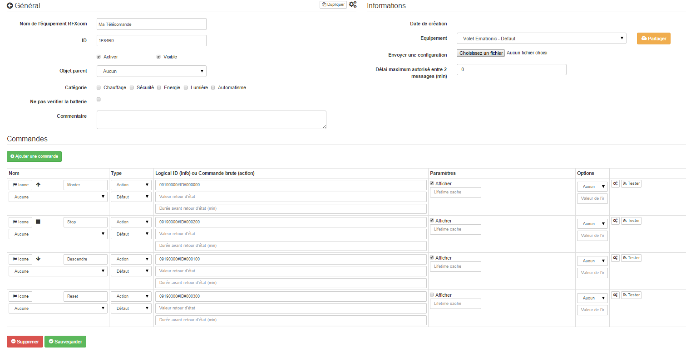

Buscar el ID remoto
====================================

Ir a "Plugins", "Gestión de Programas", "RFX COM"
-------------------------------------------------- ----

En "Los protocolos de manejo RFXCOM"
-------------------------------------

comprobar Protocolo 8 BlindsT1, guardar y salir.

Habilitar "Iniciar en modo de depuración"
-------------------------------

Espere a que la apertura de la ventana, a continuación, pulse Abrir para
Ematronic su control remoto.

    TrenzadoPrincipal - rfxcmd: 2765 - Depuración - Mensaje de prueba 09 de marzo de 19 de 01 84 B9 1F 1 de enero de 60
    TrenzadoPrincipal - rfxcmd: 2805 - debug - Mensaje OK
    TrenzadoPrincipal - rfxcmd: 328 - debug - Verified OK
    TrenzadoPrincipal - rfxcmd: 334 - debug - PacketType: 19
    TrenzadoPrincipal - rfxcmd: 338 - debug - subtipo: 03
    TrenzadoPrincipal - rfxcmd: 342 - debug - SEQNBR: 01
    TrenzadoPrincipal - rfxcmd: 346 - debug - Id1: 1F
    TrenzadoPrincipal - rfxcmd: 350 - DEBUG - Id2: 84
    TrenzadoPrincipal - rfxcmd: 359 - Depuración - Verificar la longitud del paquete correcto
    TrenzadoPrincipal - rfxcmd: 556 - debug - Guardar paquete a log_msgfile

Buscar el ID del mando a distancia
-------------------------------------

Nota: Los controles remotos Ematronic siempre comienzan con: 19 Septiembre 03
Por lo que el área que nos interesa para iniciar "Mensaje de prueba": September 19, 03.

Marca: ID1 e ID2 y agregue el siguiente formato hexadecimal: en mi ejemplo
Id1 y Id2 = 1F = 84. debe identificar en la línea, "Test
mensaje "y extraer el Id3 aquí id3 = B9, ​​por lo tanto nuestro remoto
⇒ 1F84B9 como identificación.

Detener modo de depuración Uso de la "parada / reinicio del diablo"
-------------------------------------------------- ---------------

Creación de la distancia bajo JeeDom
=======================================

Ir en plugins, domtique Protocolo RFXCOM.

Haga clic en "Agregar" e introduzca un nombre para su control remoto
Virtual.

Elija de la lista de equipos de la plantilla: "Componente Ematronic -
Por defecto".

Reemplazar Identificación automática con la que ha extraído anteriormente
y comprobar "Habilitar" y "visible":

Haga clic en "Guardar" para guardar la configuración y
cargar la plantilla "Ematronic componentes - Fallo".

Este mando a distancia está listo, se debe tener este aspecto:

Enlace su JeeDom remota su motor Ematronic virtual:
================================================== ====================

Restablecimiento del motor:
---------------------------

-   desconectar eléctricamente el motor.

-   En el mando a distancia original, permita que el botón "Up" Supported 3 o 4
    segundo, el LED se vuelve rojo sólido.

-   Conectar eléctricamente el motor.

-   Al soltar el botón del mando a distancia.

-   El motor será de 5 pitidos.

-   presione rápidamente con un clip de papel en el botón "micro" tiene
    la parte posterior del mando a distancia.

-   El motor será de 3 pitidos.

Asociación JeeDom mando a distancia virtual a motor Ematronic:
================================================== ==================

-   desconectar eléctricamente el motor.

-   En el mando a distancia original, permitir que el botón "Up" Pulse 3 o 4
    segundo, el LED se vuelve rojo sólido.

-   Conectar eléctricamente el motor.

-   Al soltar el botón del mando a distancia.

-   El motor será de 5 pitidos.

-   Pulse la tecla "Up" de control de remoto virtual
    JeeDom. Imagen :: ../ images / volet.ematronic / image09.png \ [\]

-   El motor será de 3 pitidos para anunciar que su pareja es JeeDoom
    !!

