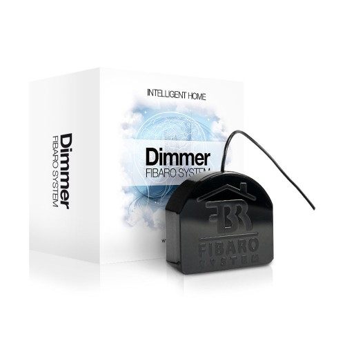
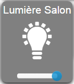

Fibaro Dimmer - FGD-211
=======================

\

-   **The module**

\

\

-   **The Jeedom**

\

\

summary
------

\

The dimmer micromodule FGD-211 will allow you to control a
remote lamp or ceiling lamp thanks to the Z-Wave protocol while
retaining your existing switch.

So you will be able to operate the connected lamp and vary its
intensity using the existing switch, a Z-Wave transmitter or
directly from the button on the micromodule. It is
compatible with any type of lamp supporting variation
(incandescent, fluo-compact, LED, ...). The Fibaro variator micromodule
is a concentrate of technology, it automatically detects the type of
connected load and is protected against overvoltages.

For fluorescent bulbs that do not support variation, the
module then automatically acts as a switch module (ON / OFF
only).

It can be used in 2-wire mode (without neutral), replacing a
existing switch, or three wires with a conventional power supply
module (Phase + Neutral).

For lamps with very low consumption (LED lamp per
example), you will be able to use the FGB-001 (bypass)
correct operation of the module. A Z-Wave controller (remote control,
dongle ...) is necessary to integrate this detector into your network
if you already have an existing network. Each Z-Wave module works
as a wireless repeater with the other modules, to ensure
total coverage of your home.

\

functions
---------

\

-   Controlling remote lighting

-   Installs behind an existing switch

-   ON / OFF and Variation function

-   Use in 2-wire mode (neutral not necessary)

-   Automatic load detection

-   Protected against overloads

-   Small, discreet and aesthetic

-   Ease of use and installation

\

Technical characteristics
---------------------------

\

-   Module Type: Z-Wave Receiver

-   Power supply: 230V, 50 Hz

-   Wiring: neutral not necessary

-   Max load: 25-500W (resistive load) or 1.5A (inductive load)

-   Compatible lamp type (dimmable): Incandescent, Fluocompact,
    Halogen (230VAC and 12VDC with electronic transformer), LED

-   Compatible lamp type (non dimmable): Compact fluorescent, LED

-   Fuse: 2.5A

-   Frequency: 868.42 Mhz

-   Transmission distance: 50m free field, 30m indoor

-   Dimensions: 15 x 42 x 36 mm

-   Operating temperature: 0-40 ° C

-   Limit temperature: 105 ° C

-   Standards: EN 55015 and EN 60669-2-1

\

Module data
-----------------

\

-   Brand: Fibar Group

-   Name: Fibaro FGMS-001 \ [Motion Sensor \]

-   Manufacturer ID: 271

-   Product Type: 256

-   Product ID: 4106

\

Configuration
-------------

\

To configure the OpenZwave plugin and know how to put Jeedom in
inclusion refer to this
[Documentation] (https://jeedom.fr/doc/documentation/plugins/openzwave/fr_FR/openzwave.html).

\

> **Important**
>
> To put this module in inclusion mode you have to press 3 times on the
> inclusion button, according to its paper documentation.

\

\

> **Tip**
>
> If you have already integrated your module on the wall, you can include it
> by doing many go back on the switch or many
> supports if you have a push button switch.

\

Once included you should get this:

\

\

### Orders

\

Once the module is recognized, the commands associated with the module will be
available.

\

\

Here is the list of orders:

\

-   Intensity: This is the command that adjusts the intensity of the
    light

-   On: This is the command that turns on the light

-   Off: This is the command that turns off the light

-   Status: This is the order that allows to know the status of the
    light

Note that on the dashboard all the information is found on the same
icon

\

### Module configuration

\

You can configure the module according to your
installation. To do this, go through the "Configuration" button on the
OpenZwave plugin from Jeedom.

\

\

You will arrive on this page (after clicking on the tab
Settings)

\

\

Parameter details:

\

-   1: ALL ON / ALL OFF functions: used only if you have paired the
    FGD-211 to another module

-   6: lets you tell how information is sent to the group
    association 1

-   7: allows to check or not the status of the associated module before
    to send an order

-   8: Set the percentage of variation (auto)

-   9: duration of the variation between the two extremes (manual)

-   10: duration of the variation between the two extremes (auto)

-   11: allows to define the percentage of variation (manual)

-   12: Sets the maximum allowed level

-   13: Sets the minimum level allowed

-   14: IMPORTANT SETTING: allows to choose between switch
    BISTABLE or MONOSTABLE (push button)

-   15: Enable the option to set brightness to maximum
    on double support (or go back on bistable)

-   16: option to activate last state storage

-   17: to choose between the mode to and fro and the mode
    contactor

-   18: Synchronize the level of variation to others
    associated drives

-   19: operating mode of the bistable switch (inversion
    or not)

-   20: adjusts the minimum level for LEDS bulbs
    dimmable for example

-   30: allows to define the mode of operation of the module in case of
    receiving a broadcast Alarm signal

-   39: duration of the alarm defined in parameter 30

-   41: allows to activate or not the function of Activations of the scenes

\

### Groups

\

This module has three association groups, only the third is
essential.

\

\

Good to know
------------

\

### Specificities

\

> **Deposit**
>
> The most important parameter of the configuration is 14. It
> allows to choose the type of switch used. By default the type
> is set to monostable.

\

If you want to exclude / include the module without disassembling your
switch, you can press your switch several times
(or go back and forth in case of bi stable switch)

\

### Alternative visual

\

\

Wakeup
------

\

No notion of wakeup on this module.

\

F.A.Q.
------

\

No. this module can be included or excluded by pressing several times
on the switch.

\
**@** sarakha63
