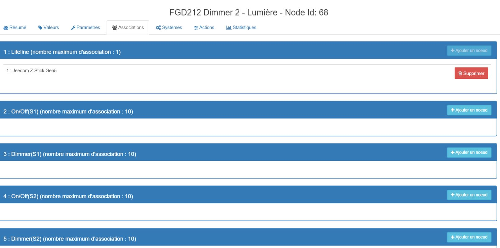

Fibaro Dimmer2 - FGD-212
========================

\

-   **The module**

\

\

-   **The Jeedom**

\

\

summary
------

\

The dimmer micromodule FGD-212 will allow you to control a
remote lamp or ceiling lamp thanks to the Z-Wave protocol while
retaining your existing switch.

So you will be able to operate the connected lamp and vary its
intensity using the existing switch, a Z-Wave transmitter or
directly from the button on the micromodule.

The new Fibaro FGD-212 drive is equipped with a
intelligent detection of the light source which facilitates the
configuration and ensures a high compatibility of the device. he
has a self-protection against overload and the function of
soft start. In the case of non-dimmable light sources,
only the ON / OFF function is possible (in 3-wire connection).

It is compatible with any type of lamps supporting variation or
no. In addition to the variation function, this micromodule can also
measure the power consumption of the connected load. Values
instantaneous consumption (in W) and total electricity consumption
(in kWh) can be viewed.

\

functions
---------

\

-   Controlling remote lighting

-   Installs behind an existing switch

-   ON / OFF and Variation function

-   Use in 2-wire mode (neutral not necessary)

-   Integrates the Z-Wave 500 series chip

-   250% faster communication compared to Z-Wave devices
    standard

-   Automatic load detection

-   Protected against overloads

-   Compatible with all Z-Wave and Z-Wave + controllers

-   Function measuring active power and energy

-   Works with different types of push switches,
    rocker, three-way, etc.

-   Soft start function

-   LED status indication of inclusion, calibration and
    MENU levels

-   Built-in Z-Wave range tester

-   Automatically detects wiring faults, high temperature,
    burnt out bulb, surges and overloads

-   Advanced configuration options

-   Small, discreet and aesthetic

-   Ease of use and installation

\

Technical characteristics
---------------------------

\

-   Module Type: Z-Wave Receiver

-   Power supply: 230V +/- 10%, 50Hz

-   Consumption: 1.3W

-   Wiring: neutral not necessary

-   Max load: 50-250W (resistive load) or 0.25-1.1A
    (inductive load)

-   Compatible lamp type (dimmable): Incandescent, Fluocompact,
    Halogen (230VAC and 12VDC with electronic transformer), LED

-   Compatible lamp type (non dimmable): Compact fluorescent, LED

-   Frequency: 868.42 Mhz

-   Signal strength: 1mW

-   Transmission distance: 50m free field, 30m indoor

-   Dimensions: 42.5 x 38.25 x 20.3mm

-   Operating temperature: 0-35 ° C

-   Limit temperature: 105 ° C

-   Standards: RoHS 2011/65 / EU, LVD 2006/95 / EC, EMC 2004/108 / EC, R & TTE
    1999/5 / EC

\

Module data
-----------------

\

-   Brand: Fibar Group

-   Name: FGD212 Dimmer 2

-   Manufacturer ID: 271

-   Product Type: 258

-   Product ID: 4096

\

Configuration
-------------

\

To configure the OpenZwave plugin and know how to put Jeedom in
inclusion refer to this
[Documentation] (https://jeedom.fr/doc/documentation/plugins/openzwave/fr_FR/openzwave.html).

\

> **Important**
>
> To put this module in inclusion mode you have to press 3 times on the
> inclusion button, according to its paper documentation. If the
> module is not already included, it will be included
> automatically when it is turned on.

\

\

> **Tip**
>
> If you have already integrated your module on the wall, you can include it
> by going back and forth on the switch or
> many supports if you have a push button switch.

\

Once included you should get this:

\

\

### Orders

\

Once the module is recognized, the commands associated with the modules will be
available.

\

\

Here is the list of orders:

\

-   Intensity: This is the command that adjusts the intensity of the
    light

-   On: This is the command that turns on the light

-   Off: This is the command that turns off the light

-   Status: This is the order that allows to know the status of the
    light

-   Consumption: It is the command which allows to go up the
    module consumption

-   Power: It is the command which allows to reassemble the power
    instant module

Note that on the dashboard all the information is found on the same
icon

\

### Module configuration

\

You can configure the module according to your
installation. To do this, go through the "Configuration" button on the
OpenZwave plugin from Jeedom.

\

\

You will arrive on this page (after clicking on the tab
settings)

\

\

Parameter details:

\

ON GOING REDACTION

\

### Groups

\

This module has five association groups, only the first is
essential.

\

\

Good to know
------------

\

### Specificities

\

> **Deposit**
>
> The most important parameter of the configuration is 20. It
> allows to choose the type of switch used. By default the type
> is set to monostable.

\

If you want to exclude / include the module without disassembling your
switch, you can press your switch several times
(or go back and forth in the event of a bistable switch)

\

### Alternative visual

\

\

Wakeup
------

\

No notion of wakeup on this module.

\

F.A.Q.
------

\

No. this module can be included or excluded by pressing several times
on the switch.

\
**@** sarakha63
