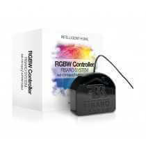

Fibaro RGVB Controler - FGRGB-101
=================================

\

-   **The module**

\

\

-   **The Jeedom**

\

\

summary
------

The Z-Wave Fibaro FGRGB-101 micromodule allows you to order
12 / 24V low voltage lights (halogen or LED), RGB LED strip
or RGB + white or even connect analog probes using
the 0-10V standard.

-   4 analog inputs 0 to 10V to connect to many sensors
    compatible, potentiometers, pushbuttons (monostable)
    or switches (bistables).

-   4 inverter outputs (PWM) to control:

-   1 * RGB LED channel + White (RGBW) 12 / 24V

-   \ * or 4 channels of white LED 12 / 24V

-   \ * or 4 channels of 12 / 24V halogen lamps (144W 12V / 288W 24V max.)

-   \ * or 12 / 24V fans.

-   Requires a separate 12 / 24V power supply.

-   Measurement of overall consumption or by instantaneous or cumulative channel.

-   Repeater function (router) to extend the Z-Wave network.

\

functions
---------

-   Order low voltage lighting 12 / 24V (halogen or LED)

-   Installs behind an existing switch

-   Previously programmed light simulation

-   ON / OFF and Variation function

-   Small, discreet and aesthetic

-   Ease of use and installation

\

Technical characteristics
---------------------------

-   Power supply: 12 V or 24 V continuous

-   Maximum output power:

-   \* 12A au total (addition de l’ensemble des canaux),

-   \* 6A max. par canal

-   Maximum power with halogen lamps:

-   \ * 12V - 144W total (all channels),

-   \* 24V - 288W total (tous canaux)

-   PWM modulation frequency: 244 Hz

-   Consumption: 0.3W

-   Radio protocol: Z-Wave at 868.4 MHz (EU)

-   Z-Wave transmit power: 1mW

-   Operating temperature: 0 - 40 C

-   For installation in boxes: Ø≥50 mm

-   Dimensions: 42 x 37 x 17 mm

-   European Standards: EMC 2004/108 / EC R & TTE 199/5 / WE

-   This module requires a Z-Wave controller to work.

\

Module data
-----------------

-   Brand: Fibar Group

-   Name: Fibaro FGRGB-101 RGBW

-   Manufacturer ID: 271

-   Product type: 2304

-   Product ID: 4096

\

Configuration
-------------

To configure the OpenZwave plugin and know how to put Jeedom in
inclusion refer to this
[Documentation] (https://jeedom.fr/doc/documentation/plugins/openzwave/fr_FR/openzwave.html).

\

> **Important**
>
> To put this module in inclusion mode you have to press 3 times on the
> inclusion button, according to its paper documentation.

\

\

Once included you should get this:

\

\

### Orders

Once the module is recognized, the commands associated with the module will be
available.

\

\

Here is the list of orders:

-   Color: This is the command that allows you to set the color code to
    display

-   Fireplace: This is the command that simulates an atmosphere of
    fireplace

-   Thunderstorm: This is the command that simulates a storm atmosphere

-   Dawn: This is the command that simulates a mood of aude
    (gradual lifting of the sun)

-   Fading: This is the command that simulates the entire
    color spectrum

-   RBB: This is the command that simulates a cop atmosphere

-   Cold White: This is the command that allows you to simulate having a
    cold white type color, if the color strip allows it. (this
    command is not visible by default)

-   Warm White: This is the command that allows you to simulate having a
    color type warm white, if the color strip allows. (this
    command is not visible by default)

-   On: This is the command that turns on the banner on the
    last color chooses before

-   Off: This is the command that turns off the banner

-   Intensity: This is the command that adjusts the intensity
    light

Note that on the dashboard all the information is found on the same
icon

\

### Module configuration

You can configure the module according to your
installation. To do this, go through the "Configuration" button on the
OpenZwave plugin from Jeedom.

\

\

You will arrive on this page (after clicking on the tab
Settings)

\

\

Parameter details:

Please refer to the previous screenshot, settings
being translated into French.

\

### Groups

This module has five association groups, only the fifth is
essential.

\

Good to know
------------

### Specificities

Use of 0-10V sensors.

\

> **Deposit**
>
> For now, Jeedom's default configuration does not allow it
> not, but a specific configuration can be considered.

### Alternative visual

\

\

Wakeup
------

No notion of wakeup on this module.

\

F.A.Q.
------

For now, Jeedom's default configuration does not allow it,
but a specific configuration can be considered.

\

