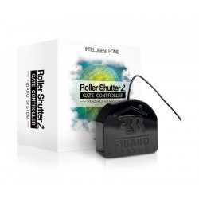

Fibaro FGRM-222 "Roller shutter"
===============================

\

-   **The module**

\

\

-   ** The Jeedom **

\

\

summary
------

\

The micromodule FGRM-222 will allow you to manage the engines of
shutters with electronic stop, Venetian blinds or doors
garage thanks to the Z-Wave protocol while keeping your
existing switch. So you will be able to operate the engine
connected using the existing switch, a Z-Wave transmitter or
directly from the button on the micromodule.

In addition, this micromodule is able to transmit the consumption
instantaneous (W) and cumulative (KWh) electrical power of equipment
attached to.

A Z-Wave controller (remote control, dongle ...) is necessary in order
to integrate this module into your network if you already have a network
existing.

Each Z-Wave module operates as a wireless repeater with the
other modules, to ensure full coverage of your
dwelling.

Note: This module requires the neutral to operate.

\

functions
---------

\

-   Order your blinds or shutters remotely

-   Compatible with BSO and venetian blind with positioning of
    strips

-   Installs behind an existing switch

-   Raise / lower function and positioning

-   Compatible with motors with mechanical or electronic stops

-   Measurement of instantaneous and cumulative consumption

-   Wireless update with Fibaro Home Center 2 box

-   Z-Wave network coverage test function

-   Small, discreet and aesthetic

-   Ease of use and installation

\

Technical characteristics
---------------------------

\

-   Module Type: Z-Wave Receiver

-   Power supply: 230V, 50 Hz

-   Power Consumption: &lt; 0.8W

-   Wiring: 3 wires, neutral required

-   Max load: 1000W

-   Frequency: 868.42 Mhz

-   Signal strength: 1mW

-   Transmission distance: 50m free field, 30m indoor

-   Dimensions: 17 x 42 x 37 mm

-   Operating temperature: 0-40 ° C

-   Limit temperature: 105 ° C

-   Standards: LVD (2006/95 / EC), EMC (2004 / 10B / EC), R & TTE (1999/5 / EC)

\

Module data
-----------------

\

-   Brand: Fibar Group

-   Name: Fibaro FGRM-222

-   Manufacturer ID: 271

-   Product Type: 769

-   Product ID: 4097

\

Configuration
-------------

\

To configure the OpenZwave plugin and know how to put Jeedom in
inclusion refer to this
[Documentation] (https://jeedom.fr/doc/documentation/plugins/openzwave/fr_FR/openzwave.html).

\

> ** Important **
>
> To put this module in inclusion mode you have to press 3 times on the
> inclusion button, according to its paper documentation.

\

\

Once included you should get this:

\

\

### Orders

\

Once the module is recognized, the commands associated with the module will be
available.

\

\

Here is the list of orders:

\

-   Status: This is the command that allows to know the position of
    your part

-   Positioning: This is the command that defines the
    opening percentage

-   Up: This is the command that allows to completely open the shutter

-   Down: This is the command that completely closes the shutter

-   Refresh: This is the command that allows to ask again the position
    of the shutter

-   Power: Command allowing to have the consumption of the module

-   Consumption: Command to know the power
    instantaneous used by the module

-   STOP: Command to stop the movement of the shutter

-   STOP BSO: Command to stop the movement (in mode
    adjustable blade)

-   Tilt: Allows tilting of slats (steerable slat mode)

-   Decline: Declare the slats (adjustable slat mode)

-   Step: Allows you to set the step for a press on Decline or
    tilt

\

### Module configuration

\

Then if you want to configure the module accordingly
of your installation, you have to go through the button
"Configuration" of Jeedom's OpenZwave plugin.

\

\

You will arrive on this page (after clicking on the tab
settings)

\

\

Parameter details:

\

-   1: to block the module (to freeze a shutter) (dasn case
    a press on a switch)

-   2: same but for zwave commands

-   3: type of relationship (classic or fibar)

-   10: mode of operation (venetian blind, shutter etc ...)

-   12: duration of a complete turn (in Venetian blind mode)

-   13: allows to choose when the slats should return to their
    previous position

-   14: allows to choose the type of switch

-   17: allows to choose how long after the limit defines in 18
    the shutter stops

-   18: safety power for the engine

-   22: NA

-   29: calibrates the shutter

-   30 to 35: defines the behavior of the module against
    different zwave alarms

-   40: delta power to trigger a feedback (even in
    outside the period defined in 42)

-   42: feedback period

-   43: delta of energy to trigger a feedback (even in
    outside the period defined in 42)

-   44: allows to choose whether or not the consumption and power
    must take into account that of the module itself

-   50: allows to choose if the module must send the information to the nodes
    in association with scene mode or association mode

\

### Groups

\

This module has 3 association groups, only the third is
essential.

\

\

Good to know
------------

\

### reset

\

\

You can reset your consumption meter by clicking
on this button available in the System tab.

\

### Important

\

> ** Important **
>
> For the return of state to work in Jeedom, it is necessary to
> force equipment calibration (parameter 29 to "Yes") and the
> positioning must be active (parameter 10 to the values ​​"Active
> direct "," Active Venetian "or" Active door ").

\

### Alternative visual

\

\

Wakeup
------

\

No notion of wakeup on this module.

\

F.A.Q.
------

\

Read the Reset section of this doc.

\

** @ ** sarakha63
