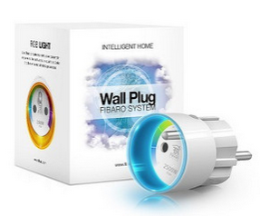

Fibaro FGRWPE-101 "Wall plug"
=============================

\

-   **The module**

\

\

-   **The Jeedom**

\

\

summary
------

\

Le Wall Plug Fibaro est un récepteur-prise-transmetteur universel sous
forme d\`un adaptateur à brancher sur une prise murale au réseau
électrique, compatible avec le standard Z-Wave. Il permet de gérer
n’importe quel dispositif ayant une puissance maximale de 2,5kW, tout en
intégrant la fonctionnalité de mesurer la puissance active du courant et
la consommation d’énergie des dispositifs. Ce module est équipé d\`un
anneau lumineux avec des LEDs signalant son état et la consommation
d’énergie de tout dispositif branché. Le Wall Plug Fibaro peut être
contrôlé par un bouton sur son carter ou bien depuis n’importe quel
contrôleur compatible avec le standard Z-Wave

\

functions
---------

\

-   Controlled from a controller compatible with the Z-Wave standard.

-   Micro-chip control.

-   Élément d\`exécution: relais.

-   Mesure de puissance active du courant et de l\`énergie électrique
    of the receiver.

\

Technical characteristics
---------------------------

\

-   Module Type: Z-Wave Receiver

-   Power supply: 230V, 50Hz

-   Power consumption: up to 0.8W

-   Max load: 2.5kW

-   Frequency: 868.42 Mhz EU

-   Transmission distance: 50m free field, 30m indoor

-   Dimensions: 17 x 42 x 37 mm

-   Operating temperature: 0-40 ° C

-   Limit temperature: 105 ° C

-   Standards: LVD (2006/95 / WE), EMC (2004/108 / EC), R & TTE (1999/5 / WE)

\

Module data
-----------------

\

-   Brand: Fibar Group

-   Name: Wall Plug FGWPE-101

-   Manufacturer ID: 271

-   Product Type: 1536

-   Product ID: 4096

\

Configuration
-------------

\

To configure the OpenZwave plugin and know how to put Jeedom in
inclusion refer to this
[Documentation] (https://jeedom.fr/doc/documentation/plugins/openzwave/fr_FR/openzwave.html).

\

> **Important**
>
> To put this module in inclusion mode you have to press 3 times on the
> inclusion button, according to its paper documentation.

\

\

Once included you should get this:

\

\

### Orders

\

Once the module is recognized, the commands associated with the module will be
available.

\

\

Here is the list of orders:

\

-   Status: This is the command that allows to know the status of the
    taking

-   On: This is the command that turns on the plug

-   Off: This is the command that turns off the plug

-   Power: It is the command that raises the power instatanée
    consumed

-   Conso: This is the order that goes back the total consumption

\

Note that on the dashboard the ON / OFF / STATUS commands are grouped together
in one button.

\

### Module configuration

\

Then if you want to configure the module accordingly
of your installation, you have to go through the button
"Configuration" of Jeedom's OpenZwave plugin.

\

\

You will arrive on this page (after clicking on the tab
settings)

\

\

Parameter details:

\

-   1: block the module always ON

-   16: allows to remember the last state in case of break of
    current

-   34: allows to choose what type of network alarm Zwave the socket
    must react

-   35: Set how the plug will react to alarms

-   39: Set the duration of the alarm

-   40: allows to define how much power must vary to be
    ascent (in%)

-   42: same but in standard mode (up to 5 times in steps defined in
    param 43)

-   43: power rise interval

-   45: rise in consumption (in kWh 10 = 0.1 kWh)

-   47: interval in seconds of information feed independently
    a variation

-   49: take into account the consumption of the module itself in the
    values

-   50: minimum value used by param 52

-   51: maximum value used by param 52

-   52: action to be done if the power goes out of the limits defined in
    parameters 50 and 51

-   60: power beyond which the socket will flash in purple

-   61: color when the plug is on

-   62: color when the plug is off

-   63: color when a Zwave alarm is detected

-   70: safety power (the plug will turn off when the power
    will reach this threshold)

\

### Groups

\

This module has 3 association groups, only the third is
essential.

\

\

Good to know
------------

\

### reset

\

\

You can reset your consumption meter by clicking
on this button available in the System tab. It's necessary to choose
Pressbutton.

\

### Alternative visual

\

\

Wakeup
------

\

No notion of wakeup on this module.

\

F.A.Q.
------

\

Read the Reset section of this doc.

\

**@** sarakha63
