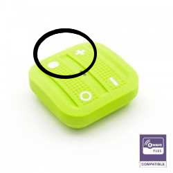

Nodon Remote Control - Soft Remote
================================

\

-   **The module**

\

\

-   **The Jeedom**

\

\

summary
------

\

The Soft Remote NodOn® can directly control any device
Z-Wave® or Z-Wave Plus® compatible, such as the NodOn® Smart Jack.

It can also trigger scenes via a home automation system
compatible.

\

functions
---------

\

-   Control any Z-Wave compatible device

-   Resistant to shocks and splashes

-   Attaches everywhere thanks to its integrated magnet

-   6 colors available

\

Technical characteristics
---------------------------

\

-   Power supply: CR2032 battery - Autonomy 1,5 - 2 years

-   4 buttons

-   Integrated magnet for fixing on metal surface

-   Resistant to shocks and splashes

-   Operating temperature: 0 ° C to 40 ° C - Altitude: 2000m

-   Z-Wave® Radio Protocol: 868.4MHz - 500 Series - Z-Wave Compatible
    SDK 06.51.06

-   Range: 40m indoor / 80m outdoors

-   Dimensions 56 \ * 56 \ * 20mm

-   2 years warranty

\

Module data
-----------------

\

-   Brand: Nodon

-   Name: CRC-3-6-0x Soft Remote

-   Manufacturer ID: 357

-   Product type: 2

-   Product ID: 2

\

Configuration
-------------

\

To configure the OpenZwave plugin and know how to put Jeedom in
inclusion refer to this
[Documentation] (https://jeedom.fr/doc/documentation/plugins/openzwave/fr_FR/openzwave.html).

\

> **Important**
>
> To put this module in inclusion mode you have to press both
> button (+ and 0 full) until the light becomes pink then
> press the + button according to the printed documentation.

\

\

Once included you should get this:

\

\

### Orders

\

Once the module is recognized, the commands associated with the module will be
available.

\

\

Here is the list of orders:

\

-   Buttons: this is the command that will move up the button

+ ---------------- + ---------------- + --------------- - + ---------------- + ---------------- +
| Buttons | Support | Long Support | Relachement | Double support |
================ ================ + + + =============== = + + ================ ================ +
| ** 1 (0 | 10 | 12 | 11 | 13 |
| full) ** | | | | |
+ ---------------- + ---------------- + --------------- - + ---------------- + ---------------- +
| **2 (+)** | 20 | 22 | 21 | 23 |
+ ---------------- + ---------------- + --------------- - + ---------------- + ---------------- +
| **3 (0 empty)** | 30 | 32 | 31 | 33 |
+ ---------------- + ---------------- + --------------- - + ---------------- + ---------------- +
| **4 (-)** | 40 | 42 | 41 | 43 |
+ ---------------- + ---------------- + --------------- - + ---------------- + ---------------- +

-   Battery: it is the command that raises the level of the batteries

\

### Module configuration

\

> **Important**
>
> During a first inclusion always wake up the module just after
> inclusion.

\

Then if you want to configure the module accordingly
of your installation, you have to go through the button
"Configuration" of Jeedom's OpenZwave plugin.

\

\

You will arrive on this page (after clicking on the tab
settings)

\

\

Parameter details:

\

-   1-2: To choose the profile of the buttons in case of use in
    central (useless for use in Jeedom)

-   3: Important parameter to tell if the switch should work
    in Scene or Central Scene mode (Absolutely Scene)

-   4-7: Select the operating mode of the buttons (in case
    group associations)

-   8: Allows to choose the operating mode of the LED

### Groups

\

This module has 7 association groups.

\

\

-   Group 1 - Lifeline: This group is generally used to
    report information from the Smart Plug to the main controller
    network.

-   Group 2 to 5 - Devices in these groups are controlled by the
    corresponding button according to MONO profile

-   Group 6 to 7 - Devices in these groups are controlled by
    corresponding buttons according to DUO profile

\

> **Important**
>
> At least Jeedom should be in group 1 \

Good to know
------------

\

### Specificities

\

-   This module can be capricious on inclusion. Do not hesitate to
    wake up 1 or 2 times after inclusion. And check the
    association group.

\

Wakeup
------

\

To wake up this module just press one of the buttons

\

F.A.Q.
------

\

This module is a module on battery, the new configuration will be
take into account only if you wake up the remote control.

\

Important note
---------------

\

> **Important**
>
> You have to wake up the module: after its inclusion, after a change
> of the configuration, after a wakeup change, after a
> change of association groups

\

**@** lunarok
