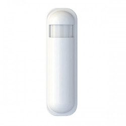
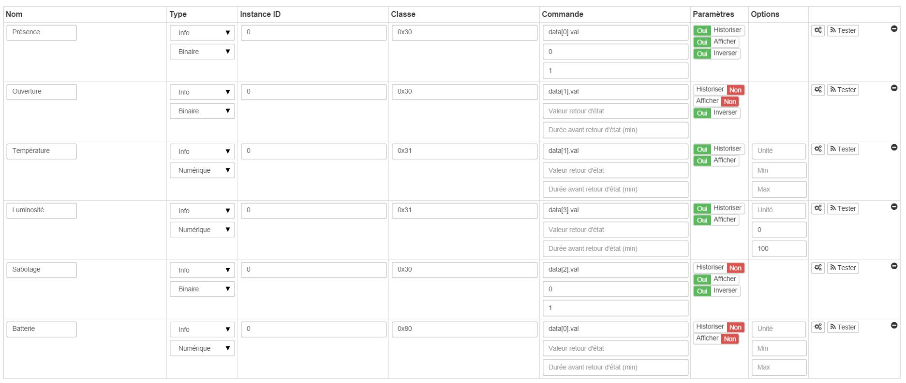

Philio PSP01
============

\

-   **The module**

\

\

-   **The Jeedom**

\

\

summary
------

\

The PSP01 detector offers 3 different functions: detection of
motion, temperature sensor and brightness sensor.

This detector can be used for security or
automation. When the detector is associated with
security, it serves as a trigger for alerts by detecting
changes in infra-red radiation levels. If a person
moving in the field of view of the detector, a radio signal is
transmitted, which triggers an alarm to deter intruders.

The detector can also be used in combination with a
Z-Wave controller for home automation uses, by detecting both
changes in the levels of infrared radiation (presence) and
changes in the brightness level. So, we can trigger a
lighting when motion detection in the dark.

The detector will also go up the brightness and the temperature, either in
case of significant change, and whenever a movement is
detected. A Z-Wave controller (remote control, dongle ...) is needed
to integrate this detector into your network if you already have a
existing network.

\

functions
---------

\

-   3-in-1 detector: movement, temperature, light

-   Adopt the recent Z-Wave 400series chip to support the
    multichannel operations and more data throughput
    high (9.6 / 40 / 100kbps)

-   Use the Z-Wave 6.02 SDK

-   Optimized antenna range

-   Use for home automation or security applications

-   Button to include / exclude the detector

-   tamper

-   Low battery indication

-   Small, discreet and aesthetic

-   Ease of use and installation

\

Technical characteristics
---------------------------

\

-   Module type: Z-Wave transmitter

-   Power supply: 1 battery 3V CR123A

-   Battery life: 2 years

-   Frequency: 868.42 MHz

-   Transmission distance: 30m indoors

-   Temperature sensor: -10 to 70 ° C

-   Light sensor: 0 to 500 lux

-   PIR detection angle: 90 °

-   PIR detection range: 8 to 10m

-   Dimensions: 28 x 96 x 23 mm

-   Weight: 39g

-   Operating temperature: -10 to 40 ° C

-   Operating humidity: 85% RH max

-   CE Standard: EN300 220-1

-   Z-Wave Certification: ZC08-13050003

\

Module data
-----------------

\

-   Brand: Philio Technology Corporation

-   Name: Philio PSP01

-   Manufacturer ID: 316

-   Product type: 2

-   Product ID: 2

\

Configuration
-------------

\

To configure the OpenZwave plugin and know how to put Jeedom in
inclusion refer to this
[Documentation] (https://jeedom.fr/doc/documentation/plugins/openzwave/fr_FR/openzwave.html).

\

> **Important**
>
> To put this module in inclusion mode you have to press 3 times on the
> inclusion button, according to its paper documentation.

\

\

Once included you should get this:

\

\

### Orders

\

Once the module is recognized, the commands associated with the module will be
available.

\

\

Here is the list of orders:

\

-   Presence: this is the command that will trace a presence detection

-   Opening: it is the command that will remount a detection
    opening

-   Temperature: it is the command which allows to go up the
    temperature

-   Brightness: it is the command which makes it possible to raise the luminosity

-   Sabotage: it is the sabotage command (it is triggered in
    case of tearing)

-   Battery: it's the battery control

\

All the modules of the range having the same ids, to you to display those
corresponding to your module.

### Module configuration

\

> **Important**
>
> During a first inclusion always wake up the module just after
> inclusion.

\

Then if you want to configure the module accordingly
of your installation, you have to go through the button
"Configuration" of Jeedom's OpenZwave plugin.

\

\

You will arrive on this page (after clicking on the tab
Settings)

\

\

Parameter details:

\

-   2: Adjusts the signal sent to the modules in the group
    association 2

-   3: Adjusts the sensitivity of the presence sensor (0:
    disabled 99: max sensitivity)

-   4: Adjusts the brightness level from which the
    signal defined in parameter 2 will be sent to the modules associated with the
    group 2

-   5: operating mode (not recommended to change it: refer to
    on the manufacturer documentation)

-   6: mode of operation of the multi-sensor (not recommended to change it
    : refer to the manufacturer's documentation)

-   9: Set how long the OFF signal will be
    sent to modules associated with group 2

-   10: Sets the duration between two battery reports (one
    unit = 30 minutes)

-   12: Set the duration between two brightness ratios
    (one unit = 30 minutes)

-   13: defines the duration between two temperature reports
    (one unit = 30 minutes)

\

### Groups

\

This module has two association groups, only the first is
essential.

\

\

Good to know
------------

\

### Specificities

\

> **Tip**
>
> This module has a peculiarity, having no report based on
> variations but only over time, he sends all his information to
> each detection. It also sends the signal of
> presence detection as a result. It is therefore advisable to check the
> "Change event" box on the presence if you use this
> command in scenario trigger.

\

### Alternative visual

\

\

Wakeup
------

\

To wake up this module there is only one way to proceed:

-   release the tamper button and press it again

\

F.A.Q.
------

\

This module wakes up by pressing its tamper button.

\

Check the "Event on change" box.

\

This module is a battery module, the new configuration will be
taken into account at the next wakeup.

\

Important note
---------------

\

> **Important**
>
> You have to wake up the module: after its inclusion, after a change
> of the configuration, after a wakeup change, after a
> change of association groups

\

**@** sarakha63
