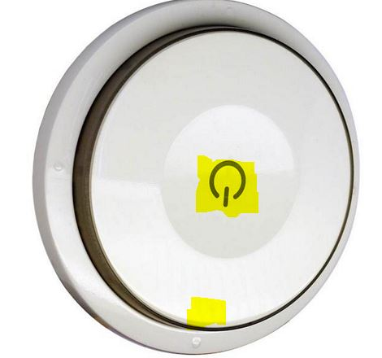

Philio Smart Color Button
=========================

\

-   **The module**

\

\

-   ** The Jeedom **

\

\

summary
------

\

This uniquely designed switch offers several functions. You
can be used to turn on, turn off or dim the lights, adjust
the position of your shutters, adjust the temperature of the thermostat or
use it as a timer.

Once included in your Z-Wave network, the PSR04 switch from Philio
must be associated with the device (s) you want to control.
It can only work by direct association with
devices, and can not launch scenes created in your controller
Z-Wave home automation.

Used as a dimmer, it has the same behavior as a dimmer
traditional. Turn the knob to the right to increase the
light, and to the left to diminish it.

In addition, you can easily move and position this switch
at the place of your choice thanks to its magnetic support. Its conception
waterproof allows to install in a place with high humidity as a
bathroom.

It uses the latest Z-Wave 500 series chip, offering an increase
50% radio range and 250% more communication speed
faster than previous Z-Wave products, as well as one more
low energy consumption allowing greater autonomy.

\

functions
---------

\

-   Multifunction switch

-   Z-Wave + technology

-   ON / OFF function and dimming (lighting or shutters)

-   Integrated timer function

-   Waterproof

-   Fits any style of decoration

-   Rechargeable battery

-   Very low energy consumption

-   Long battery life (6 months per charge)

-   Magnetic support

-   RGBW indication LED

-   Easy to install

\

Technical characteristics
---------------------------

\

-   Power supply: Lithium Polymer Battery 3.7V, 220mA vAutonomy of
    the battery: 6 months for 2 hours of charge

-   Standby power consumption: 18μA

-   Consumption in operation: 45mA

-   Frequency: 868.42 MHz

-   Transmission distance: 100m outdoor, 40m indoor

-   Dimensions:

Support: 71.16 x 10.94 mm (diameter x thickness) Button: 59.99 x 14.89
mm (diameter x thickness) Support + Button: 71.16 x 17.22 mm (diameter
x thickness) \ * Certifications:

EN 301 489-1, EN 301 489-3 EN 300 220-1, EN 300 220-2 EN62479, EN60950
FCC Part 15 B, FCC Part 15 C

\

Module data
-----------------

\

-   Brand: Philio

-   Name: PSR04 Smart Color Button

-   Manufacturer ID: 316

-   Product type: 9

-   Product ID: 34

\

Configuration
-------------

\

To configure the OpenZwave plugin and know how to put Jeedom in
inclusion refer to this
[Documentation] (https://jeedom.fr/doc/documentation/plugins/openzwave/fr_FR/openzwave.html).

\

> ** Important **
>
> To put this module in inclusion mode, put it in position
> bass (inclusion) and press the button, in accordance with its
> paper documentation.

\

\

Once included you should get this:

\

\

### Orders

\

Once the module is recognized, the commands associated with the module will be
available.

\

\

Here is the list of orders:

\

-   State: it is the command which will go up the position of the button from 0 to
    100%

-   Battery: this is the command that goes back to the battery status of the
    module

\

### Module configuration

\

> ** Important **
>
> During a first inclusion always wake up the module just after
> inclusion.

\

Then if you want to configure the module accordingly
of your installation, you have to go through the button
"Configuration" of Jeedom's OpenZwave plugin.

\

\

You will arrive on this page (after clicking on the tab
settings)

\

\

Parameter details:

\

-   1: defines the lowest terminal (position completely to the left)

-   2: Sets the highest terminal (position to the far right)

-   10: battery rise time interval

-   25: allows to define if the module sends its positon
    automatically after rotation (1s delay) or if you have to press
    the button to validate the sending

-   26: activates the scene sending or not on support of the central button
    (parameter not taken into account in Jeedom)

\

### Groups

\

This module has two association groups, the first is the only one
essential. The second goes back to Jeedom

\

\

Good to know
------------

\

### Specificities

To use this module as a remote control, proceed as follows:

-   Add controller in group 2

Indeed this type of module is not made to interact directly
with a box but directly with other modules. However in
adding Jeedom to group 2, this allows to receive the position of the
button and therefore use it to control a scenario (adjust a
volume for example)

Wakeup
------

\

To wake up this module there is only one way to proceed:

-   put the module in the down position and press the button

\

F.A.Q.
------

\

\

This module is a module on battery, the new configuration will be
taken into account only if you wake up the module.

\

Important note
---------------

\

> ** Important **
>
> You have to wake up the module: after its inclusion, after a change
> of the configuration, after a wakeup change, after a
> change of association groups

\

** @ ** sarakha63
