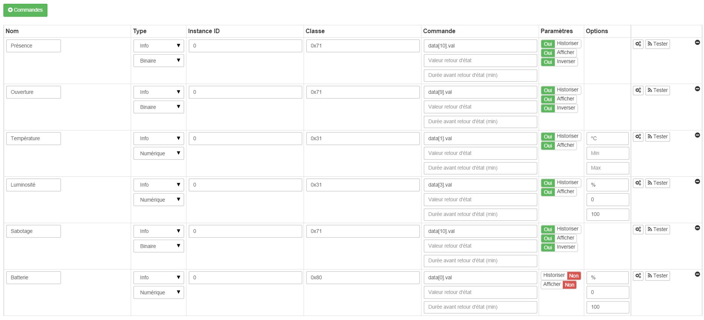
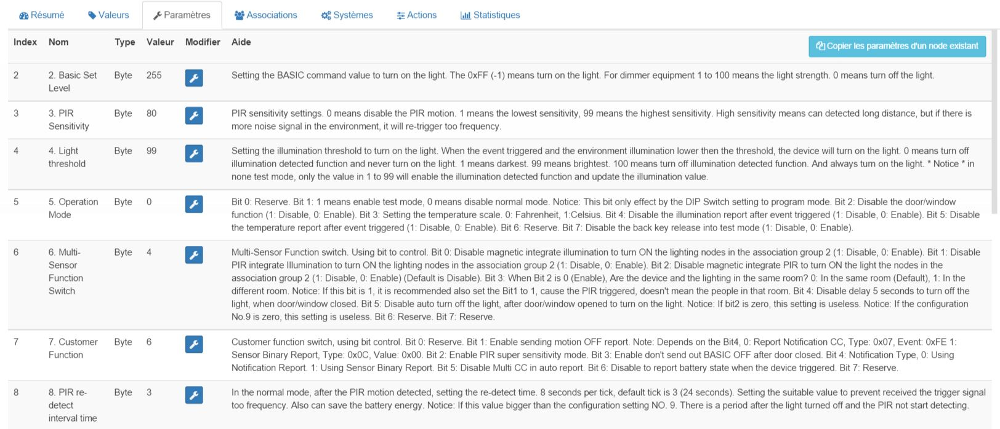

Philio PST02 A - 4 in 1
=======================

\

-   **The module**

\

\

-   **The Jeedom**

\

\

summary
------

\

The ZIP-PSM02-EU detector offers 4 different functions: detection of
movement, opening detection, temperature sensor and
brightness. It consists of two parts: a detector and a magnet.
They are designed to be placed on a door or window with
the magnet fixed on the part that opens and the detector on the part
fixed.

Opening the door or window will move the magnet away from
detector, which will trigger the detector that will send a Z-Wave signal
if the system is armed (this signal can be operated by a
siren or by a home automation box for example). This detector can be
used for security or automation. When the detector
is associated with security devices, it serves as a trigger
alerts by detecting changes in radiation levels
infrared or door / window opening. If a person moves in
the field of view of the detector or open a door / window, a signal
The radio is transmitted, which triggers an alarm to dissuade
intruder.

The detector can also be used in combination with a
Z-Wave controller for home automation uses, by detecting both
changes in the levels of infrared radiation (presence) or
door / window opening and changes in the level of
brightness. Thus, one can trigger a lighting during a detection
movement or door opening in the dark.

The detector will also go up the brightness and the temperature, either in
case of significant change, and whenever a movement or
open / close are detected. A Z-Wave controller (remote control,
dongle ...) is necessary to integrate this detector into your network
if you already have an existing network. \

functions
---------

\

-   4-in-1 detector: movement, opening, temperature, light

-   Adopt the recent Z-Wave 400series chip to support the
    multichannel operations and more data throughput
    high (9.6 / 40 / 100kbps)

-   Use the Z-Wave 6.02 SDK

-   Optimized antenna range

-   Use for home automation or security applications

-   Button to include / exclude the detector

-   tamper

-   Low battery indication

-   Small, discreet and aesthetic

-   Ease of use and installation

\

Technical characteristics
---------------------------

\

-   Module type: Z-Wave transmitter

-   Power supply: 1 battery 3V CR123A

-   Battery life: 2 years

-   Frequency: 868.42 MHz

-   Transmission distance: 30m indoors

-   Temperature sensor: -10 to 70 ° C

-   Light sensor: 0 to 500 lux

-   PIR detection angle: 90 °

-   PIR detection range: 8 to 10m

-   Dimensions:

-   Detector: 28 x 96 x 23 mm

-   Magnet: 10 x 50 x 12 mm

-   Weight: 52g

-   Operating temperature: -10 to 40 ° C

-   Operating humidity: 85% RH max

-   CE Standard: EN300 220-1

-   Z-Wave Certification: ZC08-13050003

\

Module data
-----------------

\

-   Brand: Philio Technology Corporation

-   Name: PST02-A 4 in 1 Multi-Sensor

-   Manufacturer ID: 316

-   Product type: 2

-   Product ID: 12

\

Configuration
-------------

\

To configure the OpenZwave plugin and know how to put Jeedom in
inclusion refer to this
[Documentation] (https://jeedom.fr/doc/documentation/plugins/openzwave/fr_FR/openzwave.html).

\

> **Important**
>
> To put this module in inclusion mode you have to press 3 times on the
> inclusion button, according to its paper documentation.

\

\

Once included you should get this:

\

\

### Orders

\

Once the module is recognized, the commands associated with the module will be
available.

\

\

Here is the list of orders:

\

-   Presence: this is the command that will trace a presence detection

-   Opening: it is the command that will remount a detection
    opening

-   Temperature: it is the command which allows to go up the
    temperature

-   Brightness: it is the command which makes it possible to raise the luminosity

-   Sabotage: it is the sabotage command (it is triggered in
    case of tearing)

-   Battery: it's the battery control

\

### Module configuration

\

> **Important**
>
> During a first inclusion always wake up the module just after
> inclusion.

\

Then if you want to configure the module accordingly
of your installation, you have to go through the button
"Configuration" of Jeedom's OpenZwave plugin.

\

\

You will arrive on this page (after clicking on the tab
settings)

\

\

Parameter details:

\

-   2: Adjusts the signal sent to the modules in the group
    association 2

-   3: Adjusts the sensitivity of the presence sensor (0:
    disabled 99: max sensitivity)

-   4: Adjusts the brightness level from which the
    signal defined in parameter 2 will be sent to the modules associated with the
    group 2

-   5: operating mode (refer to the
    manufacturer's documentation) Recommended value: 8

-   6: multi-sensor operating mode (refer to the
    manufacturer's documentation) Recommended value: 4

-   7: Custom operating mode of the multi-sensor (refer to
    on the manufacturer's documentation) Recommended value: 6 (for
    have a return on OFF of the presence)

-   8: Set the duration in 8 second redetection steps
    of movement

-   9: Set how long the OFF signal will be
    sent to modules associated with group 2

-   10: Sets the duration between two battery reports (one
    unit = parameter 20)

-   11: Sets the duration between two opening auto reports
    (one unit = parameter 20)

-   12: Sets the duration between two auto reports of
    brightness (one unit = parameter 20) Recommended value: 3

-   13: allows to define the duration between two auto reports of
    temperature (one unit = parameter 20) Recommended value: 2

-   20: duration of an interval for parameters 10 to 13 Value
    recommended: 10

-   21: value of variation in ° F of temperature to trigger a
    report

-   22: value in% of brightness variation to trigger a
    report Recommended value: 10

\

### Groups

\

This module has two association groups, only the first is
essential.

\

\

Good to know
------------

\

### Alternative visual

\

\

Wakeup
------

\

To wake up this module there is only one way to proceed:

-   release the tamper button and press it again

\

F.A.Q.
------

\

This module wakes up by pressing its tamper button.

\

This module is a battery module, the new configuration will be
taken into account at the next wakeup.

\

Important note
---------------

\

> **Important**
>
> You have to wake up the module: after its inclusion, after a change
> of the configuration, after a wakeup change, after a
> change of association groups

\

**@** sarakha63
