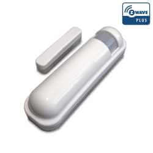
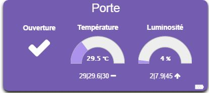
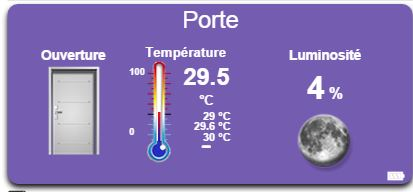

Philio PST02 C - 3 in 1 Opening
=================================

\

-   **The module**

\

\

-   **The Jeedom**

\

\

summary
------

\

The ZIP-PSM01 detector offers 3 different functions: detection
opening, temperature sensor and brightness sensor. He is
consists of two parts: a detector and a magnet. They are designed
to be placed on a door or window with the magnet attached to the
part that opens and the detector on the fixed part.

Opening the door or window will move the magnet away from
detector, which will trigger the detector that will send a Z-Wave signal
if the system is armed (this signal can be operated by a
siren or by a home automation box for example). The sensor can also
be used for automatic lighting control, depending on the
brightness level. For example, the sensor will send a signal to
the Z-Wave switch to turn on the light when the door opens
and that the room is dark.

The detector will also go up the brightness and the temperature, either in
case of significant change, and each time the opening / closing
is detected.

A Z-Wave controller (remote control, dongle ...) is necessary in order
to integrate this detector into your network if you already have a network
existing.

\

functions
---------

\

-   3-in-1 detector: Opening, temperature, light

-   Adopt the recent Z-Wave 400series chip to support the
    multichannel operations and more data throughput
    high (9.6 / 40 / 100kbps)

-   Use the Z-Wave 6.02 SDK

-   Optimized antenna range

-   Use for home automation or security applications

-   Button to include / exclude the detector

-   tamper

-   Low battery indication

-   Small, discreet and aesthetic

-   Ease of use and installation

\

Technical characteristics
---------------------------

\

-   Module type: Z-Wave transmitter

-   Power supply: 1 battery 3V CR123A

-   Battery life: 3 years (for 14 trips per day)

-   Frequency: 868.42 MHz

-   Transmission distance: 30m indoors

-   Temperature sensor: -10 to 70 ° C

-   Light sensor: 0 to 500 lux

-   Dimensions:

-   Detector: 28 x 96 x 23 mm

-   Magnet: 10 x 50 x 12 mm

-   Weight: 52g

-   Operating temperature: -10 to 40 ° C

-   Operating humidity: 85% RH max

-   CE Standard: EN300 220-1

-   Z-Wave Certification: ZC08-13050003

\

Module data
-----------------

\

-   Brand: Philio Technology Corporation

-   Name: PST02-C Door / Window 3 in 1 sensor

-   Manufacturer ID: 316

-   Product type: 2

-   Product ID: 14

\

Configuration
-------------

\

To configure the OpenZwave plugin and know how to put Jeedom in
inclusion refer to this
[Documentation] (https://jeedom.fr/doc/documentation/plugins/openzwave/fr_FR/openzwave.html).

\

> **Important**
>
> To put this module in inclusion mode you have to press 3 times on the
> inclusion button, according to its paper documentation.

\

\

Once included you should get this:

\

\

### Orders

\

Once the module is recognized, the commands associated with the module will be
available.

\

\

Here is the list of orders:

\

-   Opening: it is the command that will remount a detection
    opening

-   Temperature: it is the command which allows to go up the
    temperature

-   Brightness: it is the command which makes it possible to raise the luminosity

-   Battery: it's the battery control

\

### Module configuration

\

> **Important**
>
> During a first inclusion always wake up the module just after
> inclusion.

\

Then if you want to configure the module accordingly
of your installation, you have to go through the button
"Configuration" of Jeedom's OpenZwave plugin.

\

\

You will arrive on this page (after clicking on the tab
settings)

\

\

Parameter details:

\

-   2: Adjusts the signal sent to the modules in the group
    association 2

-   4: Adjusts the brightness level from which the
    signal defined in parameter 2 will be sent to the modules associated with the
    group 2

-   5: operating mode (refer to the
    manufacturer's documentation) Recommended value: 8

-   6: multi-sensor operating mode (refer to the
    manufacturer's documentation) Recommended value: 4

-   7: Custom operating mode of the multi-sensor (refer to
    on the manufacturer's documentation) Recommended value: 20 (for
    have the opening of functional)

-   9: Set how long the OFF signal will be
    sent to modules associated with group 2

-   10: Sets the duration between two battery reports (one
    unit = parameter 20)

-   11: Sets the duration between two opening auto reports
    (one unit = parameter 20)

-   12: Sets the duration between two auto reports of
    brightness (one unit = parameter 20) Recommended value: 3

-   13: allows to define the duration between two auto reports of
    temperature (one unit = parameter 20) Recommended value: 2

-   20: duration of an interval for parameters 10 to 13 Value
    recommended: 10

-   21: value of variation in ° F of temperature to trigger a
    report

-   22: value in% of brightness variation to trigger a
    report Recommended value: 10

\

### Groups

\

This module has two association groups, only the first is
essential.

\

\

Good to know
------------

\

### Alternative visual

\

\

Wakeup
------

\

To wake up this module there is only one way to proceed:

-   release the tamper button and press it again

\

F.A.Q.
------

\

This module wakes up by pressing its tamper button.

\

This module is a battery module, the new configuration will be
taken into account at the next wakeup.

\

Important note
---------------

\

> **Important**
>
> You have to wake up the module: after its inclusion, after a change
> of the configuration, after a wakeup change, after a
> change of association groups

\

**@** sarakha63
