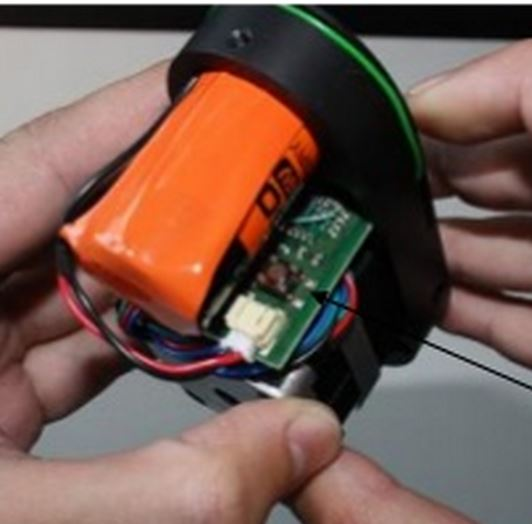
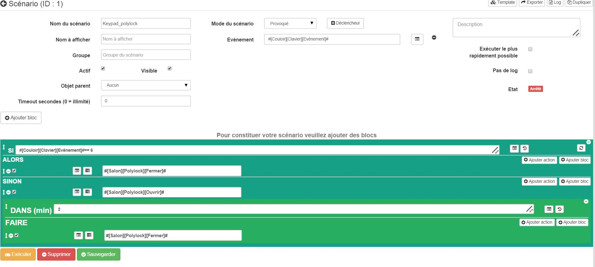

polylock
========

\

-   **The module**

\

\

-   ** The Jeedom **

\

\

summary
------

Secure your home using the Z-Wave electronic lock
Poly-Control!

The Poly-Lock electronic lock is designed to fit almost
all the doors in the world. It can be easily mounted in 5
minutes, you just have to change the cylinder of your door.

Once paired with your Z-Wave controller (such as Vera systems from
VeraControl), you can have complete control of your lock
from any computer or smartphone, no matter where you are
be in the world. It is also possible to use the lock
with the wireless keyboard Poly-Pad to open or lock the door.

It is therefore possible to lock your house in a similar way
to lock your car - with a remote control, pressing
simply on a button and your house is secure. The lock
Poly-Control can also work with other Z-Wave scenes, where
the lights come on, and the alarm system is disabled when
unlocked via your remote control.

The Poly-Control system can be used in an environment
domestic or work. The Poly-Lock lock is powered by
battery, and has been tested to run for 1 year without
battery replacement.

\

functions
---------

\

-   Control your gateway remotely

-   Fits most doors

-   Can be integrated into Z-Wave scenes, for example for a system
    alarm

-   Suitable for domestic or corporate use

-   Wheel for manual closing

-   Easy installation

\

Technical characteristics
---------------------------

\

-   Power supply: Lithium-Chloride 3.6V battery

-   Frequency: 868.42 Mhz

-   Range: up to 100 m outdoors, up to 30 m in
    buildings

-   Dimensions: 120 x 52 x 60 mm (L x W x H)

-   Weight: 370g

\

Module data
-----------------

\

-   Brand: Poly-Control

-   Name: Polylock

-   Manufacturer ID: 270

-   Product type: 1

-   Product ID: 1

\

Configuration
-------------

\

To configure the OpenZwave plugin and know how to put Jeedom in
inclusion refer to this
[Documentation] (https://jeedom.fr/doc/documentation/plugins/openzwave/fr_FR/openzwave.html).

\

> ** Important **
>
> To put this module in inclusion mode you have to press 1 time on the
> inclusion button, according to its paper documentation.

\

\

Once included you should get this:

\

\

### Orders

\

Once the module is recognized, the commands associated with the module will be
available.

\

\

Here is the list of orders:

\

-   Status: this is the command that will trace the last action
    executed (open / close)

-   Open: this is the command that opens the lock

-   Close: this is the command that closes the lock

-   Battery: it's the battery control

\

### Module configuration

\

> ** Warning **
>
> Although this module is battery-powered, it uses Flirs technology.
> That means he has no concept of wake up and wake up. he
> will recover all configuration changes in near real time
> as a mains module.

\

If you want to configure the module according to your
installation, it is necessary to go through the "Configuration" button of the
OpenZwave plugin from Jeedom.

\

\

You will arrive on this page (after clicking on the tab
settings)

\

\

Parameter details:

\

-   0: change the direction of rotation for commands
    open close

-   1: Sets how long the lock will turn for
    open (0 to 15 s)

-   2: Set how long the lock will turn for
    close (0 to 15 s)

-   3: to define the rotation speed of the lock (0 to 15,
    15 being the slowest)

-   4: allows you to choose from different modes of operation
    (torque, strength, power etc ...)

\

### Groups

\

This module has only one association group.

\

\

Examples of use
----------------------

\

\

The trigger is the event command of a zipato keyboard
(This can be anything else) If the value is 6 (home) on
lock the door. Indeed we have just returned so we can close
the door to key. Otherwise (necessarily 5) we open the door and 2 minutes
after it is closed. Indeed, we want to go out, the door opens and
close shortly thereafter.

\

Good to know
------------

\

### Specificities

\

> ** Tip **
>
> Although this module is battery-powered, it uses Flirs technology.
> That means he has no concept of wake up and wake up. he
> will recover all configuration changes in near real time
> as a mains module.

\

> ** Tip **
>
> This module does not return its state, if you operate the lock at the
> the state will remain the same. \

### Alternative visual

\

\

Wake up
-------

\

There is no concept of wake up for this module.

\

F.A.Q.
------

\

No concept of wake up on this module, read the paragraph specificities.

\

** @ ** sarakha63
