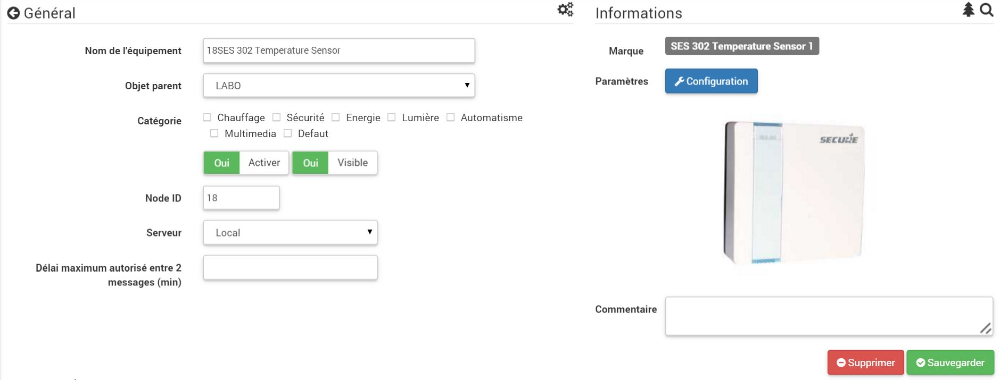
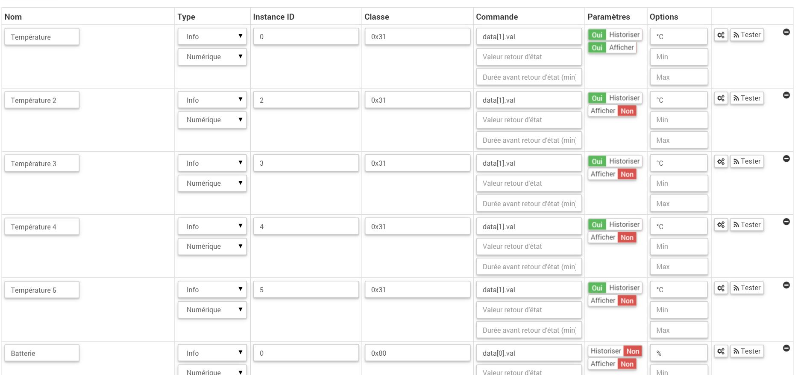

Secure SES 302 "Temperature"
============================

\

-   **The module**

\

\

-   ** The jeedom **

\

\

summary
------

\

The SES302 sensor is used to measure the room temperature
interior. It is powered by 2 AA batteries and is certified Z-Wave
More. In addition to its main function, it is possible to wire
different SECURE external probes on the module, ie:

-   An external temperature sensor NTC (SES001)

-   4 wired or pipe temperature sensors (SES002)
    connected by 1m cables

-   1 wired or pipe temperature sensor (SES003)
    connected by a 4m cable

These modules are ideal for measuring temperature in
central heating control applications or any other
similar application. Its user interface is simple, with a
local push-button and an indication LED on the rear panel. We
can easily include / exclude it in a Z-Wave network.

\

functions
---------

\

-   Precise temperature measurement

-   Application in dynamic control systems of
    tanks / tubes / heated floors / ...

-   Possibility of connecting external probes

-   Interoperable with certified Z-Wave products and systems

-   Easy and quick installation

-   Low battery ratio

\

Technical characteristics
---------------------------

\

-   Type: Portable / Wall Mount

-   Temperature measurement range: ± 0.5 ° C for 0 ° C to 40 ° C

-   Z-Wave Plus chip

-   Frequency: 868.42 Mhz

-   Power supply: 2x AA batteries (LR6)

-   Range: up to 100 m in free field

-   Protection class: IP30

-   Dimensions: 86 x 85 x 30 mm

\

Module data
-----------------

\

-   Brand: Horstmann

-   Name: SES 302 Temperature Sensor

-   Manufacturer ID: 89

-   Product Type: 13

-   Product ID: 2

\

Configuration
-------------

\

To configure the OpenZwave plugin and know how to put Jeedom in
inclusion refer to this
[Documentation] (https://jeedom.fr/doc/documentation/plugins/openzwave/fr_FR/openzwave.html).

\

> ** Important **
>
> To put this module in inclusion mode, press 1 second on
> the button on the back and release, according to its paper documentation.

\

\

Once included you should get this:

\

\

### Orders

\

Once the module is recognized, the commands associated with the module will be
available.

\

\

Here is the list of orders:

\

-   Temperature: this is the temperature control

-   Battery: it's the battery control

Several non-visible temperatures are also available and will be
useful if you have connected external probes

\

### Module configuration

\

> ** Important **
>
> During a first inclusion always wake up the module just after
> inclusion.

\

Then it is necessary to perform the configuration of the module in
depending on your installation. You have to go through the button
"Configuration" of Jeedom's OpenZwave plugin.

\

\

You will arrive on this page (after clicking on the tab
settings)

\

\

Parameter details:

\

-   1: Set how much the temperature should vary so that
    the module sends it to Jeedom (in steps of 0.1)

-   2: Set the time interval for sending the temperature
    at Jeedom (in minutes)

All other parameters are identical and correspond to all
external probes possibly connected

\

### Groups

\

This module has only one association group, it is essential

\

\

Good to know
------------

\

### Specificities

\

### Alternative visual

\

\

Wakeup
------

\

To wake up this module you have to press the button on the back once

\

F.A.Q.
------

\

This module wakes up by pressing its inclusion button once.

\

This module is a battery module, the new configuration will be
taken into account at the next wake up.

\

Important note
---------------

\

> ** Important **
>
> You have to wake up the module: after its inclusion, after a change
> of the configuration, after a change of wake up, after a
> change of association groups

\

** @ ** sarakha63
