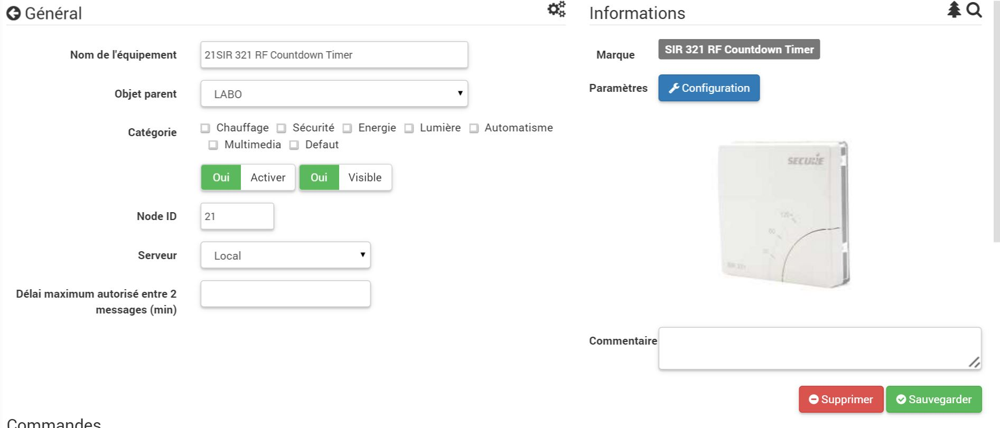

Secure SIR 321 "Timer"
======================

\

-   **The module**

\

\

-   ** The jeedom **

\

\

summary
------

\

The SIR321 digital timer is a simple switch to
push button that remembers turning off your devices
electric. Big energy savings are possible by adding
this simple device on any electrical appliance of great power,
with loads up to 3kW (resistive).

These units are perfect for use on panels
heaters, immersion heaters, towel warmers and oil coolers. The
boost goes from 30 to 120 minutes.

The SIR 321 supports the SES001 external temperature sensors,
SES002 and SES003.

\

functions
---------

\

-   Booster for immersion heater, panel heater, heated towel rail,
    radiator with oil bath

-   Timer for boiler

-   Forced ventilation in conference rooms

-   Ground heating temperature measurement (with optional probes)

-   Simple to use and reliable

-   Achieves energy savings

\

Technical characteristics
---------------------------

\

-   Type: Electronic timer

-   Relay: 13 (3) A, 230V AC, suitable for charging loads up to
    3kW

-   Power supply: 230V AC, 50Hz

-   Dimensions 85x85x44mm

-   Protection class: IP30

-   Operating temperature: 0 ° C to 35 ° C

\

Module data
-----------------

\

-   Brand: Horstmann

-   Name: SIR 321 RF Countdown Timer

-   Manufacturer ID: 89

-   Product Type: 1/2 (depending on if it is included with a probe
    temperature or not)

\

Configuration
-------------

\

To configure the OpenZwave plugin and know how to put Jeedom in
inclusion refer to this
[Documentation] (https://jeedom.fr/doc/documentation/plugins/openzwave/fr_FR/openzwave.html).

\

> ** Important **
>
> To put this module in inclusion mode, press 1 second on
> the button (until fast flashing) and release, according to
> its paper documentation.

\

\

Once included you should get this:

\

\

### Orders

\

Once the module is recognized, the commands associated with the module will be
available.

\

\

Here is the list of orders:

\

-   On: this is the command to switch on the relay

-   Off: this is the command to turn off the relay

-   Temperature: this is the temperature measurement command if a
    external probe is present

\

### Module configuration

\

If you want to configure the module you have to go through the button
"Configuration" of Jeedom's OpenZwave plugin.

\

\

You will arrive on this page (after clicking on the tab
settings)

\

\

Parameter details:

\

-   1: Enable or disable the fail safe timer function (refer to
    the documentation of the module)

-   2: Set the temperature unit

-   3: Set the time interval for sending the temperature
    to Jeedom (in seconds)

-   4: Set how much the temperature should vary so that
    the module sends it to Jeedom (in steps of 0.1 10- → 0.1)

-   5: Set a cut off temperature beyond which
    the module will cut the relay

\

### Groups

\

This module has two association groups. If the first is
indispensable, the second is active and is indispensable if a probe
temperature is connected.

\

F.A.Q.
------

\

** @ ** sarakha63
