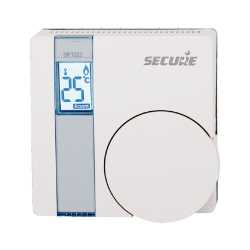
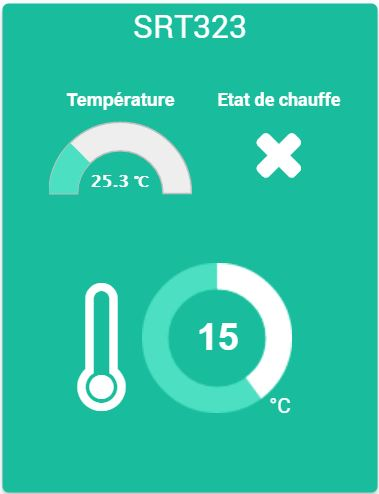
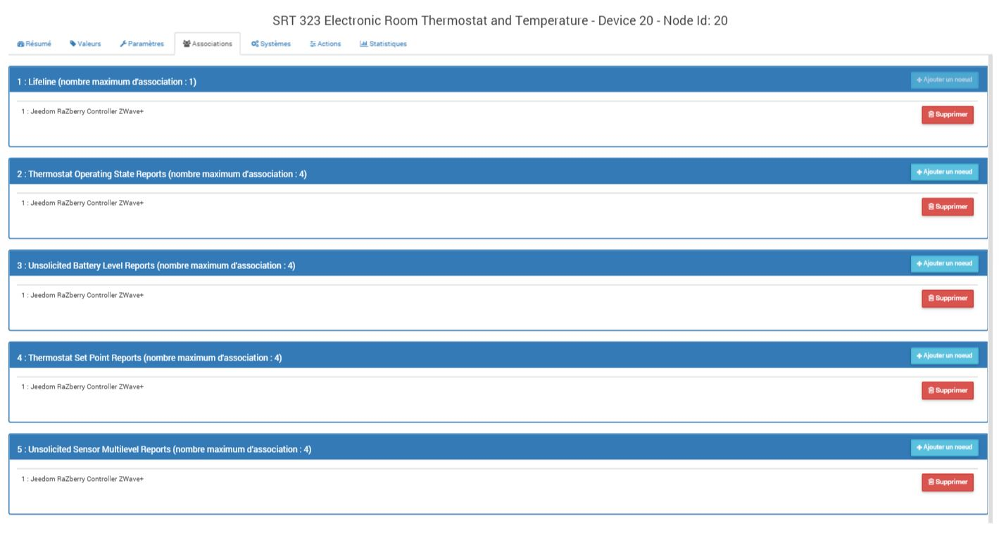

Secure SRT 323 "Thermostat"
===========================

\

-   **The module**

\

\

-   **The jeedom**

\

\

summary
------

\

The SRT323 is a battery operated wall thermostat. He has
a rotary knob that allows the user to adjust the temperature
deposit in the room. This thermostat incorporates a control relay
load. It is not necessary to install an actuator near
of the boiler.

By checking the set temperature with the actual temperature
measured, the thermostat decides to operate the boiler. Moreover, this
thermostat incorporates a TPI algorithm (time-proportional integral),
allowing optimization and a more precise adjustment of the temperature
of your environment.

The thermostat can receive the set temperature from another
Z-Wave controller, and can also be used as a sensor for
temperature. The thermostat itself has no built-in timer but
execute Z-Wave commands and local commands.

It can be used as a direct substitute for thermostats
existing, without having to make any wiring changes. The algorithm
TPI will optimize the ignition and shutdown of the boiler
in order to best maintain the set temperature, without
"overtaking" of it. It has been shown that TPI controllers
can provide considerable energy savings compared to
traditional heating regulators.

The SRT323 is an ideal partner for gateway use
home automation system, allowing you to remotely control your
heating. You will not have to worry about going home in
a cold house, as long as you have a smartphone, tablet or
PC at your fingertips and connected to the internet.

\

functions
---------

\

-   Thermostat for domestic application

-   Replaces an existing thermostat

-   Z-Wave wireless technology

-   Backlit LCD display

-   Easy to use

-   Compatible with other Z-Wave products

-   One button

\

Technical characteristics
---------------------------

\

-   Module Type: Z-Wave Controller

-   Integrated TPI algorithm

-   Relay: 3 (1) A 230V AC

-   Adjustable temperature range: 5 ° C to 30 ° C

-   Power supply: 2x AAA batteries (LR3)

-   Battery life: 2 years

-   Frequency: 868.42 Mhz

-   Range: up to 50 m in free field

-   Protection class: IP30

-   Operating temperature: 0 ° C to 40 ° C

-   Dimensions: 86 x 86 x 36.25 mm

\

Module data
-----------------

\

-   Brand: Horstmann

-   Name: SRT 323 Electronic Room Thermostat and Temperature

-   Manufacturer ID: 89

-   Product type: 1

-   Product ID: 4

\

Configuration
-------------

\

To configure the OpenZwave plugin and know how to put Jeedom in
inclusion refer to this
[Documentation] (https://jeedom.fr/doc/documentation/plugins/openzwave/fr_FR/openzwave.html).

\

> **Important**
>
> To put this module in inclusion mode you have to put the switch 1 in
> position ON then with the wheel display L and press the wheel,
> in accordance with its paper documentation.

\

\

> **Important**
>
> This module is capricious on inclusion. During a first inclusion
> always wake the module right after inclusion. To do this
> leave the switch 1 in the ON position and then with the wheel put in
> position "n" and press the button. Press a second time after
> 10 seconds to be sure. Once done, click on the button
> Synchronize (visible in expert view) next to the buttons
> Inclusion / Exclusion. Then on the page of your module click on
> the magnifying glass at the top right.

\

Once included you should get this:

\

\

### Orders

\

Once the module is recognized, the commands associated with the module will be
available.

\

\

Here is the list of orders:

\

-   Temperature: this is the temperature control

-   SetpointState: This is the command that gives the current instruction

-   Setpoint: it is the command which makes it possible to adjust the instruction

-   State Heating: it is the order which makes it possible to know if the
    thermostat is in heating mode or not

-   Battery: it's the battery control

\

### Module configuration

\

Then it is necessary to perform the configuration of the module in
depending on your installation. You have to go through the button
"Configuration" of Jeedom's OpenZwave plugin.

\

\

You will arrive on this page (after clicking on the tab
settings)

\

\

Parameter details:

\

-   1: enable or disable the internal temperature sensor

-   2: allows you to choose the temperature unit

-   3: defines the temperature variation step for
    the module goes up (per unit of 0.1 ° C)

\

### Groups

\

For optimum operation of your module Jeedom must be
associated with 5 groups

\

\

Good to know
------------

\

### Specificities

\

> **Important**
>
> This module is battery powered. So it's important to note that a
> setpoint change will only be taken into account when the alarm is woken up. By
> default the wake up is at 86400 seconds. It is strongly recommended to
> reduce it to about 10 minutes. So a change of instructions will be
> taken into account by the module at maximum after 10 minutes

\

Wakeup
------

\

To wake up this module it is necessary to put the switch 1 in ON position and
use the dial to select n and press the dial.

\

F.A.Q.
------

\

\

This module is a battery module, the new configuration will be
taken into account at the next wake up.

\

Important note
---------------

\

> **Important**
>
> You have to wake up the module: after its inclusion, after a change
> of the configuration, after a wakeup change, after a
> change of association groups

\

**@** sarakha63
