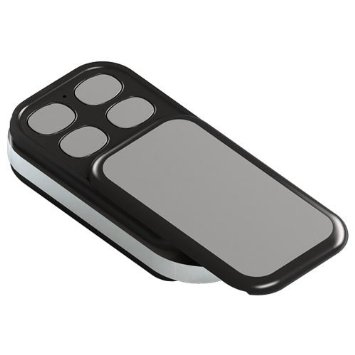

Aeotec Mando
=============

\

-   ** ** El módulo

\

\

-   ** El Jeedom visual **

\

\

resumen
------

\

El llavero Aeon Labs, diseño moderno
dispone de 4 botones para controlar cualquier tipo de dispositivos
Z-Wave, tales como lámparas, persianas, etc ...

Con su tamaño compacto, se puede poner fácilmente
en el bolsillo. Fácil de usar y elegante, está equipado con una
anillo para adjuntarlo a la llave, que pone a disposición de
al salir de la casa o al volver a su hogar.

Cada botón puede controlar dos dispositivos o escenas a través
gestión de prensas cortas y largas. Este mando a distancia también puede
bien utilizado como controlador principal y secundaria.

\

funciones
---------

\

-   llavero de control remoto

-   controlador primario o secundario

-   Ultra compacto y diseño ultra

-   4 botones configurables

-   Gestiona hasta 8 dispositivos / escenas

-   deslizamiento panel de protección

-   Facilidad de uso e instalación

\

Características técnicas
---------------------------

\

-   Tipo de módulo: Transmisor Z-Wave

-   Fuente de alimentación: 1 batería de litio de 3V CR2450

-   Duración de la batería: 1 año

-   Frecuencia: 868.42 MHz

-   Distancia de transmisión: 100 metros en campo abierto

-   Temperatura: -10 ° C a 50 ° C

-   Dimensiones: 55 x 30 x 13 mm (L x W x H)

\

datos de los módulos
-----------------

\

-   Marca: Aeotec

-   Nombre: Key Fob

-   Identificación del fabricante: 134

-   Tipo de producto: 1

-   Identificación del producto: 22

\

configuración
-------------

\

Para configurar OpenZwave plugin y cómo poner en Jeedom
inclusión se refiere a este
[Documentación] (https://jeedom.fr/doc/documentation/plugins/openzwave/fr_FR/openzwave.html).

\

> ** Importante **
>
> Para poner este modo la inclusión del módulo tiene que pulsar el botón
> LEARN, de acuerdo con su documentación en papel.

\

\

Una vez incluido usted debe conseguir esto:

\

\

### comandos

\

Una vez reconocido el módulo, los comandos asociados a los módulos
disponible.

\

\

Estos son los comandos:

\

-   Botones: el comando que ascienda el botón pulsado

1: 1 pulsando brevemente la tecla

2: 1 pulsación larga del botón

3: Botón 2 pulsaciones cortas

4: 2 Botón soporte largo

5: Botón de 3 pulsaciones cortas

6: Botón apoyo 3 característica

7: Botón 4 pulsaciones cortas

8: Botón soporte 4 característica

\

### Configuración del módulo

\

> ** Importante **
>
> Cuando inclusión por primera vez todavía despierta en el módulo justo después de
> Inclusión.

\

Entonces, si usted quiere configuración del módulo en función effectuer
su instalación, para ello es necesario pasar por el botón
"Configuración" plug-in OpenZwave Jeedom.

\

\

Se llega en esta página (después de hacer clic en la pestaña
Configuraciones)

\

\

Detalles de los parámetros:

\

-   250: modo de funcionamiento del mando a distancia (absolutamente poner
    Escenas a ser utilizado en el control remoto)

Todos los demás parámetros son útiles que la combinación directa
entre el controlador y los módulos.

\

### grupos

\

Este módulo tiene un solo grupo de asociación. El es
esencial.

\

\

Bueno saber
------------

\

### detalles específicos

Para utilizar este módulo en remoto proceder como sigue:

-   1: Incluir el control remoto

-   2: El despertar del control remoto

-   3: establece el valor true 250 Cambio (lo hacen bien, incluso si él
    aparece ya en true)

-   4: El despertar del mando a distancia y para asegurar que el cambio ha sido
    tener en cuenta

-   5: El cambio en el modo de funcionamiento permanente de los restantes remoto
    presione los dos botones en la parte posterior durante 3 segundos.

wakeup
------

\

Para despertar este módulo hay una sola manera de hacer esto:

-   mantenga pulsado 3 segundos en el botón LEARN

\

F.A.Q.
------

\

Este módulo se despierta aún presionando 3 segundos en el botón LEARN.

\

Este módulo es un módulo de batería, la nueva configuración se
consideración de que si se despierta el mando a distancia.

\

Nota importante
---------------

\

> ** Importante **
>
> Hay que despertar el módulo después de su inclusión, después de un cambio
> La configuración, después de un cambio de wakeup después de una
> Asociación cambiar de grupo

\

** ** @ sarakha63
