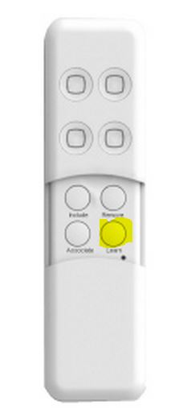

Aeotec Minimote
===============

\

-   ** ** El módulo

\

\

-   **El Jeedom visual**

\

\

resumen
------

\

Este mini controlador de Aeon Labs es compatible con una amplia variedad de
módulos Z-Wave tales como interruptores, reguladores, sensores
movimiento de los interruptores para las persianas ... así que puedes pedir en
de distancia de sus luces, aparatos o persianas. con este
mando a distancia, también se pueden incluir / excluir módulos
su red Z-Wave y se combinan escenas con los botones
mando a distancia. Una válvula de corredera oculta los botones para
establecer la red Z-Wave.

\

funciones
---------

\

-   Configuración de la red Z-Wave (inclusión / módulos de exclusión)

-   Permite hasta 4 escenas

-   8 teclas: 4 escenas, 4 para la configuración de la red

-   caminar / parada y cambio de funciones

-   ALL ON / OFF Función ALL

-   Batería interna rehargeable USB

-   Actualización del firmware a través de USB

\

Características técnicas
---------------------------

\

-   Tipo de módulo: Z-Wave Controlador

-   Color: Blanco

-   Alimentación: batería interna recargable a través de USB

-   Pantalla: azul y el LED rojo

-   Frecuencia: 868,42MHz

-   Alcance: hasta 30 metros

-   Dimensiones: 0,8 cm x 3,3 cm x 9.3cm

-   Temperatura de funcionamiento -35 a +85 ° C

\

datos de los módulos
-----------------

\

-   Marca: Aeotec

-   Nombre: Minimote

-   Identificación del fabricante: 134

-   Tipo de producto: 1

-   Identificación del producto: 3

\

configuración
-------------

\

Para configurar OpenZwave plugin y cómo poner en Jeedom
inclusión se refiere a este
[Documentación] (https://jeedom.fr/doc/documentation/plugins/openzwave/fr_FR/openzwave.html).

\

> **Importante**
>
> Para poner este modo la inclusión del módulo tiene que pulsar el botón
> LEARN, de acuerdo con su documentación en papel.

\

\

Una vez incluido usted debe conseguir esto:

\

\

### comandos

\

Una vez reconocido el módulo, los comandos asociados con el módulo serán
disponible.

\

\

Estos son los comandos:

\

-   Botones: el comando que ascienda el botón pulsado

1: 1 pulsando brevemente la tecla

2: 1 pulsación larga del botón

3: Botón 2 pulsaciones cortas

4: 2 Botón soporte largo

5: Botón de 3 pulsaciones cortas

6: Botón apoyo 3 característica

7: Botón 4 pulsaciones cortas

8: Botón soporte 4 característica

\

### Configuración del módulo

\

> **Importante**
>
> Cuando inclusión por primera vez todavía despierta en el módulo justo después de
> Inclusión.

\

Entonces, si desea configurar el módulo de acuerdo
su instalación, para ello es necesario pasar por el botón
"Configuración" plug-in OpenZwave Jeedom.

\

\

Se llega en esta página (después de hacer clic en la pestaña
configuraciones)

\

\

Detalles de los parámetros:

\

-   1 botón de operación (deje por defecto): 241

-   2 botón de operación (deje por defecto): 242

-   3 botón de operación (deje por defecto): 243

-   botón de operación 4 (deje por defecto): 244

-   250: el modo de funcionamiento del mando a distancia (dejar absolutamente
    Escenas a ser utilizado en el control remoto)

\

### grupos

\

Este módulo tiene cuatro grupos de asociación, ninguno es necesario
para ser utilizado en Jeedom remoto.

\

\

Bueno saber
------------

\

### detalles específicos

wakeup
------

\

Para despertar este módulo hay una sola manera de hacer esto:

-   mantenga pulsado 3 segundos en el botón LEARN

\

F.A.Q.
------

\

Este módulo se despierta aún presionando 3 segundos en el botón LEARN.

\

Este módulo es un módulo de batería, la nueva configuración se
consideración de que si se despierta el mando a distancia.

\

Nota importante
---------------

\

> **Importante**
>
> Hay que despertar el módulo después de su inclusión, después de un cambio
> La configuración, después de un cambio de wakeup después de una
> Asociación cambiar de grupo

\

** ** @ sarakha63
