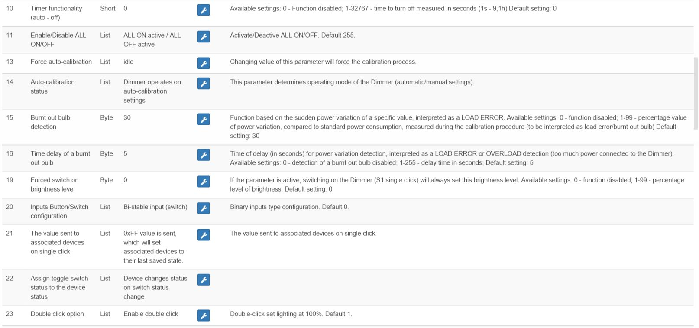
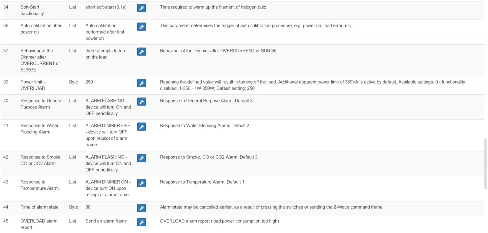
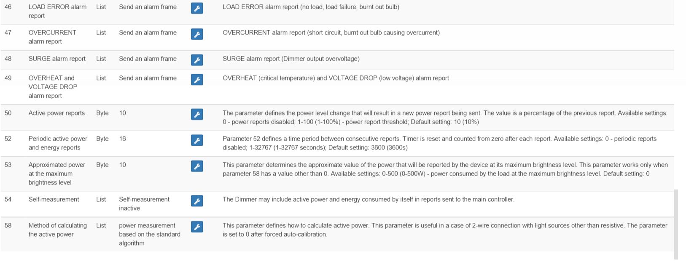
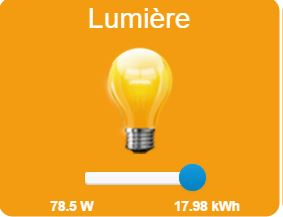

Fibaro Dimmer2 - FGD-212
========================

\

-   ** ** El módulo

\

\

-   ** El Jeedom visual **

\

\

resumen
------

\

El controlador micromódulo FGD-212 le permitirá controlar una
lámpara o la distancia hasta el techo con el protocolo Z-Wave mientras
conservando su interruptor existente.

Por lo tanto, usted será capaz de operar la lámpara conectada y variar su
la intensidad con el interruptor existente, un emisor o Z-Wave
directamente desde este botón en el micromódulo.

El nuevo amplificador Fibaro FGD-212 está equipado con un algoritmo
la detección inteligente de la fuente de luz que facilita el
configuración y garantiza una alta compatibilidad del dispositivo. lo
tiene una auto-protección contra sobrecargas y función
arranque suave. Para las fuentes de luz no regulables,
Sólo la función ON / OFF es posible (conexión 3 hijo).

Es compatible con cualquier tipo de lámparas o cambios de apoyo
no. Además de la variación característica, micro-módulo también puede
medir el consumo eléctrico de la carga conectada. Los valores
consumo instantáneo (W) y el consumo de energía total
(KWh) puede ser consultado.

\

funciones
---------

\

-   Ordenar la iluminación a distancia

-   Se instala detrás de un interruptor existente

-   ON / OFF función y el Cambio

-   Modo de uso 2 hijo (neutro no es obligatorio)

-   Se integra el chip Z-Wave 500 series

-   Comunicación 250% más rápido en comparación con los dispositivos Z-Wave
    estándar

-   Detección automática de carga

-   Protegido contra sobrecarga

-   Compatible con los controladores de Z-Wave Z-Wave y +

-   Función de medición de la potencia activa y la energía

-   Funciona con diferentes tipos de interruptores - pulsador,
    flop, de tres vías, etc.

-   función de arranque suave (soft-start)

-   LED de indicación de estado de la inclusión, y la calibración
    niveles de menú

-   probador alcance integrado Z-Wave

-   detecta automáticamente los fallos del cableado, alta temperatura,
    bulbo, sobretensiones y sobrecargas

-   Opciones de configuración avanzada

-   Pequeña, discreta y estética

-   Facilidad de uso e instalación

\

Características técnicas
---------------------------

\

-   Tipo de módulo: el receptor Z-Wave

-   Fuente de alimentación: 230V +/- 10%, 50Hz

-   Consumo: 1.3W

-   Cableado: neutral no requiere

-   Carga máxima: 50-250W (carga resistiva) o 0.25-1.1A
    (Carga inductiva)

-   Tipo de Lámpara Apoyado (regulable): incandescente, CFL,
    Halógeno (230VAC y 12VDC con transformador electrónico), LEDs

-   soportes de tipo lámpara (no regulable): CFL, LED

-   Frecuencia: 868.42 MHz

-   Intensidad de la señal: 1 mW

-   Distancia de transmisión: campo libre 50m, 30m en interiores

-   Dimensiones: 42,5 x 38,25 x 20,3mm

-   Temperatura de funcionamiento: 0-35 ° C

-   Límite de temperatura: 105 ° C

-   Normas: RoHS 2011/65 / UE, LVD 2006/95 / CE, la Directiva EMC 2004/108 / CE R & TTE
    1999/5 / EC

\

datos de los módulos
-----------------

\

-   Marca: Grupo Fibar

-   Nombre: FGD212 Dimmer 2

-   Identificación del fabricante: 271

-   Tipo de producto: 258

-   Identificación del producto: 4096

\

configuración
-------------

\

Para configurar OpenZwave plugin y cómo poner en Jeedom
inclusión se refiere a este
[Documentación] (https://jeedom.fr/doc/documentation/plugins/openzwave/fr_FR/openzwave.html).

\

> ** Importante **
>
> Para poner este modo la inclusión del módulo debe ser presionado 3 veces en el
> Botón de inclusión, de acuerdo con su documentación en papel. Si el
> Módulo no está incluido, lo hará Inclusión
> Automáticamente al encenderse.

\

\

> ** Tip **
>
> Si ya ha integrado el módulo a la pared, puede incluir
> Realización de muchos viajes de vuelta en el interruptor o
> Muchas veces, si usted tiene un botón interruptor.

\

Una vez incluido usted debe conseguir esto:

\

\

### comandos

\

Una vez reconocido el módulo, los comandos asociados a los módulos
disponible.

\

\

Estos son los comandos:

\

-   Intensidad: Este es el comando para ajustar la intensidad de la
    luz

-   Uno: Este es el comando para encender la luz

-   Apagado: Este es el comando para apagar la luz

-   Estado: Este es el comando que permite conocer el estado de la
    luz

-   Consumo: Este es el comando para respaldar la
    el consumo del módulo

-   Potencia: Este es el comando para aumentar el poder
    módulo instantánea

Tenga en cuenta que la información completa salpicadero se puede encontrar en la misma
icono

\

### Configuración del módulo

\

Se puede configurar la función de su módulo
instalación. Para ello es necesario pasar por el botón "Configuración"
OpenZwave plug-in Jeedom.

\

\

Se llega en esta página (después de hacer clic en la pestaña
configuraciones)

\

\

Detalles de los parámetros:

\

CURSO DE ESCRITURA

\

### grupos

\

Este módulo tiene cinco grupos de asociación, sólo la primera es
esencial.

\

\

Bueno saber
------------

\

### detalles específicos

\

> ** Atención **
>
> La configuración de parámetro más importante es 20.
> Selecciona el tipo de interruptor utilizado. El tipo de defecto
> Está establecido en tiro.

\

Si desea excluir / incluir el módulo sin necesidad de retirar su
cambiar puede pulsar repetidamente el conmutador
(O ir y venir cuando el interruptor biestable)

\

### alternativa visual

\

\

wakeup
------

\

Sin noción de despertar en este módulo.

\

F.A.Q.
------

\

No. este módulo puede incluir o excluir en varias ocasiones
en el interruptor.

\
** ** @ sarakha63
