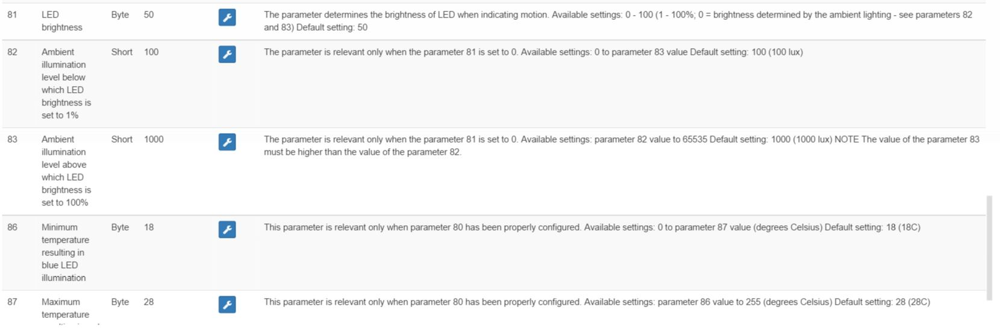
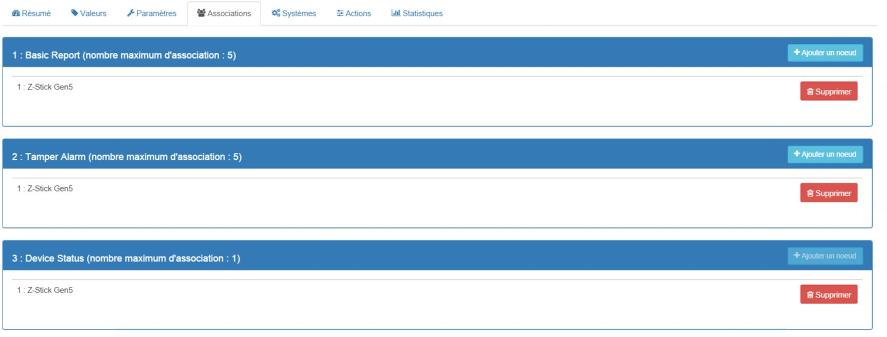

Sensor de movimiento Fibaro - GSMF-001
===============================

\

-   ** ** El módulo

\

\

-   **El Jeedom visual**

\

\

resumen
------

\

El detector de movimiento Fibaro es un detector de Z-Wave multifuncional.
Además de la detección de movimiento, el dispositivo mide el
la temperatura y la intensidad de la luz. El detector incluye también una
acelerómetro incorporado para detectar cualquier manipulación de
dispositivo.

Fibaro el detector de movimiento es con pilas y está diseñado
para instalarse rápida y fácilmente en cualquier
superficie. El LED señala el nivel de movimiento, temperatura,
el modo de funcionamiento y se puede utilizar para ver si el dispositivo
es la red Z-Wave.

El detector de movimiento se puede utilizar para escenas de iluminación
y el seguimiento y / o sistemas de seguridad.

\

funciones
---------

\

-   detector de movimiento inalámbrico

-   Detecta movimientos con un sensor infrarrojo pasivo

-   La medición de la temperatura

-   La medición de la intensidad de la luz

-   Protección contra el robo y hurto

-   Alertas de movimiento y temperatura indicada por el parpadeo
    del LED

-   Modo de detección terremoto

-   Botón para incluir / excluir el detector

-   Detección de batería baja

-   Muy pequeña, de tamaño compacto

-   Fácil de instalar en una pared u otra superficie

\

Características técnicas
---------------------------

\

-   Tipo de módulo: Transmisor Z-Wave

-   Potencia: CR123A 3,6VDC

-   La altura recomendada para la instalación: 2,4 m

-   medido rango de temperatura: -20 ° C a 100 ° C

-   Precisión de medida: 0,5 ° C

-   Brillo rango de medición: 0-32000 LUX

-   Frecuencia: 868.42 MHz

-   Distancia de transmisión: campo libre 50m, 30m en interiores

-   Dimensiones: 4,4 cm de diámetro

-   Temperatura de funcionamiento: 0-40 ° C

-   Certificaciones: LVD 2006/95 / WE EMC 2004/108 / WE R & TTE 1999/5 / nosotros RoHS
    II

\

datos de los módulos
-----------------

\

-   Marca: Grupo Fibar

-   Nombre: Fibaro GSMF-001 \ [sensor de movimiento \]

-   Identificación del fabricante: 271

-   Tipo de producto: 2048

-   Identificación del producto: 4097

\

configuración
-------------

\

Para configurar OpenZwave plugin y cómo poner en Jeedom
inclusión se refiere a este
[Documentación] (https://jeedom.fr/doc/documentation/plugins/openzwave/fr_FR/openzwave.html).

\

> **Importante**
>
> Para poner este modo la inclusión del módulo debe ser presionado 3 veces en el
> Botón de inclusión, de acuerdo con su documentación en papel.

\

\

Una vez incluido usted debe conseguir esto:

\

\

### comandos

\

Una vez reconocido el módulo, los comandos asociados con el módulo serán
disponible.

\

\

Estos son los comandos:

\

-   Presencia: es el comando que ascienden detección de presencia

-   Temperatura: la orden de copia de seguridad del
    temperatura

-   Brillo: el comando para aumentar el brillo

-   Sabotaje: el comando de sabotaje (que se activa en caso de
    vibración)

-   Batería: el control de la batería

\

### Configuración del módulo

\

> **Importante**
>
> Cuando inclusión por primera vez todavía despierta en el módulo justo después de
> Inclusión.

\

Entonces, si desea configurar el módulo de acuerdo
su instalación, para ello es necesario pasar por el botón
"Configuración" plug-in OpenZwave Jeedom.

\

\

Se llega en esta página (después de hacer clic en la pestaña
Configuraciones)

\

\

Detalles de los parámetros:

\

-   Despertador: Este es el intervalo de la alarma del módulo (valor
    Recomendado 7200)

-   1: Ajuste de la sensibilidad del sensor de presencia

-   2: juego de la inercia del sensor de presencia

-   3: No se recomienda cambiar este parámetro

-   4: No se recomienda cambiar este parámetro

-   6: tiempo tras el cual el sensor envía la señal "más
    movimiento "(valor recomendado 30)

-   8: Activar el modo de noche / día, o bien (valor
    Recomendado: siempre activo)

-   9: Ajusta el umbral para la conmutación al modo de noche (útil si
    han cambiado el parámetro 8)

-   12: Sólo cambiar si sabe por qué está haciendo
    (Combinación con un módulo por ejemplo)

-   14: ídem

-   16: ídem

-   20: sensibilidad del sensor de giro (valor recomendado 15)

-   22: tiempo tras el cual el sensor envía la señal "más
    sabotaje "(valor recomendado 30)

-   24: a decir cómo se notifica el sabotaje (IMPORTANTE:
    Valor recomendado: Sabotaje Sensor notificó SensorAlarm
    class / cancelación se notifica después del tiempo establecido en
    parámetro 22)

-   26: Sólo cambiar si sabe por qué está haciendo

-   40: decir cuánto se debe modificar el valor
    brillo para ser enviado (valor recomendado 50)

-   42: para dar un período mínimo entre dos envíos sucesivos
    incluso si el brillo no se cambia (valor recomendado 3600)

-   60: decir cuánto se debe modificar el valor
    temperatura para ser enviado (valor recomendado 2 es de 0,2 grados)

-   62: permite dar la frecuencia de las mediciones de temperatura (valor
    900 recomendado)

-   64: permite dar un tiempo mínimo entre dos envíos sucesivos
    incluso si la temperatura no ha cambiado (valor recomendado 2700)

-   66: para ajustar la temperatura

-   80: elegir el color de la LED cuando hay detección
    movimiento (ver la deshabilitar)

-   81: Ajuste el brillo del LED

-   82: Ajuste del umbral mínimo para llevar el brillo
    LED 1% (en relación al parámetro 81)

-   83: establece el umbral de brillo máximo para llevar el
    LED 100% (en relación al parámetro 81)

-   86: temperatura por debajo de la cual el LED se vuelve azul
    (Relacionado con el parámetro 81)

-   87: temperatura por encima de la cual el LED se iluminará en rojo
    (Relacionado con el parámetro 81)

-   89: permite a parpadear el LED en caja azul / blanco / rojo
    sabotaje

\

### grupos

\

Este módulo tiene tres grupos de asociación, sólo el tercero es
esencial.

\

\

Bueno saber
------------

\

### detalles específicos

\

> **Tip**
>
> Este módulo es muy temperamental en la reactivación y mal configurado
> Fábrica. Es esencial para despertar después de la inclusión
> (varias veces mejor que uno), así configurarlo para su
> Deseos, y así despertarle para config se toma en
> Cuenta.

\

### alternativa visual

\

\

wakeup
------

\

Para despertar este módulo hay una sola manera de hacer esto:

-   presione 3 veces el botón de inclusión (la luz se enciende
    azul). Incluso si la luz se enciende, puede ser necesario
    hacer repetidamente (2 o 3)

\

F.A.Q.
------

\

Este módulo se despierta pulsando 3 veces en el botón de la inclusión.

\

Este módulo es muy temperamental. Es recomendable hacer la inclusión
más cerca de su caja y tomar varias veces.

\

Este módulo es un módulo de batería, la nueva configuración se
consideración en la próxima despertador.

\

Nota importante
---------------

\

> **Importante**
>
> Hay que despertar el módulo después de su inclusión, después de un cambio
> La configuración, después de un cambio de wakeup después de una
> Asociación cambiar de grupo

\

** ** @ sarakha63
