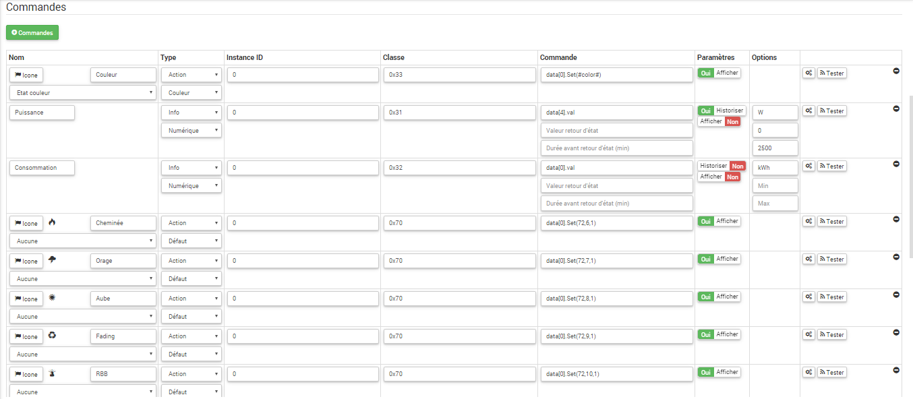
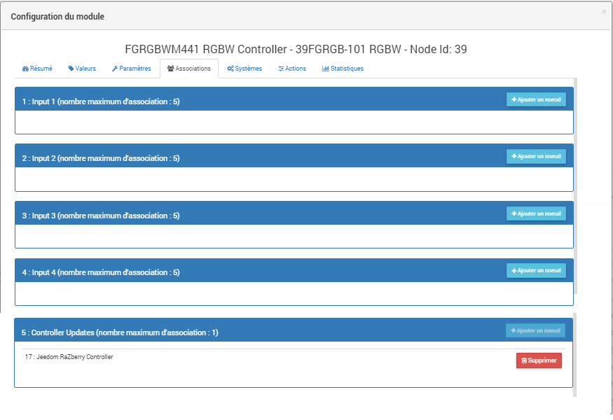

Fibaro RGVB Controler - FGRGB-101
=================================

\

-   ** ** El módulo

\

\

-   **El Jeedom visual**

\

\

resumen
------

El micro-módulo Z-Wave Fibaro FGRGB-101 permite una selección de pedidos
iluminación de baja tensión 12 / 24V (halógeno o LED), una RGB cinta LED
o RGBW o bien para conectar sensores analógicos utilizando
estándar 0-10.

-   4 entradas analógicas de 0 a 10V a ser conectados a muchos sensores
    compatibles, potenciómetros, pulsadores (un solo solenoide)
    o interruptores (flip).

-   4 salidas de inversor (PWM) para controlar:

-   \ * Es un canal LED RGBW (RGBW) 12 / 24V

-   \ * O cuatro canales de LED blanco 12 / 24V

-   \ * 4 canales o halógenas 12 / 24V (12V 144W / 288W 24V máx.)

-   \ * O ventiladores 12 / 24V.

-   Requiere una fuente de alimentación 12 / 24V separados.

-   Medición del consumo global o canal instantánea o acumulativa.

-   Función repetidor (enrutador) para extender la red Z-Wave.

\

funciones
---------

-   Pide baja tensión enciende 12 / 24V (halógeno o LED)

-   Se instala detrás de un interruptor existente

-   luz simulación previamente programado

-   ON / OFF función y el Cambio

-   Pequeña, discreta y estética

-   Facilidad de uso e instalación

\

Características técnicas
---------------------------

-   Fuente de alimentación: 12 V o 24 V DC

-   potencia de salida máxima:

-   \ * 12A en total (suma de todos los canales),

-   \ * 6A máx. por canal

-   La potencia máxima con lámparas halógenas:

-   \ * 12V - 144W totales (todos los canales),

-   \ * 24V - 288W totales (todos los canales)

-   frecuencia de modulación PWM: 244 Hz

-   Consumo: 0.3W

-   protocolo de radio: Z-Wave a 868,4 MHz (UE)

-   Poder de Z-Wave de emisión: 1 mW

-   Temperatura de funcionamiento 0 - 40 C

-   Para la instalación en latas: Ø≥50 mm

-   Dimensiones: 42 x 37 x 17 mm

-   normas europeas: EMC 2004/108 / CE R & TTE 199/5 / WE

-   Este módulo requiere un controlador Z-Wave de operar.

\

datos de los módulos
-----------------

-   Marca: Grupo Fibar

-   Nombre: Fibaro FGRGB-101 RGBW

-   Identificación del fabricante: 271

-   Tipo de producto: 2304

-   Identificación del producto: 4096

\

configuración
-------------

Para configurar OpenZwave plugin y cómo poner en Jeedom
inclusión se refiere a este
[Documentación] (https://jeedom.fr/doc/documentation/plugins/openzwave/fr_FR/openzwave.html).

\

> **Importante**
>
> Para poner este modo la inclusión del módulo debe ser presionado 3 veces en el
> Botón de inclusión, de acuerdo con su documentación en papel.

\

\

Una vez incluido usted debe conseguir esto:

\

\

### comandos

Una vez reconocido el módulo, los comandos asociados con el módulo serán
disponible.

\

\

Estos son los comandos:

-   Color: Este es el comando para establecer el código de color
    visualización

-   Chimenea: Este es el comando para simular un ambiente de
    hogar

-   Tormenta: Este es el comando para simular un ambiente de tormenta

-   Alba: Este es el comando que simule una atmósfera de Aude
    (Amanecer gradual)

-   Desvaneciendo: Este es el comando para simular el conjunto
    espectro de color

-   RBB: Este es el comando que simula un ambiente poli

-   Blanco frío: Este es el comando que simule tener una
    fresco tipo de color blanco si la banda de color permite. (este
    comando no es visible por defecto)

-   Blanco caliente: Este es el comando que simule tener una
    tipo de color blanco cálido si la banda de color permite. (este
    comando no es visible por defecto)

-   Uno: Este es el comando para activar la banda para la cabeza en
    último color seleccionado antes de

-   Apagado: Este es el comando para apagar la venda de los ojos

-   Intensidad: Este es el comando para ajustar la intensidad
    luz

Tenga en cuenta que la información completa salpicadero se puede encontrar en la misma
icono

\

### Configuración del módulo

Se puede configurar la función de su módulo
instalación. Para ello es necesario pasar por el botón "Configuración"
OpenZwave plug-in Jeedom.

\

\

Se llega en esta página (después de hacer clic en la pestaña
Configuraciones)

\

\

Detalles de los parámetros:

Gracias a traer a la pantalla anterior, los ajustes
siendo traducido al francés.

\

### grupos

Este módulo cuenta con cinco grupos de asociación, el quinto es
esencial.

\

Bueno saber
------------

### detalles específicos

Usando 0-10V sensores.

\

> **Atención**
>
> En la actualidad, la configuración por defecto permite la jeedom
> No, pero una configuración específica puede ser considerado.

### alternativa visual

\

\

wakeup
------

Sin noción de despertar en este módulo.

\

F.A.Q.
------

Por ahora, la configuración por defecto no permite jeedom,
pero una configuración específica puede ser considerado.

\

