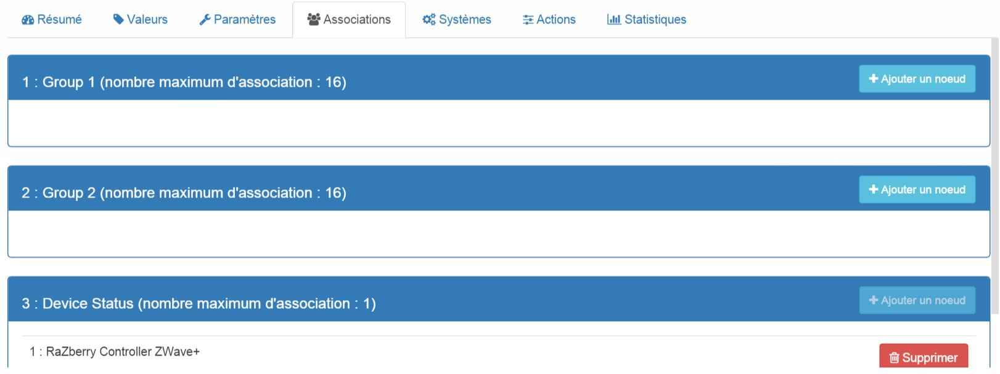

Fibaro FGRM-222 "del obturador rodante"
===============================

\

-   ** ** El módulo

\

\

-   ** El Jeedom visual **

\

\

resumen
------

\

El micromódulo FGRM-222 le permitirá gestionar del sistema de propulsión
dejar de persianas electrónicas, persianas o puertas venecianas
garaje con el protocolo Z-Wave, mientras que el mantenimiento de su
interruptor existente. Por lo que será capaz de hacer funcionar el motor
conectado con el interruptor existente, un emisor de Z-Wave o
directamente desde este botón en el micromódulo.

Además, este micro-módulo es capaz de transmitir el consumo
instantánea eléctrica (W) y acumulativo (kWh) del equipo que es
adjunta.

Se requiere un controlador Z-Wave (control remoto, dongle ...) para
integrar este módulo en su red si ya dispone de una red
existente.

Cada módulo Z-Wave actúa como un repetidor inalámbrico con
otros módulos para asegurar una cobertura completa de su
morada.

Nota: Este módulo requiere el neutro para operar.

\

funciones
---------

\

-   Ordenar sus persianas o contraventanas remoto

-   Compatible con la BSO y venecianas persianas con posicionamiento
    tiras

-   Se instala detrás de un interruptor existente

-   Función arriba / abajo y posicionamiento

-   Compatible con el tope mecánico o motores electrónicos

-   La medición del consumo instantáneo y acumulado

-   Actualización inalámbrica con caja Fibaro Home Center 2

-   Función de prueba de la cobertura de la red Z-Wave

-   Pequeña, discreta y estética

-   Facilidad de uso e instalación

\

Características técnicas
---------------------------

\

-   Tipo de módulo: el receptor Z-Wave

-   Fuente de alimentación: 230V, 50Hz

-   Consumo de energía: 0,8 W &lt;

-   Cableado: 3 hijo, Neutro necesaria

-   Carga máxima: 1000W

-   Frecuencia: 868.42 MHz

-   Intensidad de la señal: 1 mW

-   Distancia de transmisión: campo libre 50m, 30m en interiores

-   Dimensiones: 17 x 42 x 37 mm

-   Temperatura de funcionamiento: 0-40 ° C

-   Límite de temperatura: 105 ° C

-   Normas: LVD (2006/95 / CE), EMC (2004 / 10B / CE), R & TTE (1999/5 / CE)

\

datos de los módulos
-----------------

\

-   Marca: Grupo Fibar

-   Nombre: Fibaro FGRM-222

-   Identificación del fabricante: 271

-   Tipo de producto: 769

-   Identificación del producto: 4097

\

configuración
-------------

\

Para configurar OpenZwave plugin y cómo poner en Jeedom
inclusión se refiere a este
[Documentación] (https://jeedom.fr/doc/documentation/plugins/openzwave/fr_FR/openzwave.html).

\

> ** Importante **
>
> Para poner este modo la inclusión del módulo debe ser presionado 3 veces en el
> Botón de inclusión, de acuerdo con su documentación en papel.

\

\

Una vez incluido usted debe conseguir esto:

\

\

### comandos

\

Una vez reconocido el módulo, los comandos asociados con el módulo serán
disponible.

\

\

Estos son los comandos:

\

-   Estado: Este es el comando para conocer la posición de
    su componente

-   Posicionamiento: Este es el comando para establecer el
    porcentaje de apertura

-   Hasta: Este es el comando para abrir completamente el obturador

-   Abajo: Este es el comando para cerrar completamente la puerta

-   Actualizar: Este es el comando para volver a aplicar la posición
    solapa

-   Potencia: Comando para tener consumo de los módulos

-   Consumo: Comando para saber el poder
    Instantánea que utiliza el módulo

-   STOP: comando para detener el movimiento de la aleta

-   BSO STOP: comando para detener el movimiento (Modo
    lama orientable)

-   Inclinación: Permite para inclinar los listones (modo de láminas ajustable)

-   Rechazar: Permite rechazar las laminillas (modo de láminas ajustable)

-   No: marcar el ritmo de prensado o Rechazar
    inclinación

\

### Configuración del módulo

\

Entonces, si desea configurar el módulo de acuerdo
su instalación, para ello es necesario pasar por el botón
"Configuración" plug-in OpenZwave Jeedom.

\

\

Se llega en esta página (después de hacer clic en la pestaña
configuraciones)

\

\

Detalles de los parámetros:

\

-   1: se utiliza para bloquear el módulo (para congelar un panel) (abogados en el caso
    y presionar un interruptor)

-   2: igual, pero para los pedidos Zwave

-   3 tipos de informes (clásicos o Fibar)

-   10: modo de funcionamiento (celosía, persiana etc ...)

-   12: duración de una vuelta completa (en venitien forma ciega)

-   13: Elija cuando las lamas están a regresar a su
    posición anterior

-   14: Se utiliza para seleccionar el tipo de interruptor

-   17: permite elegir el tiempo después de la fecha límite definido en 18
    la solapa se detiene

-   potencia la seguridad al motor: 18

-   22: NA

-   29: calibra la solapa

-   30-35: ajustar la sensibilidad del módulo de
    alarmas Zwave diferentes

-   40: delta de potencia para desencadenar una recuperación de información (incluso
    Fuera del periodo de tiempo definido en 42)

-   42: ascenso información del período

-   43: Energía delta para desencadenar una recuperación de información (incluso
    Fuera del periodo de tiempo definido en 42)

-   44: Elija si el consumo de energía o no
    debe tener en cuenta que el propio módulo

-   50: selecciona si el módulo enviará información a los nodos
    en el modo de escena en asociación o en combinación de la moda

\

### grupos

\

El módulo tiene tres grupos de asociación, sólo el tercero es
esencial.

\

\

Bueno saber
------------

\

### reajustar

\

\

Usted puede configurar su medidor de consumo haciendo clic
este botón disponible en la ficha Sistema.

\

### importante

\

> ** Importante **
>
> Para la realimentación del estado trabaja en Jeedom, es necesario
> Forzar la calibración de los equipos (parámetro 29 a "Sí") y
> Posicionamiento debe estar activa (10 valores del parámetro "Activo
> Live "" veneciana Activo "o" puerta activa ").

\

### alternativa visual

\

\

wakeup
------

\

Sin noción de despertar en este módulo.

\

F.A.Q.
------

\

Lea la sección Restablecer este documento.

\

** ** @ sarakha63
