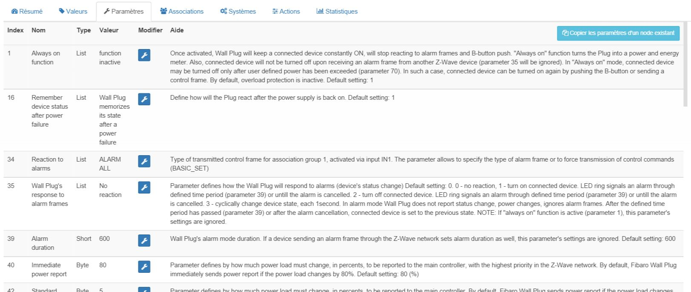
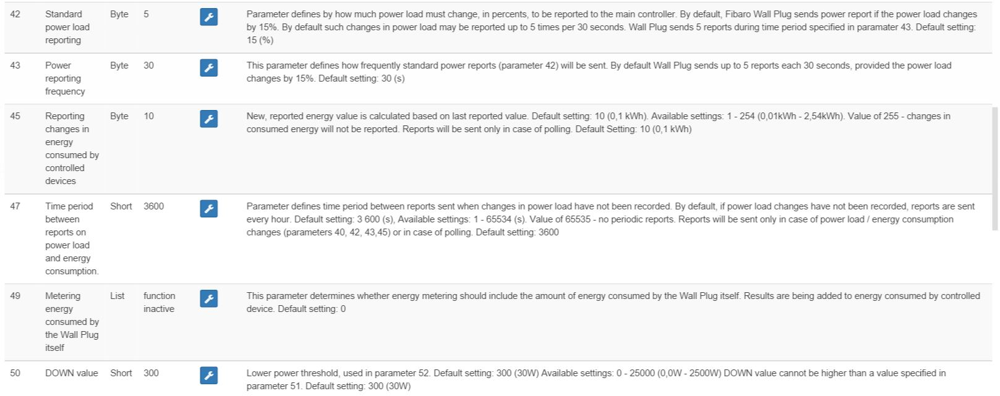

Fibaro FGRWPE-101 "El enchufe de pared"
=============================

\

-   ** ** El módulo

\

\

-   **El Jeedom visual**

\

\

resumen
------

\

El enchufe de pared Fibaro es un plug-in universal de receptor-transmisor
forma \ `un adaptador para el enchufe en una toma de corriente a la red
eléctrico, compatible con el estándar Z-Wave. Se puede administrar
cualquier dispositivo que tiene una potencia máxima de 2,5 kW, mientras
la integración de la funcionalidad de medición de la potencia activa de la corriente y
el consumo de energía de los dispositivos. Este módulo tiene \ `una
anillo de luz con LED que indica su estado y el consumo
energía de cualquier dispositivo conectado. La pared del enchufe puede ser Fibaro
controlado por un botón en su carcasa o de cualquier
Controlador compatible con el estándar Z-Wave

\

funciones
---------

\

-   Controlada desde un controlador compatible con el estándar Z-Wave.

-   micro-chips de controlar.

-   Elemento \ `Ejecución: Relay.

-   medición de potencia activa de la corriente y la \ `energía eléctrica
    receptor.

\

Características técnicas
---------------------------

\

-   Tipo de módulo: el receptor Z-Wave

-   Fuente de alimentación: 230V, 50Hz

-   Consumo de energía: hasta 0,8 W

-   Carga máxima: 2,5 kW

-   Frecuencia: 868.42 MHz de EE.UU.

-   Distancia de transmisión: campo libre 50m, 30m en interiores

-   Dimensiones: 17 x 42 x 37 mm

-   Temperatura de funcionamiento: 0-40 ° C

-   Límite de temperatura: 105 ° C

-   Normas: LVD (2006/95 / WE), EMC (2004/108 / CE), R & TTE (1999/5 / WE)

\

datos de los módulos
-----------------

\

-   Marca: Grupo Fibar

-   Nombre: enchufe de pared FGWPE-101

-   Identificación del fabricante: 271

-   Tipo de producto: 1536

-   Identificación del producto: 4096

\

configuración
-------------

\

Para configurar OpenZwave plugin y cómo poner en Jeedom
inclusión se refiere a este
[Documentación] (https://jeedom.fr/doc/documentation/plugins/openzwave/fr_FR/openzwave.html).

\

> **Importante**
>
> Para poner este modo la inclusión del módulo debe ser presionado 3 veces en el
> Botón de inclusión, de acuerdo con su documentación en papel.

\

\

Una vez incluido usted debe conseguir esto:

\

\

### comandos

\

Una vez reconocido el módulo, los comandos asociados con el módulo serán
disponible.

\

\

Estos son los comandos:

\

-   Estado: Este es el comando para conocer el estado de la
    toma

-   Uno: Este es el comando para activar el plug

-   Apagado: Este es el comando para apagar el tapón

-   Potencia: Este es el comando que fue el poder instatanée
    consumida

-   Contras: Este es el comando que fue el consumo total

\

Tenga en cuenta que el salpicadero controla el interruptor ON / OFF / STATUS se agrupan
en un solo botón.

\

### Configuración del módulo

\

Entonces, si desea configurar el módulo de acuerdo
su instalación, para ello es necesario pasar por el botón
"Configuración" plug-in OpenZwave Jeedom.

\

\

Se llega en esta página (después de hacer clic en la pestaña
configuraciones)

\

\

Detalles de los parámetros:

\

-   1: bloqueará el módulo siempre en ON

-   16: Para recordar el último estado en el caso de la energía
    actual

-   34: para seleccionar un tipo de la red de decisión de alarma Zwave
    debe reaccionar

-   35: Ajuste cómo la decisión va a responder a las alarmas

-   39: Ajuste la hora de la alarma

-   40: define cuánto se debe variar el poder de estar
    la recuperación (en%)

-   42: igual pero en modo estándar (hasta 5 veces no definidos
    PARAM 43)

-   intervalo de recuperación de potencia: 43

-   45: El consumo de gama de elevación (10 kWh = 0,1 kWh)

-   47: segundo intervalo de levantamiento de información de forma independiente
    una variación

-   49: tener en cuenta el consumo del propio módulo de
    valores

-   50: Valor mínimo utilizado por el parámetro 52

-   51: el valor máximo utilizado por el parámetro 52

-   52: medidas para hacer si se va fuera de los límites definidos en
    parámetros 50 y 51

-   60: el poder más allá del cual la toma de destello púrpura

-   61: color cuando el tapón está activada

-   62: color cuando el tapón está apagado

-   63: Zwave color cuando se detecta una alarma

-   70: Potencia de seguridad (se corta enchufe cuando el poder
    alcanza este umbral)

\

### grupos

\

El módulo tiene tres grupos de asociación, sólo el tercero es
esencial.

\

\

Bueno saber
------------

\

### reajustar

\

\

Usted puede configurar su medidor de consumo haciendo clic
este botón disponible en la ficha Sistema. Hay que elegir
Botón de control.

\

### alternativa visual

\

\

wakeup
------

\

Sin noción de despertar en este módulo.

\

F.A.Q.
------

\

Lea la sección Restablecer este documento.

\

** ** @ sarakha63
