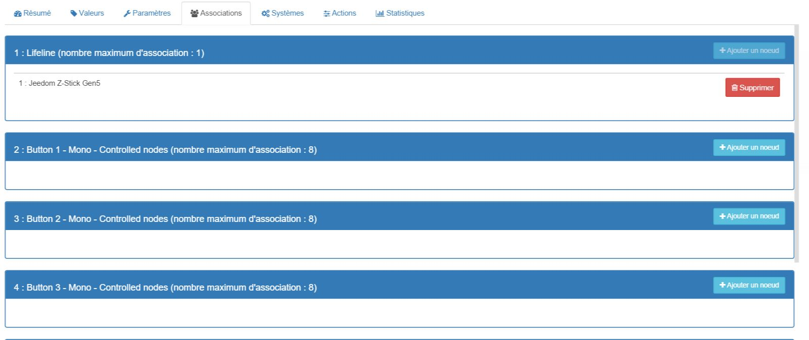

Control Nodon - Octan
==========================

\

-   ** ** El módulo

\

\

-   ** El Jeedom visual **

\

\

resumen
------

\

El mando de Octan NodOn® puede controlar cualquier receptor
compatible Wave Z- o Z-Wave Plus® como salida remoto
NodOn® (Controlador de la moda principal - independiente), o el gatillo
escenas / acción a través de una compatible con la automatización del hogar central (la moda
gateway)

Su imán integrado permite fijar todas partes del radiador en la puerta
refrigerador, pasando a través de su soporte de pared. entre el control remoto
y el interruptor, Octan revoluciona objetos de control remoto
casa

\

funciones
---------

\

-   control único o con una central de domótica

-   imán incorporado

-   El color del LED

-   Wall Plate

-   2 años de batería

\

Características técnicas
---------------------------

\

-   Potencia: CR2032 - Batería 1,5 - 2 años

-   4 botones

-   Soporte de pared unido mediante un adhesivo de doble cara (incluida) o tornillo
    (No incluido)

-   Imán integrado para el montaje en superficie de metal

-   Temperatura de funcionamiento: 0 ° C a 40 ° C - Altitud: 2000m

-   Protocolo de Z-Wave de radio: 868.4MHz - Serie 500 - compatibles con Z-Wave
    Plus® SDK 06.51.01 Rango: 40m 80m interior / exterior

-   Dimensiones: 80 \ 80 * \ * 15mm

-   2 años de garantía

\

datos de los módulos
-----------------

\

-   Marca: Nodon

-   Nombre: CRC-01.03.00 remoto Octan

-   Identificación del fabricante: 357

-   Tipo de producto: 2

-   Identificación del producto: 1

\

configuración
-------------

\

Para configurar OpenZwave plugin y cómo poner en Jeedom
inclusión se refiere a este
[Documentación] (https://jeedom.fr/doc/documentation/plugins/openzwave/fr_FR/openzwave.html).

\

> ** Importante **
>
> Para poner esto inclusión modo de módulo debe presionar tanto
> Botón (1 y 2) hasta que la luz se vuelve rosa a continuación, pulse
> Botón 1, de acuerdo con su documentación en papel.

\

\

Una vez incluido usted debe conseguir esto:

\

\

### comandos

\

Una vez reconocido el módulo, los comandos asociados con el módulo serán
disponible.

\

\

Estos son los comandos:

\

-   Botones: el comando que ascienda el botón pulsado

+ ---------------- + ---------------- + --------------- - + ---------------- + ---------------- +
| botones | soporte | Soporte larga | aflojamiento | Doble toque |
================ ================ + + + =============== = + + ================ ================ +
| ** 1 ** | 10 | 12 | 11 | 13 |
+ ---------------- + ---------------- + --------------- - + ---------------- + ---------------- +
| ** 2 ** | 20 | 22 | 21 | 23 |
+ ---------------- + ---------------- + --------------- - + ---------------- + ---------------- +
| ** 3 ** | 30 | 32 | 31 | 33 |
+ ---------------- + ---------------- + --------------- - + ---------------- + ---------------- +
| ** 4 ** | 40 | 42 | 41 | 43 |
+ ---------------- + ---------------- + --------------- - + ---------------- + ---------------- +

\

### Configuración del módulo

\

> ** Importante **
>
> Cuando inclusión por primera vez todavía despierta en el módulo justo después de
> Inclusión.

\

Entonces, si desea configurar el módulo de acuerdo
su instalación, para ello es necesario pasar por el botón
"Configuración" plug-in OpenZwave Jeedom.

\

\

Se llega en esta página (después de hacer clic en la pestaña
configuraciones)

\

\

Detalles de los parámetros:

\

-   1-2: Elija el botón Perfil de si se utiliza en
    central (innecesario para su uso en Jeedom)

-   3: Un parámetro importante para saber si el interruptor está funcionando
    Escena de modo de escena o central (escena absolutamente poniendo)

-   4-7: Seleccionar los botones de modo de funcionamiento (en caso
    asociaciones grupos)

-   8: selecciona la operación del LED

### grupos

\

Este módulo tiene 7 grupos de asociación.

\

\

-   Grupo 1 - Supervivencia: Este grupo se utiliza generalmente para
    Ver información del Smart Plug el controlador principal
    red.

-   Grupo 2 a 5 - Dispositivos de estos grupos están controlados por el
    botón correspondiente de acuerdo con el perfil MONO

-   Grupo 6-7 - Los dispositivos en estos grupos son controlados por el
    botón correspondiente de acuerdo con el perfil DUO

\

> ** Importante **
>
> Una Jeedom mínimo debería reflejarse en el grupo 1 \

Bueno saber
------------

\

### detalles específicos

\

-   Este módulo puede ser temperamental al inicio del estudio. No dude en el
    despertar después de 1 ó 2 veces el valor basal, y revisión de niño sano
    grupo asociación.

\

wakeup
------

\

Para despertar este módulo sólo tiene que pulsar uno de los botones

\

F.A.Q.
------

\

Este módulo es un módulo de batería, la nueva configuración se
consideración de que si se despierta el mando a distancia.

\

Nota importante
---------------

\

> ** Importante **
>
> Hay que despertar el módulo después de su inclusión, después de un cambio
> La configuración, después de un cambio de wakeup después de una
> Asociación cambiar de grupo

\

** ** @ sarakha63
