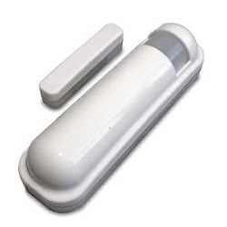
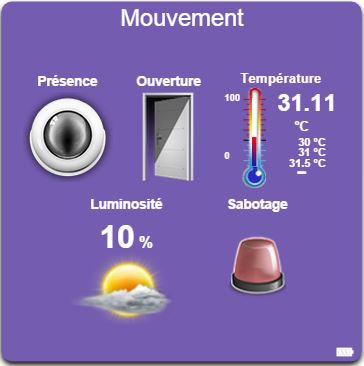

Philio PST02 A - 4 1
=======================

\

-   ** ** El módulo

\

\

-   **El Jeedom visual**

\

\

resumen
------

\

El detector postal-PSM02-UE ofrece 4 funciones diferentes: la detección
movimiento, detección de apertura, sensor de temperatura y sensor
brillo. Se compone de dos partes: un sensor y un imán.
Están diseñados para ser colocado en una puerta o ventana
el imán fijado a la porción de abertura y el sensor en la parte
Fijo.

La apertura de la puerta o ventana se apartan del imán
detector, que activará el detector enviará una señal Z-Wave
alarma si el sistema está armado (esta señal puede ser operado por una
sirena o una caja de automatización, por ejemplo). Este detector puede ser
utilizado para la seguridad o la automatización. Cuando el detector
está asociado con los dispositivos de seguridad, sirve como un disparador
Alerta detectando cambios en los niveles de radiación
apertura de infrarrojos o de la puerta / ventana. Si una persona se mueve en
campo del sensor de vista o abrir una puerta / ventana, una señal
de radio se transmite, lo que desencadena una alarma para desalentar
intruso.

El sensor también puede ser usado en combinación con una
controlador Z-Wave para fines de automatización, mediante la detección tanto
cambios en los niveles de radiación infrarroja (presencia) o
la apertura de la puerta / ventana y cambios en el nivel de
brillo. Por lo tanto, se puede desencadenar una luz después de la detección
el movimiento o la puerta de apertura en la oscuridad.

El detector también ascender el brillo y la temperatura, ya sea
Si cambio significativo, y cada vez que un movimiento o
se detecta la apertura / cierre. Un controlador Z-Wave (control remoto,
dongle ...) es necesario para integrar el detector en su red
si ya dispone de una red existente. \

funciones
---------

\

-   Detector 4 en 1: el movimiento, la apertura, la temperatura, la luz

-   Adopta el último chip Z-Wave para apoyar 400series
    operaciones multicanal y una velocidad de datos
    alta (9,6 / 40/100 kbps)

-   Utilizar el Z-Wave SDK 6.02

-   Ámbito de aplicación de la antena optimizado

-   El uso para la automatización del hogar o aplicaciones de seguridad

-   Botón para incluir / excluir el detector

-   manosear

-   Indicador de batería baja

-   Pequeña, discreta y estética

-   Facilidad de uso e instalación

\

Características técnicas
---------------------------

\

-   Tipo de módulo: Transmisor Z-Wave

-   Fuente de alimentación: 1 CR123A 3V

-   Duración de la batería: 2 años

-   Frecuencia: 868.42 MHz

-   Distancia de transmisión: 30m cubierta

-   Sensor de temperatura: -10 a 70 ° C

-   sensor de luminosidad: 0 a 500 lux

-   PIR ángulo de detección: 90 °

-   PIR rango de detección: 8 a 10m

-   dimensiones:

-   Detector: 28 x 96 x 23 mm

-   Imán: 10 x 50 x 12 mm

-   Peso: 52g

-   Rango de temperatura de funcionamiento: -10 a 40 ° C

-   Humedad de funcionamiento: 85% HR max

-   CE: EN300 220-1

-   La certificación Z-Wave: ZC08-13050003

\

datos de los módulos
-----------------

\

-   Marca: Philio Technology Corporation

-   Nombre: PST02-A 4 en 1 Multi-Sensor

-   Identificación del fabricante: 316

-   Tipo de producto: 2

-   Identificación del producto: 12

\

configuración
-------------

\

Para configurar OpenZwave plugin y cómo poner en Jeedom
inclusión se refiere a este
[Documentación] (https://jeedom.fr/doc/documentation/plugins/openzwave/fr_FR/openzwave.html).

\

> **Importante**
>
> Para poner este modo la inclusión del módulo debe ser presionado 3 veces en el
> Botón de inclusión, de acuerdo con su documentación en papel.

\

\

Una vez incluido usted debe conseguir esto:

\

\

### comandos

\

Una vez reconocido el módulo, los comandos asociados con el módulo serán
disponible.

\

\

Estos son los comandos:

\

-   Presencia: es el comando que ascienden detección de presencia

-   Apertura: este es el comando que se elevará la detección
    apertura

-   Temperatura: la orden de copia de seguridad del
    temperatura

-   Brillo: el comando para aumentar el brillo

-   Sabotaje: el comando de sabotaje (que se dispara
    Si lagrimeo)

-   Batería: el control de la batería

\

### Configuración del módulo

\

> **Importante**
>
> Cuando inclusión por primera vez todavía despierta en el módulo justo después de
> Inclusión.

\

Entonces, si desea configurar el módulo de acuerdo
su instalación, para ello es necesario pasar por el botón
"Configuración" plug-in OpenZwave Jeedom.

\

\

Se llega en esta página (después de hacer clic en la pestaña
configuraciones)

\

\

Detalles de los parámetros:

\

-   2 ajusta la señal enviada a los módulos del grupo
    Asociación 2

-   3: Ajuste de la sensibilidad del sensor de presencia (0:
    99 desactivado: sensibilidad máxima)

-   4: se utiliza para ajustar el nivel de brillo a la que la
    señal especificada por el parámetro 2 será enviado a los módulos asociados con el
    el grupo 2

-   5: modo de funcionamiento (consulte la
    Valor documentación del fabricante) Recomendado: 8

-   6: operación de multi-sensor (véase la
    Valor documentación del fabricante) Recomendado: 4

-   7: Modo personalizado del multisensor (véase
    en la documentación del fabricante) Valor recomendado: 6 (para
    obtener información sobre la presencia OFF)

-   8: Establecer la duración en intervalos de 8 segundos Redetección
    movimiento

-   9: juego después de cuánto tiempo la señal estará apagado
    enviado a los módulos asociados con el grupo 2

-   10: ajusta el tiempo entre los informes de la batería (una
    parámetro individual = 20)

-   11: Ajuste el tiempo entre dos informes de apertura automática
    (A parámetro de unidad = 20)

-   12: Establecer la duración entre dos informes de auto
    brillo (unidad = parámetro 20) Recomendado valor 3

-   13: Establecer la duración entre dos informes de auto
    temperatura (unidad = 20 parámetros) Valor recomendado: 2

-   20: duración de un intervalo de parámetros 10-13 Valor
    recomendada: 10

-   21: cantidad de cambio en la temperatura ° F para desencadenar una
    relación

-   22: Valor de% de variación de brillo para desencadenar una
    reportar el valor recomendado: 10

\

### grupos

\

Este módulo tiene dos grupos de asociación, sólo la primera es
esencial.

\

\

Bueno saber
------------

\

### alternativa visual

\

\

wakeup
------

\

Para despertar este módulo hay una sola manera de hacer esto:

-   manipular suelte el botón y pulse de nuevo

\

F.A.Q.
------

\

Este módulo se despierta pulsando el tamper botón.

\

Este módulo es un módulo de batería, la nueva configuración se
consideración en la próxima despertador.

\

Nota importante
---------------

\

> **Importante**
>
> Hay que despertar el módulo después de su inclusión, después de un cambio
> La configuración, después de un cambio de wakeup después de una
> Asociación cambiar de grupo

\

** ** @ sarakha63
