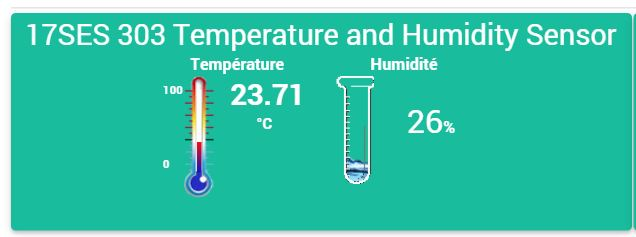

Asegurar su "Temperatura / Humedad" 303
=====================================

\

-   ** ** El módulo

\

\

-   ** El jeedom visual **

\

\

resumen
------

\

SES303 la sonda permite la medición de la temperatura de la atmósfera interior
así como la humedad. Está alimentado por 2 baterías AA y está certificado
Además Z-Wave. Además de su función principal, es posible
alambre SEGURO diferentes sensores externos en el módulo, incluyendo:

-   Un sensor de temperatura NTC externo (SES001)

-   4 sensores de temperatura por cable para tubería o tanque (SES002)
    conectado por cables 1m

-   1 sensor de temperatura por cable para tubería o tanque (SES003)
    conectado por un cable 4m

Estos módulos son ideales para la medición de temperatura en
Aplicación de calefacción central o otros controles
aplicación similar. Su interfaz de usuario es simple, con una
pulsador local y los indicadores LED en la parte posterior. uno
puede incluir / excluir fácilmente en una red Z-Wave.

\

funciones
---------

\

-   La medición precisa de la temperatura y la humedad

-   Aplicación en los sistemas de control dinámico
    tanques / tuberías / calefacción por suelo radiante / ...

-   Posibilidad de conexión de sonda externa

-   Interropérable con productos y sistemas de certificación Z-Wave

-   fácil Instalación

-   Informe de batería baja

\

Características técnicas
---------------------------

\

-   Tipo: Portable montaje / pared

-   rango de medición de temperatura: ± 0,5 ° C desde 0 ° C a 40 ° C

-   el chip Z-Wave Más

-   Frecuencia: 868.42 MHz

-   Fuente de alimentación: 2x AA (LR6)

-   Rango: hasta 100 m en el exterior

-   Protección: IP30

-   Dimensiones: 86 x 85 x 30 mm

\

datos de los módulos
-----------------

\

-   Marca: Horstmann

-   Nombre: SES 303 temperatura y sensor de humedad

-   Identificación del fabricante: 89

-   Tipo de producto: 13

-   Identificación del producto: 3

\

configuración
-------------

\

Para configurar OpenZwave plugin y cómo poner en Jeedom
inclusión se refiere a este
[Documentación] (https://jeedom.fr/doc/documentation/plugins/openzwave/fr_FR/openzwave.html).

\

> ** Importante **
>
> Para poner este modo la inclusión del módulo hay que pulsar 1 segundo
> Botón en la parte posterior y la liberación de conformidad con su documentación en papel.

\

\

Una vez incluido usted debe conseguir esto:

\

\

### comandos

\

Una vez reconocido el módulo, los comandos asociados con el módulo serán
disponible.

\

\

Estos son los comandos:

\

-   Temperatura: el control de la temperatura de medición

-   Humedad: la humedad de control de medición

-   Batería: el control de la batería

Varios temperaturas NONS visibles también están disponibles y serán
Útiles sondas externas si se ha conectado

\

### Configuración del módulo

\

> ** Importante **
>
> Cuando inclusión por primera vez todavía despierta en el módulo justo después de
> Inclusión.

\

A continuación, es necesario la configuración del módulo
Dependiendo de su configuración. Para ello es necesario pasar por el botón
"Configuración" plug-in OpenZwave Jeedom.

\

\

Se llega en esta página (después de hacer clic en la pestaña
configuraciones)

\

\

Detalles de los parámetros:

\

-   1: Ajusta la cantidad debe variar la temperatura para ese
    el módulo envía a Jeedom (en 0.1)

-   2: Establecer el intervalo de enviar el tiempo de la temperatura
    a Jeedom (en minutos)

-   3: ajustar la cantidad debe variar la humedad a la
    Módulo envía a Jeedom (en%)

-   4: Establecer el intervalo de tiempo para el envío de la humedad
    Jeedom (en minutos)

Todos los demás parámetros son idénticos y corresponden a todo
sondas externas opcionalmente ramificados

\

### grupos

\

Este módulo tiene un solo grupo de asociación, es esencial

\

\

Bueno saber
------------

\

### detalles específicos

\

### alternativa visual

\

\

wakeup
------

\

Para despertar este módulo tiene que pulsar 1 tanto en el botón de retroceso

\

F.A.Q.
------

\

Este módulo se despierta pulsando 1 de nuevo en su botón de la inclusión.

\

Este módulo es un módulo de batería, la nueva configuración se
consideración en la próxima activación.

\

Nota importante
---------------

\

> ** Importante **
>
> Hay que despertar el módulo después de su inclusión, después de un cambio
> Configuración, después de un cambio de despertar después de una
> Asociación cambiar de grupo

\

** ** @ sarakha63
